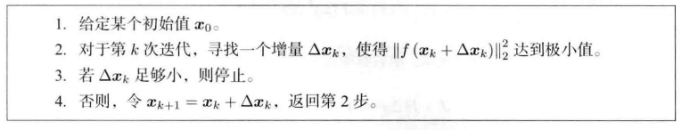
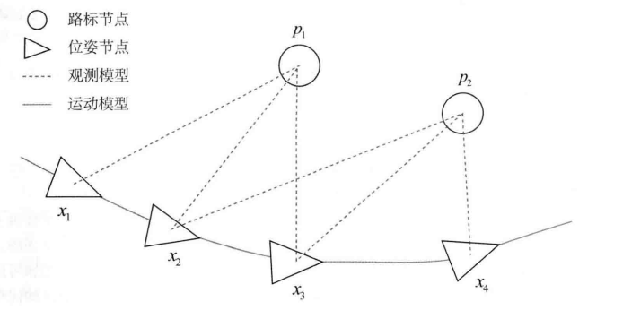
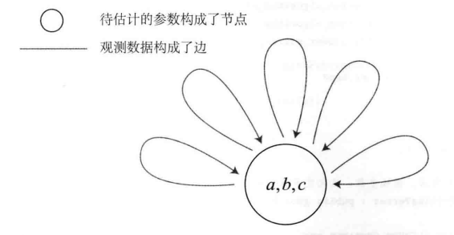

# 视觉SLAM十四讲笔记

## 第六讲 - 非线性优化

### 6.1 状态估计问题

#### 经典SLAM模型

-   经典SLAM模型: 
    -   $\boldsymbol{x}_{k-1}$, 前一刻相机位姿
    -   $\boldsymbol{u}_k$, 此刻运动控制
    -   $f$ 运动方程
    -   $\boldsymbol{w}_k$, 此刻运动噪声
    -   $\boldsymbol{x}_k$, 此刻相机位姿
    -   $\boldsymbol{y}_j$, 此刻观测的路标
    -   $h$ 观测方程
    -   $\boldsymbol{v}_{k,j}$, 此刻观测噪声
    -   $\boldsymbol{z}_{k,j}$, 此刻观测结果, 即路标对应到图像上的像素位置 

$$
\left\{\begin{array}{l}
\boldsymbol{x}_{k}=f\left(\boldsymbol{x}_{k-1}, \boldsymbol{u}_{k}\right)+\boldsymbol{w}_{k} \\
\boldsymbol{z}_{k, j}=h\left(\boldsymbol{y}_{j}, \boldsymbol{x}_{k}\right)+\boldsymbol{v}_{k, j}
\end{array}\right.
$$

-   观测方程:

    -   $\boldsymbol{K}$, 相机内参
    -   $s$, 观测路标到图像的距离

    $$
    s \boldsymbol{z}_{k, j}=\boldsymbol{K}\left(\boldsymbol{R}_{k} \boldsymbol{y}_{j}+\boldsymbol{t}_{k}\right)
    $$

-   噪声, 假设满足零均值高斯分布

    -   $\boldsymbol{w}_k$, 运动噪声

    -   $\boldsymbol{v}_{k,j}$, 观测噪声

    -   $\mathcal{N}$, 高斯分布

    -   $0$, 表示零均值

    -   $\boldsymbol{R}_{k}, \boldsymbol{Q}_{k, j}$, 为协方差矩阵
        $$
        \boldsymbol{w}_{k} \sim \mathcal{N}\left(\mathbf{0}, \boldsymbol{R}_{k}\right), \boldsymbol{v}_{k} \sim \mathcal{N}\left(\mathbf{0}, \boldsymbol{Q}_{k, j}\right)
        $$

-   估计方法

    -   增量式
        -   扩展卡尔曼滤波（放到后端讲解）
    -   批量式
        -   局部批量: 滑动窗口法
        -   全局批量: SfM, Structure from Motion
    -   最大似然估计

#### 最大后验估计

-   考虑从1到N的所有时刻, 假设有M个路标, 定义所有时刻的机器人位姿 $\boldsymbol{x}$ 和路标点坐标 $\boldsymbol{y}$ 为:
    $$
    \boldsymbol{x}=\left\{\boldsymbol{x}_{1}, \ldots, \boldsymbol{x}_{N}\right\}, \quad \boldsymbol{y}=\left\{\boldsymbol{y}_{1}, \ldots, \boldsymbol{y}_{M}\right\}
    $$

-   $\boldsymbol{u}$ 表示所有时刻运动输入, $\boldsymbol{z}$ 表示所有时刻观测数据. 对机器人状态的估计, 从概率学来说, 就是已知输入数据 $\boldsymbol{u}$ 和观测数据 $\boldsymbol{z}$ 的条件下, 求状态 $\boldsymbol{x}$, $\boldsymbol{y}$ 的条件概率分布:
    $$
    P(\boldsymbol{x}, \boldsymbol{y} \mid \boldsymbol{z}, \boldsymbol{u}) .
    $$

    -   当不知道控制输入时
        $$
        P(\boldsymbol{x}, \boldsymbol{y} \mid \boldsymbol{z})
        $$

-   贝叶斯法则
    $$
    \underbrace{P(\boldsymbol{x}, \boldsymbol{y} \mid \boldsymbol{z}, \boldsymbol{u})}_{\text{后验}}
    =
    \frac{P(\boldsymbol{z}, \boldsymbol{u} \mid \boldsymbol{x}, \boldsymbol{y}) P(\boldsymbol{x}, \boldsymbol{y})}{P(\boldsymbol{z}, \boldsymbol{u})} \propto \underbrace{P(\boldsymbol{z}, \boldsymbol{u} \mid \boldsymbol{x}, \boldsymbol{y})}_{\text {似然 }} \underbrace{P(\boldsymbol{x}, \boldsymbol{y})}_{\text {先验 }} .
    $$

-   **求解最大后验概率, 等价于最大化似然和先验的乘积**
    $$
    (\boldsymbol{x}, \boldsymbol{y})^{*}{ }_{\text {MAP }}=\arg \max P(\boldsymbol{x}, \boldsymbol{y} \mid \boldsymbol{z}, \boldsymbol{u})=\arg \max P(\boldsymbol{z}, \boldsymbol{u} \mid \boldsymbol{x}, \boldsymbol{y}) P(\boldsymbol{x}, \boldsymbol{y})
    $$

-   如果没有机器人位姿或路标, 则没有了先验, 此时可以求解最大似然估计 (MLE, Maximize Likelihood Estimation), 即 "**在什么样的状态下, 最可能产生现在观测到的数据**"
    $$
    (\boldsymbol{x}, \boldsymbol{y})^{*}{ }_{\mathrm{MLE}}=\arg \max P(\boldsymbol{z}, \boldsymbol{u} \mid \boldsymbol{x}, \boldsymbol{y})
    $$

#### 最小二乘法求解最大似然估计

-   观测模型，第k次观测，第j个观测目标
    $$
    \boldsymbol{z}_{k, j}=h\left(\boldsymbol{y}_{j}, \boldsymbol{x}_{k}\right)+\boldsymbol{v}_{k, j},
    $$

-   假设噪声项符合高斯分布 $\boldsymbol{v}_{k} \sim \mathcal{N}\left(\mathbf{0}, \boldsymbol{Q}_{k, j}\right)$

-   观测数据的条件概率依然是高斯分布
    $$
    P\left(\boldsymbol{z}_{j, k} \mid \boldsymbol{x}_{k}, \boldsymbol{y}_{j}\right)=N\left(h\left(\boldsymbol{y}_{j}, \boldsymbol{x}_{k}\right), \boldsymbol{Q}_{k, j}\right)
    $$

-   高斯分布的概率密度函数
    $$
    P(\boldsymbol{x})=\frac{1}{\sqrt{(2 \pi)^{N} \operatorname{det}(\boldsymbol{\Sigma})}} \exp \left(-\frac{1}{2}(\boldsymbol{x}-\boldsymbol{\mu})^{\mathrm{T}} \boldsymbol{\Sigma}^{-1}(\boldsymbol{x}-\boldsymbol{\mu})\right)
    $$

-   对其取负对数
    $$
    -\ln (P(\boldsymbol{x}))=\frac{1}{2} \ln \left((2 \pi)^{N} \operatorname{det}(\boldsymbol{\Sigma})\right)+\frac{1}{2}(\boldsymbol{x}-\boldsymbol{\mu})^{\mathrm{T}} \boldsymbol{\Sigma}^{-1}(\boldsymbol{x}-\boldsymbol{\mu})
    $$

-   对数函数单调递增, 所以对原函数求最大化, 即对负对数求最小化. 上式中第一项与 $\boldsymbol{x}$ 无关, 只要最小化右侧的二次型项, 就得到状态的最大似然估计. 这里等价于最小化噪声项误差的一个二次型, 为马式距离, 也可以理解为由 $\boldsymbol{Q}_{k, j}^{-1}$ 加权后的欧氏距离.
    $$
    \begin{aligned}
    \left(\boldsymbol{x}_{k}, \boldsymbol{y}_{j}\right)^{*} &=\arg \max \mathcal{N}\left(h\left(\boldsymbol{y}_{j}, \boldsymbol{x}_{k}\right), \boldsymbol{Q}_{k, j}\right) \\
    &=\arg \min \left(\left(\boldsymbol{z}_{k, j}-h\left(\boldsymbol{x}_{k}, \boldsymbol{y}_{j}\right)\right)^{\mathrm{T}} \boldsymbol{Q}_{k, j}^{-1}\left(\boldsymbol{z}_{k, j}-h\left(\boldsymbol{x}_{k}, \boldsymbol{y}_{j}\right)\right)\right)
    \end{aligned}
    $$

-   假设各个时刻的运动输入和观测互相独立
    $$
    P(\boldsymbol{z}, \boldsymbol{u} \mid \boldsymbol{x}, \boldsymbol{y})=\prod_{k} P\left(\boldsymbol{u}_{k} \mid \boldsymbol{x}_{k-1}, \boldsymbol{x}_{k}\right) \prod_{k, j} P\left(\boldsymbol{z}_{k, j} \mid \boldsymbol{x}_{k}, \boldsymbol{y}_{j}\right)
    $$

-   定义每次输入和观测数据与模型之间的误差
    $$
    \begin{aligned}
    \boldsymbol{e}_{\boldsymbol{u}, k} &=\boldsymbol{x}_{k}-f\left(\boldsymbol{x}_{k-1}, \boldsymbol{u}_{k}\right) \\
    \boldsymbol{e}_{\boldsymbol{z}, j, k} &=\boldsymbol{z}_{k, j}-h\left(\boldsymbol{x}_{k}, \boldsymbol{y}_{j}\right)
    \end{aligned}
    $$

-   最小化所有时刻估计值与真实读数之间的马式距离, 等价于求最大似然估计. 这里负对数允许我们把乘积变成求和, 由此变成一个最小二乘问题 (Least Square Problem)
    $$
    \min J(\boldsymbol{x}, \boldsymbol{y})=\sum_{k} \boldsymbol{e}_{\boldsymbol{u}, k}^{\mathrm{T}} \boldsymbol{R}_{k}^{-1} \boldsymbol{e}_{\boldsymbol{u}, k}+\sum_{k} \sum_{j} \boldsymbol{e}_{\boldsymbol{z}, k, j}^{\mathrm{T}} \boldsymbol{Q}_{k, j}^{-1} \boldsymbol{e}_{\boldsymbol{z}, k, j}
    $$

-   SLAM中最小二乘问题的特点

    -   目标函数由许多简单的加权误差项二次型组成
    -   如果用李代数表示增量, 该问题为无约束的最小二乘问题. 如果用旋转矩阵, 则要考虑旋转矩阵自身的约束比如 $\boldsymbol{R}^{\mathrm{T}} \boldsymbol{R}=\boldsymbol{I}$ 且 $\operatorname{det}(\boldsymbol{R})=1$
    -   误差分布将影响每个误差项在整个问题中的权重, 比如某次观测非常准确, 那么该误差项会在问题中占有较高的权重

#### 批量状态估计的简单例子: 沿x轴前进或后退的汽车

-   运动方程和观测方程

    -   $\boldsymbol{x}_k$ 为汽车在k时刻在x轴上的位置
    -   $\boldsymbol{u}_k$ 为运动输入
    -   $\boldsymbol{w}_k$ 为运动噪声
    -   $\boldsymbol{z}_k$ 为对汽车位置在k时刻的测量
    -   $\boldsymbol{n}_k$ 为测量噪声

    $$
    \begin{array}{ll}
    \boldsymbol{x}_{k}=\boldsymbol{x}_{k-1}+\boldsymbol{u}_{k}+\boldsymbol{w}_{k}, & \boldsymbol{w}_{k} \sim \mathcal{N}\left(0, \boldsymbol{Q}_{k}\right) \\
    \boldsymbol{z}_{k}=\boldsymbol{x}_{k}+\boldsymbol{n}_{k}, & \boldsymbol{n}_{k} \sim \mathcal{N}\left(0, \boldsymbol{R}_{k}\right)
    \end{array}
    $$

    -   批量状态变量: $\boldsymbol{x}=\left[\boldsymbol{x}_{0}, \boldsymbol{x}_{1}, \boldsymbol{x}_{2}, \boldsymbol{x}_{3}\right]^{\mathrm{T}}$
    -   批量观测: $\boldsymbol{z}=\left[\boldsymbol{z}_{1}, \boldsymbol{z}_{2}, \boldsymbol{z}_{3}\right]^{\mathrm{T}}$
    -   批量运动输入: $\boldsymbol{u}=\left[\boldsymbol{u}_{1}, \boldsymbol{u}_{2}, \boldsymbol{u}_{3}\right]^{\mathrm{T}}$

-   最大似然估计为
    $$
    \begin{aligned}
    \boldsymbol{x}_{\text {map }}^{*} &=\arg \max P(\boldsymbol{x} \mid \boldsymbol{u}, \boldsymbol{z})=\arg \max P(\boldsymbol{u}, \boldsymbol{z} \mid \boldsymbol{x}) \\
    &=\prod_{k=1}^{3} P\left(\boldsymbol{u}_{k} \mid \boldsymbol{x}_{k-1}, \boldsymbol{x}_{k}\right) \prod_{k=1}^{3} P\left(\boldsymbol{z}_{k} \mid \boldsymbol{x}_{k}\right)
    \end{aligned}
    $$

-   运动方程的似然概率
    $$
    P\left(\boldsymbol{u}_{k} \mid \boldsymbol{x}_{k-1}, \boldsymbol{x}_{k}\right)=\mathcal{N}\left(\boldsymbol{x}_{k}-\boldsymbol{x}_{k-1}, \boldsymbol{Q}_{k}\right)
    $$

-   观测方程的似然概率
    $$
    P\left(\boldsymbol{z}_{k} \mid \boldsymbol{x}_{k}\right)=\mathcal{N}\left(\boldsymbol{x}_{k}, \boldsymbol{R}_{k}\right) .
    $$

-   误差变量
    $$
    \begin{align}
    \boldsymbol{e}_{\boldsymbol{u}, k} &= \boldsymbol{x}_{k}-\boldsymbol{x}_{k-1}-\boldsymbol{u}_{k}, \\
    
    \boldsymbol{e}_{z, k} &= \boldsymbol{z}_{k}-\boldsymbol{x}_{k}
    \end{align}
    $$

-   最小二乘的目标函数
    $$
    \min \sum_{k=1}^{3} \boldsymbol{e}_{\boldsymbol{u}, k}^{\mathrm{T}} \boldsymbol{Q}_{k}^{-1} \boldsymbol{e}_{\boldsymbol{u}, k}+\sum_{k=1}^{3} \boldsymbol{e}_{\boldsymbol{z}, k}^{\mathrm{T}} \boldsymbol{R}_{k}^{-1} \boldsymbol{e}_{z, k}
    $$

-   由于该系统是线性的, 很容易写成向量形式, 定义 $\boldsymbol{y}=[\boldsymbol{u}, \boldsymbol{z}]^{\mathrm{T}}$, 写出矩阵 $\boldsymbol{H}$, 使得:
    $$
    \begin{align}
    \boldsymbol{y}-\boldsymbol{H} \boldsymbol{x} &= 
    \boldsymbol{e} \sim \mathcal{N}(\mathbf{0}, \boldsymbol{\Sigma})
    
    \\
    \\
    
    \boldsymbol{H} &= \left[\begin{array}{cccc}
    1 & -1 & 0 & 0 \\
    0 & 1 & -1 & 0 \\
    0 & 0 & 1 & -1 \\
    0 & 1 & 0 & 0 \\
    0 & 0 & 1 & 0 \\
    0 & 0 & 0 & 1
    \end{array}\right],
    
    \\
    \\
    
    \boldsymbol{\Sigma} &= \operatorname{diag}\left(\boldsymbol{Q}_{1}, \boldsymbol{Q}_{2}, \boldsymbol{Q}_{3}, \boldsymbol{R}_{1}, \boldsymbol{R}_{2}, \boldsymbol{R}_{3}\right)
    
    
    \end{align}
    $$

-   整个问题可以写成
    $$
    \boldsymbol{x}_{\text {map }}^{*}=\arg \min \boldsymbol{e}^{\mathrm{T}} \boldsymbol{\Sigma}^{-1} \boldsymbol{e}
    
    \\
    $$

-   唯一解
    $$
    \boldsymbol{x}_{\text {map }}^{*}=\left(\boldsymbol{H}^{\mathrm{T}} \boldsymbol{\Sigma}^{-1} \boldsymbol{H}\right)^{-1} \boldsymbol{H}^{\mathrm{T}} \boldsymbol{\Sigma}^{-1} \boldsymbol{y} .
    $$

### 6.2 非线性最小二乘

#### 简单的最小二乘问题

$$
\min _{\boldsymbol{x}} F(\boldsymbol{x})=\frac{1}{2}\|f(\boldsymbol{x})\|_{2}^{2}
$$

其中, 自变量 $\boldsymbol{x} \in \mathbb{R}^{n}, f$ 是任意标量非线性函数 $f(\boldsymbol{x}): \mathbb{R}^{n} \mapsto \mathbb{R}$ 。

这样一个优化问题。显然, 如果 $f$ 是个数学形式上很简单的函数, 那么该问题可以用解析形式来 求。令目标函数的导数为零, 然后求解 $\boldsymbol{x}$ 的最优值, 就和求二元函数的极值一样:
$$
\frac{\mathrm{d} F}{\mathrm{~d} \boldsymbol{x}}=\mathbf{0} .
$$
如果 $f$ 为简单的线形函数, 那么这个问题就是简单的线形最小二乘问题, 但有些导函数形式复杂, 可以采用迭代法:

#### 一阶和二阶牛顿梯度法

现在考虑第 $k$ 次迭代, 假设我们在 $\boldsymbol{x}_{k}$ 处, 想要寻到增量 $\Delta \boldsymbol{x}_{k}$, 那么最直观的方式是将目标函数在 $x_{k}$ 附近进行泰勒展开:
$$
F\left(\boldsymbol{x}_{k}+\Delta \boldsymbol{x}_{k}\right) \approx F\left(\boldsymbol{x}_{k}\right)+\boldsymbol{J}\left(\boldsymbol{x}_{k}\right)^{\mathrm{T}} \Delta \boldsymbol{x}_{k}+\frac{1}{2} \Delta \boldsymbol{x}_{k}^{\mathrm{T}} \boldsymbol{H}\left(\boldsymbol{x}_{k}\right) \Delta \boldsymbol{x}_{k} .
$$
其中 $\boldsymbol{J}\left(\boldsymbol{x}_{k}\right)$ 是 $F(\boldsymbol{x})$ 关于 $\boldsymbol{x}$ 的一阶导数 (也叫梯度、雅可比（Jacobian ) 矩阵), $ \boldsymbol{H}$ 则是二阶导数 (海塞 (Hessian) 矩阵), 它们都在 $\boldsymbol{x}_{k}$ 处取值.

-   一阶梯度下降
    $$
    \Delta \boldsymbol{x}^{*}=-\boldsymbol{J}\left(\boldsymbol{x}_{k}\right)
    $$

-   二阶梯度下降
    $$
    \Delta \boldsymbol{x}^{*}=\arg \min \left(F(\boldsymbol{x})+\boldsymbol{J}(\boldsymbol{x})^{\mathrm{T}} \Delta \boldsymbol{x}+\frac{1}{2} \Delta \boldsymbol{x}^{\mathrm{T}} \boldsymbol{H} \Delta \boldsymbol{x}\right)
    $$
    求右侧等式关于 $\Delta \boldsymbol{x}$ 的导数并令它为零, 求解这个线性方程, 就得到了增量。该方法又称为牛顿法。
    $$
    \boldsymbol{J}+\boldsymbol{H} \Delta \boldsymbol{x}=\mathbf{0} \Rightarrow \boldsymbol{H} \Delta \boldsymbol{x}=-\boldsymbol{J}
    $$

-   一阶和二阶梯度法的特点
    -   把函数在迭代点附近进行泰勒展开, 针对更新量做最小化
    -   一阶梯度最速下降过于贪心, 容易走出锯齿, 增加迭代次数
    -   二阶梯度牛顿法需要计算海森矩阵, 计算消耗大

#### 高斯牛顿法

-   将 $f(\boldsymbol{x})$ 进行一阶泰勒展开

$$
f(\boldsymbol{x}+\Delta \boldsymbol{x}) \approx f(\boldsymbol{x})+\boldsymbol{J}(\boldsymbol{x})^{\mathrm{T}} \Delta \boldsymbol{x}
$$

-   这里 $\boldsymbol{J}(\boldsymbol{x})^{\mathrm{T}}$ 为 $f(\boldsymbol{x})$ 关于 $\boldsymbol{x}$ 的导数, 为 $n \times 1$ 的列向量。根据前面的框架, 当前的目标是寻找增量 $\Delta \boldsymbol{x}$, 使得 $\|f(\boldsymbol{x}+\Delta \boldsymbol{x})\|^{2}$ 达到最小。为了求 $\Delta \boldsymbol{x}$, 我们需要解一个线性的最小二乘问题:
    $$
    \Delta \boldsymbol{x}^{*}=\arg \min _{\Delta \boldsymbol{x}} \frac{1}{2}\left\|f(\boldsymbol{x})+\boldsymbol{J}(\boldsymbol{x})^{\mathrm{T}} \Delta \boldsymbol{x}\right\|^{2}
    $$

-   根据极值条件, 将上述目标函数对 $ \Delta \boldsymbol{x}$ 求导, 并令导数为零, 为此先展开目标函数平方项:
    $$
    \begin{aligned}
    \frac{1}{2}\left\|f(\boldsymbol{x})+\boldsymbol{J}(\boldsymbol{x})^{\mathrm{T}} \Delta \boldsymbol{x}\right\|^{2} &=\frac{1}{2}\left(f(\boldsymbol{x})+\boldsymbol{J}(\boldsymbol{x})^{\mathrm{T}} \Delta \boldsymbol{x}\right)^{\mathrm{T}}\left(f(\boldsymbol{x})+\boldsymbol{J}(\boldsymbol{x})^{\mathrm{T}} \Delta \boldsymbol{x}\right) \\
    &=\frac{1}{2}\left(\|f(\boldsymbol{x})\|_{2}^{2}+2 f(\boldsymbol{x}) \boldsymbol{J}(\boldsymbol{x})^{\mathrm{T}} \Delta \boldsymbol{x}+\Delta \boldsymbol{x}^{\mathrm{T}} \boldsymbol{J}(\boldsymbol{x}) \boldsymbol{J}(\boldsymbol{x})^{\mathrm{T}} \Delta \boldsymbol{x}\right) .
    \end{aligned}
    $$

-   求上式关于 $\Delta \boldsymbol{x}$ 的导数, 并令其为零:

$$
\boldsymbol{J}(\boldsymbol{x}) f(\boldsymbol{x})+\boldsymbol{J}(\boldsymbol{x}) \boldsymbol{J}^{\mathrm{T}}(\boldsymbol{x}) \Delta \boldsymbol{x}=\mathbf{0}
$$

$$
\underbrace{\boldsymbol{J}(\boldsymbol{x}) \boldsymbol{J}^{\mathrm{T}}}_{\boldsymbol{H}(\boldsymbol{x})}(\boldsymbol{x}) \Delta \boldsymbol{x}=\underbrace{-\boldsymbol{J}(\boldsymbol{x}) f(\boldsymbol{x})}_{\boldsymbol{g}(\boldsymbol{x})} .
$$

-   这个方程是关于变量 $\Delta \boldsymbol{x}$ 的线性方程组, 我们称它为增量方程, 也可以称为高斯牛顿方程 ( Gauss-Newton equation) 或者正规方程 (Normal equation)。我们把左边的系数定义为 $\boldsymbol{H}$, 右边定义为 $\boldsymbol{g}$, 那么上式变为:
    $$
    \boldsymbol{H} \Delta \boldsymbol{x}=\boldsymbol{g}
    $$

-   这里把左侧记作 $\boldsymbol{H}$ 是有意义的。对比牛顿法可见, **高斯牛顿法用 $\boldsymbol{J} \boldsymbol{J}^{\mathrm{T}}$ 作为牛顿法中二阶 Hessian 矩阵的近似**, 从而省略了计算 $\boldsymbol{H}$ 的过程。求解增量方程是整个优化问题的核心所在.

-   高斯牛顿步骤

    1. 给定初始值 $\boldsymbol{x}_{0}$ 。
    2. 对于第 $k$ 次迭代, 求出当前的雅可比矩阵 $\boldsymbol{J}\left(\boldsymbol{x}_{k}\right)$ 和误差 $f\left(\boldsymbol{x}_{k}\right)$ 。
    3. 求解增量方程: $\boldsymbol{H} \Delta \boldsymbol{x}_{k}=\boldsymbol{g}$ 。
    4. 若 $\Delta \boldsymbol{x}_{k}$ 足够小, 则停止。否则, 令 $\boldsymbol{x}_{k+1}=\boldsymbol{x}_{k}+\Delta \boldsymbol{x}_{k}$, 返回第 2 步。

-   高斯牛顿缺点

    -   $\boldsymbol{J} \boldsymbol{J}^{\mathrm{T}}$ 只有半正定性, 可能为奇异矩阵或病态矩阵, 稳定性较差, 导致算法不收敛
    -   原函数在这个点的局部近似不像二次函数
    -   如果 $\Delta \boldsymbol{x}$ 步长太大, 也会导致局部近似不够准确.
    -   一些线搜索法加入了步长 $\alpha$ 
    -   列文伯格一马夸尔特方法在一定程度上修正了这些问题, 一般认为它比高斯牛顿法更加健壮, 但它的收敛速度可能比高斯牛顿法更慢, 被称为阻尼牛顿法

#### 列文伯格一马夸尔特方法

##### 信赖区域

-   相比高斯牛顿, 给 $\Delta\boldsymbol{x}$ 添加一个范围, 信赖区域 (Trust Region)

-   那么, 如何确定这个信赖区域的范围呢? 一个比较好的方法是根据我们的近似模型跟实际函数之间的差异来确定: 如果差异小, 说明近似效果好, 我们扩大近似的范围; 反之, 如果差异大, 就缩小近似的范围。我们定义一个指标 $\rho$ 来刻画近似的好坏程度
    $$
    \rho=\frac{f(\boldsymbol{x}+\Delta \boldsymbol{x})-f(\boldsymbol{x})}{\boldsymbol{J}(\boldsymbol{x})^{\mathrm{T}} \Delta \boldsymbol{x}}
    $$

-   $\rho$ 的分子是实际函数下降的值, 分母是近似模型下降的值。如果 $\rho$ 接近于 1, 则近似是好的。如 果 $\rho$ 太小, 说明实际减小的值远少于近似减小的值, 则认为近似比较差, 需要缩小近似范围。反 之, 如果 $\rho$ 比较大, 则说明实际下降的比预计的更大，我们可以放大近似范围。

##### 算法步骤

1. 给定初始值 $x_{0}$, 以及初始优化半径 $\mu_{\text {。 }}$

2. 对于第 $k$ 次迭代, 在高斯牛顿法的基础上加上信赖区域, 求解:
    $$
    \min _{\Delta \boldsymbol{x}_{k}} \frac{1}{2}\left\|f\left(\boldsymbol{x}_{k}\right)+\boldsymbol{J}\left(\boldsymbol{x}_{k}\right)^{\mathrm{T}} \Delta \boldsymbol{x}_{k}\right\|^{2}, \quad \text { s.t. } \quad\left\|\boldsymbol{D} \Delta \boldsymbol{x}_{k}\right\|^{2} \leqslant \mu,
    $$
    其中, $\mu$ 是信赖区域的半径, $\boldsymbol{D}$ 为系数矩阵. 可以理解为把增量限定于一个半径为 $\mu$ 的球中, 带上 $\boldsymbol{D}$ 之后可以看成椭球, 比如可以为 $\boldsymbol{I}$ 即为球. 这里通过拉格朗日乘子 $\lambda$ 来求解带不等式约束的梯度优化问题。
    $$
    \mathcal{L}\left(\Delta \boldsymbol{x}_{k}, \lambda\right) =\frac{1}{2}\left\|f\left(\boldsymbol{x}_{k}\right) + \boldsymbol{J}\left(\boldsymbol{x}_{k}\right)^{\mathrm{T}} \Delta \boldsymbol{x}_{k}\right\|^{2}+\frac{\lambda}{2}\left(\left\|\boldsymbol{D} \Delta \boldsymbol{x}_{k}\right\|^{2}-\mu\right)
    $$

    $$
    \begin{align}
    (\boldsymbol{H} + \lambda \boldsymbol{D}^{\mathrm{T}}\boldsymbol{D})\Delta \boldsymbol{x}_k &= \boldsymbol{g} 
    
    \\
    \\
    
    (\boldsymbol{H} + \lambda \boldsymbol{I})\Delta \boldsymbol{x}_k &= \boldsymbol{g}, \text{with }\boldsymbol{D} = \boldsymbol{I} \\
    
    
    
    \end{align}
    $$

    我们看到, 一方面, 当参数 $\lambda$ 比较小时, $H$ 占主要地位, 这说明二次近似模型在该范围内 是比较好的, 列文伯格一马夸尔特方法更接近于高斯牛顿法。另一方面, 当 $\lambda$ 比较大时, $\lambda \boldsymbol{I}$ 占 据主要地位, 列文伯格一马夸尔特方法更接近于一阶梯度下降法（即最速下降）, 这说明附近的 二次近似不够好。列文伯格一马㚎尔特方法的求解方式, 可在一定程度上避免线性方程组的系数 矩阵的非奇异和病态问题, 提供更稳定、更准确的增量 $\Delta \boldsymbol{x}_{\text {。 }}$

3. 计算 $\rho_{\circ}$
    $$
    \rho=\frac{f(\boldsymbol{x}+\Delta \boldsymbol{x})-f(\boldsymbol{x})}{\boldsymbol{J}(\boldsymbol{x})^{\mathrm{T}} \Delta \boldsymbol{x}}
    $$

4. 若 $\rho>\frac{3}{4}$, 则设置 $\mu=2 \mu_{\circ}$

5. 若 $\rho<\frac{1}{4}$, 则设置 $\mu=0.5 \mu_{\text {。 }}$

6. 如果 $\rho$ 大于某阈值, 则认为近似可行。令 $\boldsymbol{x}_{k+1}=\boldsymbol{x}_{k}+\Delta \boldsymbol{x}_{k}$ 。

7. 判断算法是否收敛。如不收玫则返回第 2 步, 否则结束。

### 6.3 实践 - 曲线拟合问题

#### 手写高斯牛顿法

-   待拟合的曲线模型, $a, b, c$ 为曲线的参数, $w$ 为高斯噪声, 满足 $w \sim\left(0, \sigma^{2}\right)$ 。
    $$
    y=\exp \left(a x^{2}+b x+c\right)+w
    $$

-   目标函数
    $$
    \min _{a, b, c} \frac{1}{2} \sum_{i=1}^{N}\left\|y_{i}-\exp \left(a x_{i}^{2}+b x_{i}+c\right)\right\|^{2}
    $$

-   误差项 Cost
    $$
    e_{i}=y_{i}-\exp \left(a x_{i}^{2}+b x_{i}+c\right)
    $$

-   雅可比矩阵
    $$
    \begin{align}
    \boldsymbol{J}_{i}&=\left[\frac{\partial e_{i}}{\partial a}, \frac{\partial e_{i}}{\partial b}, \frac{\partial e_{i}}{\partial c}\right]^{\mathrm{T}}
    
    \\
    \\
    
    \frac{\partial e_{i}}{\partial a}&=-x_{i}^{2} \exp \left(a x_{i}^{2}+b x_{i}+c\right) \\
    \frac{\partial e_{i}}{\partial b}&=-x_{i} \exp \left(a x_{i}^{2}+b x_{i}+c\right) \\
    \frac{\partial e_{i}}{\partial c}&=-\exp \left(a x_{i}^{2}+b x_{i}+c\right)
    
    \end{align}
    $$

-   高斯牛顿法的增量方程为
    $$
    \underbrace{\boldsymbol{J}(\boldsymbol{x}) \boldsymbol{J}^{\mathrm{T}}}_{\boldsymbol{H}(\boldsymbol{x})}(\boldsymbol{x}) \Delta \boldsymbol{x}=\underbrace{-\boldsymbol{J}(\boldsymbol{x}) f(\boldsymbol{x})}_{\boldsymbol{g}(\boldsymbol{x})} 
    
    \\
    \\
    
    \left(\sum_{i=1}^{100} \boldsymbol{J}_{i}\cdot\left(\sigma^{2}\right)^{-1}\cdot \boldsymbol{J}_{i}^{\mathrm{T}}\right) \Delta \boldsymbol{x}_{k}=\sum_{i=1}^{100}-\boldsymbol{J}_{i}\cdot\left(\sigma^{2}\right)^{-1}\cdot e_{i}
    $$
    
-   求解 $\boldsymbol{A}\boldsymbol{x} = \boldsymbol{b}$ 问题（参考reference中的资料）

    -   LU分解, 求解 $\boldsymbol{L}\boldsymbol{U}\boldsymbol{x} = \boldsymbol{b}$
        -   把一个方阵A分解成下三角阵和上三角阵的乘积，即是LU分解
        -   高斯消元法，逐步把矩阵A进行拆分
        -   不稳定的风险
    -   LUP分解, 求解 $\boldsymbol{L}\boldsymbol{U}\boldsymbol{P}\boldsymbol{x} = \boldsymbol{b}$
        -   在高斯消元的时候，做一些行置换（pivoting）
        -   比LU分解更稳定
    -   Cholesky分解
        -   当A是SPD 对称正定矩阵时，$U = L^{\mathrm{T}}$  求解 $\boldsymbol{L}\boldsymbol{L}^{\text{T}}\boldsymbol{x} = \boldsymbol{b}$ 
        -   满足条件时，求解稳定
    -   QR分解
        -   CGS
        -   MGS
        -   Householeder变换。

#### Ceres曲线拟合, 最小二乘求解器

-   Ceres求解的最小二乘问题, 带边界的核函数最小二乘
    $$
    \begin{aligned}
    &\min _{x} \frac{1}{2} \sum_{i} \rho_{i}\left(\left\|f_{i}\left(x_{i_{1}}, \cdots, x_{i_{n}}\right)\right\|^{2}\right) \\
    &\text { s.t. } l_{j} \leqslant x_{j} \leqslant u_{j} .
    \end{aligned}
    $$

    -   参数块（Parameter blocks）, 即优化变量: $x_{1}, \cdots, x_{n}$
    -   残差块（Residual blocks）, 即代价函数或误差项: $f_i$ 
    -   优化变量 $x_j$ 的上限或下限: $l_j$, $u_j$
    -   核函数: $\boldsymbol{\rho}(\cdot)$，可以取恒等函数

-   Ceres求解步骤

    -   定义参数块
        -   向量
        -   四元数
        -   李代数
    -   定义残差块
        -   残差块关联若干个参数块，进行自定义计算，返回残差值
        -   定义残差块的雅可比计算方式
    -   设置Problem对象
        -   设置配置信息如迭代次数, 中止条件等
        -   调用Solve求解

#### G2O曲线拟合, 基于图优化的非线性优化

##### 图优化理论简介

-   图优化: 把优化问题表现成图, 能直观看到优化问题的表现
-   图, 贝叶斯图, 因子图: 
    -   顶点Vertex, **优化变量**
    -   边Edge, **误差项**
-   运动相机的图优化例子：

##### 使用G2O拟合曲线

-   曲线拟合问题对应的因子图, 
    
    -   一个顶点： 待优化的参数 $a,b,c$
    -   边：所有观测的数据，作为边
    
    $$
    y=\exp \left(a x^{2}+b x+c\right)+w
    $$

-   G2O 优化步骤
    1.  定义顶点和边的类型
    2.  构建图
    3.  选择优化算法
    4.  调用G2O优化

### CPP Demo

-   gaussNewton
    -   本程序展示了手动实现高斯牛顿法求解非线性优化问题。
-   ceresCurveFitting
    -   本程序演示了通过 Ceres 解决曲线拟合的优化问题。
-   g2oCurveFitting
    -   本程序演示了通过 G2O 构建因子图，解决曲线拟合问题。
