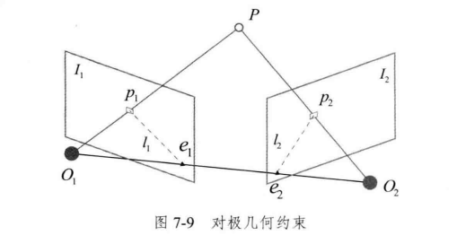
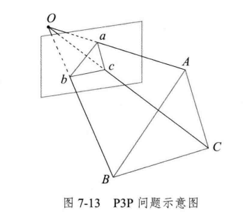
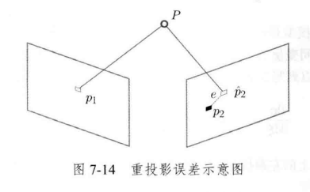

# 视觉SLAM十四讲笔记

## 第七讲 - 视觉里程计 1

### 7.1 特征点法 (以ORB特征为例)

#### 特征点介绍

-   特质
    -   可重复性
    -   可区别性
    -   高效率
    -   本地性
-   特征点组成
    -   关键点 Key-Point, 特征点在图像中的位置
    -   描述子 Descriptor, 描述了关键点周围像素的信息
        -   外观相思的特征应该有相似的描述子
-   经典的特征点
    -   SIFT, (Scale-Invariant Feature Transform)
        -   尺度不变特征变换
        -   计算量大
    -   SURF
    -   FAST 关键点
        -   没有描述子
    -   ORB, (Oriented FAST and Rotated BRIEF)
        -   改进了FAST检测子没有方向性的问题
        -   速度极快的二进制描述子BRIEF (Binary Robust Independent Elementary Feature)

#### ORB特征

ORB特征的组成

-   关键点 - Oriented FAST

    -   改进的FAST角点, 提供了特征点的主方向

    -   只比较像素与领域的亮度大小

    -   FAST 提取步骤

        1.  在图像中选取像素 $p$, 假设它的亮度为 $I_{p}$ 。
        2.  设置一个阈值 $T$ ( 比如, $I_{p}$ 的 $20 \%$ )。
        3.  以像素 $p$ 为中心，选取半径为 3 的圆上的 16 个像素点。
        4.  假如选取的圆上有连续的 $N$ 个点的亮度大于 $I_{p}+T$ 或小于 $I_{p}-T$, 那么像素 $p$ 可以被 认为是特征点 ( $N$ 通常取 12, 即 FAST-12。其他常用的 $N$ 取值为 9 和 11 , 它们分别被 称为 FAST-9 和 FAST-11)。
            1.  FAST-12 预测试操作, 直接检测1, 5, 9, 13的像素亮度, 只有当这四个中有三个同时大于 $I_{p}+T$ 或小于 $I_{p}-T$, 才有可能为角点, 大大加速了角点检测
            2.  非极大值抑制, 避免角点集中
        5.  循环以上四步, 对每一个像素执行相同的操作。

        

    -   针对FAST角点不具有方向性和尺度的问题, ORB添加了尺度和旋转的描述, 称为Orient FAST

        -   尺度: 在图像金字塔每一层上检测角点, 匹配不同层的特征来实现尺度变化比如前进或后退时的特征匹配

        -   旋转: 灰度质心法 Intensity Centroid, 计算特征点附近的图像灰度质心

            1.  在一个小的图像块B中, 定义图像块的矩为
                $$
                m_{pq} = \sum_{x,y\in B} x^p y^q I(x,y), \quad p,q={0,1}
                $$

            2.  通过矩可以找到图像块的质心:
                $$
                C=\left(\frac{m_{10}}{m_{00}}, \frac{m_{01}}{m_{00}}\right) .
                $$

            3.  连接图像块的几何中心 $O$ 与质心 $C$, 得到一个方向向量 $\overrightarrow{O C}$, 于是特征点的方向可以 定义为
                $$
                \theta=\arctan \left(m_{01} / m_{10}\right) .
                $$

-   描述子 - BRIEF (Binary Robust Independent Elementary Feature)

    -   BRIEF 是一种二进制描述子, 其描述向量由许多个 0 和 1 组成, 这里的 0 和 1 编码了关键点 附近两个随机像素 (比如 $p$ 和 $q$ ) 的大小关系: 如果 $p$ 比 $q$ 大, 则取 1 , 反之就取 0 。如果我们取 了 128 个这样的 $p, q$, 则最后得到 128 维由 $0 、 1$ 组成的向量 ${ }^{[44]}$ 。BRIEF 使用了随机选点的比较, 速度非常快, 而且由于使用了二进制表达, 存储起来也十分方便, 适用于实时的图像匹配。原始 的 BRIEF 描述子不具有旋转不变性, 因此在图像发生旋转时容易丢失。而 ORB 在 FAST 特征点 提取阶段计算了关键点的方向, 所以可以利用方向信息, 计算旋转之后的 “Steer BRIEF” 特征使 ORB 的描述子具有较好的旋转不变性。

#### 特征匹配

-   匹配方式
    -   暴力匹配
        -   测量两幅图所有特征点互相之间的描述子距离，然后排序取最近的点
        -   描述子距离：两个特征之间的相似程度
            -   欧氏距离
            -   汉明距离
                -   针对BRIEF这样二进制描述子，通过记录其不同位数的个数来描述两个特征之间的相似程度
    -   快速近似最近邻 (FLANN)
-   匹配距离
    -   欧式距离
    -   汉明距离, 两个二进制串之间的不同位数的个数

#### 计算机相机运动

根据相机原理和获取的不同匹配点, 分为以下情况来估计相机的运动

-   2D-2D: 单目相机, 两帧图像获取两组2D点,估计运动, 使用**对极几何**
-   3D-3D: 双目/RGB-D/ToF 等深度相机, 两组3D点估计运动, 使用**ICP**
-   3D-2D: 3D投影到2D, 估计相机运动, 使用**PnP**

### 7.2 2D-2D 对极几何

#### 对极约束

-   两帧图像$I_1$, $I_2$
-   第一帧到第二帧的相机运动 $\boldsymbol{R}$, $\boldsymbol{t}$
-   相机中心点 $O_1$, $O_2$
-   空间中 $P$ 点在 $I_1$ 中的投影点 $p_1$, 对应 $I_2$ 中的投影点 $p_2$, 两者通过特征匹配
-   极平面 (Epipolar plane) $O_1O_2P$
-   极点 (Epipoles) $e_1$, $e_2$
-   极线 (Epipolar line) $l_1$, $l_2$

-   基线 $O_1O_2$

-   几何关系

    -    $P$ 的空间位置
         $$
         \boldsymbol{P} = [X,Y,Z]^{\text{T}}
         $$

    -    $\boldsymbol{p}_1$, $\boldsymbol{p}_2$ 像素位置

         -   $\boldsymbol{K}$ 相机内参矩阵
         -   $\boldsymbol{R}$, $\boldsymbol{t}$ 相机运动  

         $$
         s_{1} \boldsymbol{p}_{1}=\boldsymbol{K} \boldsymbol{P}, \quad s_{2} \boldsymbol{p}_{2}=\boldsymbol{K}(\boldsymbol{R} \boldsymbol{P}+\boldsymbol{t})
         $$

    -    尺度意义下相等的齐次坐标, 得到归一化平面上的坐标 $\boldsymbol{x}_1$, $\boldsymbol{x}_2$
         $$
         s \boldsymbol{p} \simeq \boldsymbol{p} 
         
         \\
         
         \boldsymbol{p}_{1} \simeq \boldsymbol{K} \boldsymbol{P}, \quad \boldsymbol{p}_{2} \simeq \boldsymbol{K}(\boldsymbol{R P}+\boldsymbol{t})
         
         \\
         
         \boldsymbol{x}_{1}=\boldsymbol{K}^{-1} \boldsymbol{p}_{1}, \quad \boldsymbol{x}_{2}=\boldsymbol{K}^{-1} \boldsymbol{p}_{2}
         
         \\
         
         \boldsymbol{x}_2 \simeq \boldsymbol{R} \boldsymbol{x}_1 + \boldsymbol{t}
         
         \\
         
         \boldsymbol{t}^{\wedge}\boldsymbol{x}_2 \simeq \boldsymbol{t}^{\wedge}\boldsymbol{R}\boldsymbol{x}_1
         
         \\
         
         \boldsymbol{x}_2^{\text{T}}\boldsymbol{t}^{\wedge}\boldsymbol{x}_2 \simeq \boldsymbol{x}_2^{\text{T}}\boldsymbol{t}^{\wedge}\boldsymbol{R}\boldsymbol{x}_1
         $$

    -    对极约束方程
         $$
         \boldsymbol{x}_2^{\text{T}}\boldsymbol{t}^{\wedge}\boldsymbol{R}\boldsymbol{x}_1 = 0
         
         \\
         
         \boldsymbol{p}_2^{\wedge}\boldsymbol{K}^{-\text{T}}\boldsymbol{t}^{\wedge}\boldsymbol{R}\boldsymbol{K}^{-1}\boldsymbol{p}_1 = 0
         $$

    -    基础矩阵 $\boldsymbol{F}$ 和本质矩阵 $\boldsymbol{E}$

         -   本质矩阵（Essential Matrix） $\boldsymbol{E} = \boldsymbol{t}^{\wedge}\boldsymbol{R}$ 
         -   基础矩阵（Fundamental Matrix） $\boldsymbol{F} = \boldsymbol{K}^{-\text{T}}\boldsymbol{E}\boldsymbol{K}^{-1}$ 
         -   对极约束 $\boldsymbol{x}_2^{\text{T}}\boldsymbol{E}\boldsymbol{x}_1 = \boldsymbol{p}_2^{\text{T}}\boldsymbol{F}\boldsymbol{p}_1 = 0$

    -    对极约束求解相机位置估计问题步骤

         1.  根据配对点像素位置求出 $\boldsymbol{E}$ 或 $\boldsymbol{F}$
             1.  八点法
         2.  根据 $\boldsymbol{E}$ 或 $\boldsymbol{F}$ 求出 $\boldsymbol{R}$ , $\boldsymbol{t}$
             1.  SVD求解

#### 本质矩阵 Essential Matrix

-   本质矩阵 $\boldsymbol{E} = \boldsymbol{t}^{\wedge}\boldsymbol{R} \in \R^{3x3}$

-   本质矩阵性质

    -   $\boldsymbol{E}$ 在不同尺度下等价, 即乘以任意非零常数, 对极约束仍然满足
    -   $\boldsymbol{E}$ 的奇异值形式为 $[\sigma, \sigma, 0]^{\text{T}}$
    -   $\boldsymbol{t}^{\wedge}\boldsymbol{R}$ 平移加旋转6个自由度, 但考虑尺度等价性, 实际是5个自由度, 表明最少五个点可以求解 $\boldsymbol{E}$, 但一般用**八点法**来求解. 

-   八点法求解本质矩阵 $\boldsymbol{E}$

    -   考虑一对匹配点, 归一化坐标为 $\boldsymbol{x}_{1}=\left[u_{1}, v_{1}, 1\right]^{\mathrm{T}}, \boldsymbol{x}_{2}=\left[u_{2}, v_{2}, 1\right]^{\mathrm{T}}$ 

    -   根据对极约束
        $$
        \left(u_{2}, v_{2}, 1\right)\left(\begin{array}{ccc}
        e_{1} & e_{2} & e_{3} \\
        e_{4} & e_{5} & e_{6} \\
        e_{7} & e_{8} & e_{9}
        \end{array}\right)\left(\begin{array}{c}
        u_{1} \\
        v_{1} \\
        1
        \end{array}\right)=0
        $$

    -   把矩阵 $\boldsymbol{E}$ 展开为向量形式
        $$
        \boldsymbol{e}=\left[e_{1}, e_{2}, e_{3}, e_{4}, e_{5}, e_{6}, e_{7}, e_{8}, e_{9}\right]^{\mathrm{T}}
        $$

    -   对极约束写为关于 $\boldsymbol{e}$ 的线性形式
        $$
        \left[u_{2} u_{1}, u_{2} v_{1}, u_{2}, v_{2} u_{1}, v_{2} v_{1}, v_{2}, u_{1}, v_{1}, 1\right] \cdot \boldsymbol{e}=0
        $$

    -   加入其他点
        $$
        \left(\begin{array}{ccccccccc}
        u_{2}^{1} u_{1}^{1} & u_{2}^{1} v_{1}^{1} & u_{2}^{1} & v_{2}^{1} u_{1}^{1} & v_{2}^{1} v_{1}^{1} & v_{2}^{1} & u_{1}^{1} & v_{1}^{1} & 1 \\
        u_{2}^{2} u_{1}^{2} & u_{2}^{2} v_{1}^{2} & u_{2}^{2} & v_{2}^{2} u_{1}^{2} & v_{2}^{2} v_{1}^{2} & v_{2}^{2} & u_{1}^{2} & v_{1}^{2} & 1 \\
        \vdots & \vdots & \vdots & \vdots & \vdots & \vdots & \vdots & \vdots & \\
        u_{2}^{8} u_{1}^{8} & u_{2}^{8} v_{1}^{8} & u_{2}^{8} & v_{2}^{8} u_{1}^{8} & v_{2}^{8} v_{1}^{8} & v_{2}^{8} & u_{1}^{8} & v_{1}^{8} & 1
        \end{array}\right)\left(\begin{array}{l}
        e_{1} \\
        e_{2} \\
        e_{3} \\
        e_{4} \\
        e_{5} \\
        e_{6} \\
        e_{7} \\
        e_{8} \\
        e_{9}
        \end{array}\right)=0
        $$

    -   8对匹配点组成的矩阵满足秩为8时, 能解得 $\boldsymbol{e}$ , 通过奇异值分解恢复出 $\boldsymbol{R}, \boldsymbol{t}$
        $$
        \boldsymbol{E}=\boldsymbol{U} \boldsymbol{\Sigma} \boldsymbol{V}^{\mathrm{T}}
        $$

    -   其中 $\boldsymbol{U}, \boldsymbol{V}$ 为正交阵, $\boldsymbol{\Sigma}$ 为奇异值矩阵。根据 $\boldsymbol{E}$ 的内在性质, 我们知道 $\boldsymbol{\Sigma}=\operatorname{diag}(\sigma, \sigma, 0)$ 。在 SVD 分解中, 对于任意一个 $E$, 存在四个可能的 $t, R$ 与它对应
        $$
        \begin{aligned}
        \boldsymbol{t}_{1}^{\wedge} &=\boldsymbol{U} \boldsymbol{R}_{Z}\left(\frac{\pi}{2}\right) \boldsymbol{\Sigma} \boldsymbol{U}^{\mathrm{T}}, \quad \boldsymbol{R}_{1}=\boldsymbol{U} \boldsymbol{R}_{Z}^{\mathrm{T}}\left(\frac{\pi}{2}\right) \boldsymbol{V}^{\mathrm{T}} 
        
        \\
        
        \boldsymbol{t}_{2}^{\wedge} &=\boldsymbol{U} \boldsymbol{R}_{Z}\left(-\frac{\pi}{2}\right) \boldsymbol{\Sigma} \boldsymbol{U}^{\mathrm{T}}, \quad \boldsymbol{R}_{2}=\boldsymbol{U} \boldsymbol{R}_{Z}^{\mathrm{T}}\left(-\frac{\pi}{2}\right) \boldsymbol{V}^{\mathrm{T}}
        
        \\
        
        \boldsymbol{t}_3^{\wedge} &= -\boldsymbol{U} \boldsymbol{R}_{Z}\left(\frac{\pi}{2}\right) \boldsymbol{\Sigma} \boldsymbol{U}^{\mathrm{T}}
        
        \\ 
        
        \boldsymbol{t}_4^{\wedge} &= -\boldsymbol{U} \boldsymbol{R}_{Z}\left(-\frac{\pi}{2}\right) \boldsymbol{\Sigma} \boldsymbol{U}^{\mathrm{T}}
        
        \end{aligned}
        $$
        

    -   **只有第一种解中, $P$ 点的深度值在两个相机中都为正, 所以只有一个解**

    -   如果根据线性方程解出的 $\boldsymbol{E}$ 不满足其应有的内在性质, 即如果 $\boldsymbol{E}$ 的奇异值不为 $\sigma, \sigma, 0$ 的形式, 那么则对其奇异值矩阵 $\text{diag}(\sigma_1, \sigma_2, \sigma_3), \sigma_1 \geq \sigma_2 \geq \sigma_3$ 做如下处理
        $$
        \boldsymbol{E}=\boldsymbol{U} \operatorname{diag}\left(\frac{\sigma_{1}+\sigma_{2}}{2}, \frac{\sigma_{1}+\sigma_{2}}{2}, 0\right) \boldsymbol{V}^{\mathrm{T}}
        $$

    -   由于 $\boldsymbol{E}$ 具有尺度不变性, 所以直接设置为 $\text{diag}(1,1,0)$ 同样可行

        

#### 单应矩阵 Homography Matrix

-   **单应矩阵描述了两个平面之间的映射关系**. 如果场景中的特征点在同一平面上, 则可以通过单应性进行运动估计

-   假设图像 $\boldsymbol{I}_1$, $\boldsymbol{I}_2$ 有一对匹配好的特征点 $p_1, p_2$, 对应平面 $P$ 上, 该平面满足方程
    $$
    \boldsymbol{n}^{\text{T}}\boldsymbol{P} + d = 0
    
    \\
    
    \frac{\boldsymbol{n}^{\text{T}}\boldsymbol{P}}{d} = 1
    $$

-   代入 $\boldsymbol{p}_2$
    $$
    \begin{aligned}
    \boldsymbol{p}_{2} & \simeq \boldsymbol{K}(\boldsymbol{R P}+\boldsymbol{t}) \\
    & \simeq \boldsymbol{K}\left(\boldsymbol{R P}+\boldsymbol{t} \cdot\left(-\frac{\boldsymbol{n}^{\mathrm{T}} \boldsymbol{P}}{d}\right)\right) \\
    & \simeq \boldsymbol{K}\left(\boldsymbol{R}-\frac{\boldsymbol{t} \boldsymbol{n}^{\mathrm{T}}}{d}\right) \boldsymbol{P} \\
    & \simeq \boldsymbol{K}\left(\boldsymbol{R}-\frac{\boldsymbol{t} \boldsymbol{n}^{\mathrm{T}}}{d}\right) \boldsymbol{K}^{-1} \boldsymbol{p}_{1}
    \end{aligned}
    $$

-   得到
    $$
    \boldsymbol{p}_2 \simeq \boldsymbol{H}\boldsymbol{p}_1
    
    \\
    
    \left(\begin{array}{c}
    u_{2} \\
    v_{2} \\
    1
    \end{array}\right) \simeq\left(\begin{array}{lll}
    h_{1} & h_{2} & h_{3} \\
    h_{4} & h_{5} & h_{6} \\
    h_{7} & h_{8} & h_{9}
    \end{array}\right)\left(\begin{array}{c}
    u_{1} \\
    v_{1} \\
    1
    \end{array}\right) .
    $$

-   自由度为8的单应矩阵可以通过4对不共线(三点不共线)的匹配特征点求解以下线性方程组
    $$
    \left(\begin{array}{cccccccc}
    u_{1}^{1} & v_{1}^{1} & 1 & 0 & 0 & 0 & -u_{1}^{1} u_{2}^{1} & -v_{1}^{1} u_{2}^{1} \\
    0 & 0 & 0 & u_{1}^{1} & v_{1}^{1} & 1 & -u_{1}^{1} v_{2}^{1} & -v_{1}^{1} v_{2}^{1} \\
    u_{1}^{2} & v_{1}^{2} & 1 & 0 & 0 & 0 & -u_{1}^{2} u_{2}^{2} & -v_{1}^{2} u_{2}^{2} \\
    0 & 0 & 0 & u_{1}^{2} & v_{1}^{2} & 1 & -u_{1}^{2} v_{2}^{2} & -v_{1}^{2} v_{2}^{2} \\
    u_{1}^{3} & v_{1}^{3} & 1 & 0 & 0 & 0 & -u_{1}^{3} u_{2}^{3} & -v_{1}^{3} u_{2}^{3} \\
    0 & 0 & 0 & u_{1}^{3} & v_{1}^{3} & 1 & -u_{1}^{3} v_{2}^{3} & -v_{1}^{3} v_{2}^{3} \\
    u_{1}^{4} & v_{1}^{4} & 1 & 0 & 0 & 0 & -u_{1}^{4} u_{2}^{4} & -v_{1}^{4} u_{2}^{4} \\
    0 & 0 & 0 & u_{1}^{4} & v_{1}^{4} & 1 & -u_{1}^{4} v_{2}^{4} & -v_{1}^{4} v_{2}^{4}
    \end{array}\right)\left(\begin{array}{l}
    h_{1} \\
    h_{2} \\
    h_{3} \\
    h_{4} \\
    h_{5} \\
    h_{6} \\
    h_{7} \\
    h_{8}
    \end{array}\right)=\left(\begin{array}{c}
    u_{2}^{1} \\
    v_{2}^{1} \\
    u_{2}^{2} \\
    v_{2}^{2} \\
    u_{2}^{3} \\
    v_{2}^{3} \\
    u_{2}^{4} \\
    v_{2}^{4}
    \end{array}\right)
    $$

-   求解单应矩阵同样需要分解得到 $\boldsymbol{R}, \boldsymbol{t}$, 同时通过判断正的深度值和已知平面法向量来得到最终运动估计

-   **当特征点共面或相机发生纯旋转时, 基础矩阵的自由度下降, 即退化现象, 噪声会对多余的自由度起到决定作用**. 一般会同时估计基础矩阵 $\boldsymbol{F}$ 与 单应矩阵 $\boldsymbol{H}$, 选择重投影误差小的作为最终的运动估计矩阵

### 7.3 实践: 2D-2D 对极约束求解相机运动

#### 尺度不确定性

-   对 $\boldsymbol{t}$ 的归一化导致了单目视觉的尺度不确定性
-   单目SLAM需要初始化, 两张图像必须有平移, 之后的轨迹与地图都以此平移为单位

#### 初始化的纯旋转问题

-   如果相机发生纯旋转, 导致 $\boldsymbol{t}$ 为零, 那么 $\boldsymbol{E}$ 也为零, 无法求解 $\boldsymbol{R}$, 此时可以根据 $\boldsymbol{H}$ 求得旋转, 但仍然无法估计特征点的空间位置, 所以单目初始化不能只有纯旋转, 必须要有平移.

#### 多于8点的情况

-   通过最小二乘求解
    $$
    \boldsymbol{A} \boldsymbol{e} = 0
    
    \\
    
    \min _{\boldsymbol{e}}\|\boldsymbol{A} \boldsymbol{e}\|_{2}^{2}=\min _{\boldsymbol{e}} \boldsymbol{e}^{\mathrm{T}} \boldsymbol{A}^{\mathrm{T}} \boldsymbol{A} \boldsymbol{e} .
    $$

-   当可能存在误匹配时, 使用RANSAC (随机采样一致性, Random Sample Concensus) 求解

### 7.4 三角测量

-   考虑图像 $I_{1}$ 和 $I_{2}$, 以左图为参考, 右图的变换矩阵为 $\boldsymbol{T}$ 。相机光心为 $O_{1}$ 和 $O_{2}$ 。在 $I_{1}$ 中有特征点 $p_{1}$, 对应 $I_{2}$ 中有特征点 $p_{2}$ 。理论上, 直线 $O_{1} p_{1}$ 与 $O_{2} p_{2}$ 在场景中会相交 于一点 $P$, 该点即两个特征点所对应的地图点在三维场景中的位置。然而由于噪声的影响, 这两条直线往往无法相交。因此, 可以通过最小二乘法求解。设 $\boldsymbol{x_1}, \boldsymbol{x_2}$ 为两个特征点的归一化坐标,
    $$
    s_{2} \boldsymbol{x}_{2}=s_{1} \boldsymbol{R} \boldsymbol{x}_{1}+\boldsymbol{t}
    
    \\
    
    s_{2} \boldsymbol{x}_{2}^{\wedge} \boldsymbol{x}_{2}=0=s_{1} \boldsymbol{x}_{2}^{\wedge} \boldsymbol{R} \boldsymbol{x}_{1}+\boldsymbol{x}_{2}^{\wedge} \boldsymbol{t}
    $$

    -   根据上式可以直接求解 $s_1$, $s_2$
    -   由于噪声, 更常见通过最小二乘求解

-   三角测量注意事项

    -   三角测量需要平移, 纯旋转无法得到三角测量
    -   平移量越大, 三角测量精度越高, 但会导致图像外观发生明显变化, 使得特征匹配变得困难, 称之为视差 (parallax) 问题
    -   单目视觉中, 通过几帧之后有足够平移的数据进行三角化, 称为延迟三角化

### 7.5 3D-2D: PnP法

#### PnP法简介

-   3D-2D PnP法 与 2D-2D 对极几何的比较 
    -   2D-2D 需要八个点以上才能估计相机位姿变化, 且存在初始化, 纯旋转, 尺度等问题. 如果两个图中其中一张图的3D位置已知, 最少只需要三对点就可以估计相机运动. 特征点的3D位置可以通过三角化或RGB-D相机深度值确定. 所以在双目或RGB-D相机的视觉里程计中, 可以直接使用3D-2D 的 PnP法估计相机运动.

-   PnP法的求解方法
    -   三对点估计位置 P3P
    -   直接线性变换 DLT
    -   EPnP (Efficient PnP)
    -   UPnP
    -   光束法平差 Bundle Adjustment BA

#### 直接线性变换法 DLT

-   问题: 已知一组3D点, 以及他们在相机中的投影位置, 求相机位姿

-   考虑某个空间点 $P$, 它的齐次坐标为 $\boldsymbol{P}=(X, Y, Z, 1)^{\mathrm{T}}$ 。在图像 $I_{1}$ 中, 投影到特征点 $\boldsymbol{x}_{1}=$ $\left(u_{1}, v_{1}, 1\right)^{\mathrm{T}}$ (以归一化平面齐次坐标表示)。此时, 相机的位姿 $\boldsymbol{R}, \boldsymbol{t}$ 是末知的。与单应矩阵的求解类似, 我们定义增广矩阵 $[\boldsymbol{R} \mid \boldsymbol{t}]$ 为一个 $3 \times 4$ 的矩阵, 包含了旋转与平移信息, 我们将其展开形式列写如下:
    $$
    s\left(\begin{array}{c}
    u_{1} \\
    v_{1} \\
    1
    \end{array}\right)=\left(\begin{array}{cccc}
    t_{1} & t_{2} & t_{3} & t_{4} \\
    t_{5} & t_{6} & t_{7} & t_{8} \\
    t_{9} & t_{10} & t_{11} & t_{12}
    \end{array}\right)\left(\begin{array}{l}
    X \\
    Y \\
    Z \\
    1
    \end{array}\right)
    
    \\
    \\
    
    u_{1}=\frac{t_{1} X+t_{2} Y+t_{3} Z+t_{4}}{t_{9} X+t_{10} Y+t_{11} Z+t_{12}}, \quad v_{1}=\frac{t_{5} X+t_{6} Y+t_{7} Z+t_{8}}{t_{9} X+t_{10} Y+t_{11} Z+t_{12}}
    
    \\
    \\
    
    \boldsymbol{t}_{1}=\left(t_{1}, t_{2}, t_{3}, t_{4}\right)^{\mathrm{T}}, \boldsymbol{t}_{2}=\left(t_{5}, t_{6}, t_{7}, t_{8}\right)^{\mathrm{T}}, \boldsymbol{t}_{3}=\left(t_{9}, t_{10}, t_{11}, t_{12}\right)^{\mathrm{T}}
    
    \\
    \\
    
    \boldsymbol{t}_{1}^{\mathrm{T}} \boldsymbol{P}-\boldsymbol{t}_{3}^{\mathrm{T}} \boldsymbol{P} u_{1}=0,\quad \boldsymbol{t}_{2}^{\mathrm{T}} \boldsymbol{P}-\boldsymbol{t}_{3}^{\mathrm{T}} \boldsymbol{P} v_{1}=0
    
    \\
    \\
    
    \left(\begin{array}{ccc}
    \boldsymbol{P}_{1}^{\mathrm{T}} & 0 & -u_{1} \boldsymbol{P}_{1}^{\mathrm{T}} \\
    0 & \boldsymbol{P}_{1}^{\mathrm{T}} & -v_{1} \boldsymbol{P}_{1}^{\mathrm{T}} \\
    \vdots & \vdots & \vdots \\
    \boldsymbol{P}_{N}^{\mathrm{T}} & 0 & -u_{N} \boldsymbol{P}_{N}^{\mathrm{T}} \\
    0 & \boldsymbol{P}_{N}^{\mathrm{T}} & -v_{N} \boldsymbol{P}_{N}^{\mathrm{T}}
    \end{array}\right)\left(\begin{array}{l}
    \boldsymbol{t}_{1} \\
    \boldsymbol{t}_{2} \\
    \boldsymbol{t}_{3}
    \end{array}\right)=0 .
    $$

-   $\boldsymbol{t}$ 一共12维, 最少通过6对匹配点实现矩阵 $\boldsymbol{T}$ 的线性求解, 称为直接线性转换DLT, 当匹配点大于6对时, 也可以使用SVD法对超定方程求最小二乘解

-   DLT求解时没有考虑 $\boldsymbol{T}$ 中元素互相之间的联系. 对于其中的旋转矩阵 $\boldsymbol{R}$, 我们要找出一个最好的旋转矩阵对它近似, 通过QR分解完成, 或通过以下方法:
    $$
    \boldsymbol{R} \leftarrow\left(\boldsymbol{R} \boldsymbol{R}^{\mathrm{T}}\right)^{-\frac{1}{2}} \boldsymbol{R}
    $$

####  P3P法

-   P3P 需要三对 3D-2D 匹配点
    -   3D点：ABC 世界坐标系中的坐标
    -   2D点：abc 图像坐标系中的坐标
    -   还需要一对验证点 D-d

-   P3P 示意图

-   推导

$$
\Delta O a b-\Delta O A B, \quad \Delta O b c-\Delta O B C, \quad \Delta O a c-\Delta O A C

\\
\\

\begin{aligned}
&O A^{2}+O B^{2}-2 O A \cdot O B \cdot \cos \langle a, b\rangle=A B^{2} \\
&O B^{2}+O C^{2}-2 O B \cdot O C \cdot \cos \langle b, c\rangle=B C^{2} \\
&O A^{2}+O C^{2}-2 O A \cdot O C \cdot \cos \langle a, c\rangle=A C^{2}
\end{aligned}

\\
\\

x=O A / O C, y=O B / O C

\\
\\

\begin{aligned}
&x^{2}+y^{2}-2 x y \cos \langle a, b\rangle=A B^{2} / O C^{2} \\
&y^{2}+1^{2}-2 y \cos \langle b, c\rangle=B C^{2} / O C^{2} \\
&x^{2}+1^{2}-2 x \cos \langle a, c\rangle=A C^{2} / O C^{2}
\end{aligned}

\\
\\

v=A B^{2} / O C^{2}, u v=B C^{2} / O C^{2}, w v=A C^{2} / O C^{2}

\\
\\

\begin{aligned}
&x^{2}+y^{2}-2 x y \cos \langle a, b\rangle-v=0 \\
&y^{2}+1^{2}-2 y \cos \langle b, c\rangle-u v=0 \\
&x^{2}+1^{2}-2 x \cos \langle a, c\rangle-w v=0
\end{aligned}

\\
\\

\begin{aligned}
&(1-u) y^{2}-u x^{2}-\cos \langle b, c\rangle y+2 u x y \cos \langle a, b\rangle+1=0 \\
&(1-w) x^{2}-w y^{2}-\cos \langle a, c\rangle x+2 w x y \cos \langle a, b\rangle+1=0
\end{aligned}
$$

-   已知量
    -   通过2D图像位置获取三个余弦角
        -    $\cos{<a, b>},\cos{<b,c>},\cos{<a,c>}$
    -   通过世界坐标系获取 $u, w$
        -   $u=B C^{2} / A B^{2}, w=A C^{2} / A B^{2}$

-   通过吴消元法获得P3P的解析解, 最多可能有4个解, 通过验证点来计算最可能的解
-   缺点
    -   P3P只能利用三个点的信息, 当配对点多于三组, 难以利用更多信息
    -   3D 或 2D点受噪声影响或误匹配, 算法失效
-   SLAM 中通常通过P3P/EPnP 估计相机位姿, 然后构建最小二乘优化问题进行优化, 即**Bundle Adjustment**

#### 最小化重投影误差求解PnP (BA, Bundle Adjustment)

-   把相机位姿和空间点的三维坐标放在一起进行最小化的问题, 统称为 Bundle Adjustment. 

    

-   构建最小二乘问题, 寻找最好的相机位姿 $\boldsymbol{T}$
    $$
    s_{i}\left[\begin{array}{c}u_{i} \\ v_{i} \\ 1\end{array}\right]=\boldsymbol{K} \boldsymbol{T}\left[\begin{array}{c}X_{i} \\ Y_{i} \\ Z_{i} \\ 1\end{array}\right]
    
    \\
    \\
    
    s_{i} \boldsymbol{u}_{i}=\boldsymbol{K} \boldsymbol{T} \boldsymbol{P}_{i}
    
    \\
    \\
    
    \boldsymbol{T}^{*}=\arg \min _{\boldsymbol{T}} \frac{1}{2} \sum_{i=1}^{n}\left\|\boldsymbol{u}_{i}-\frac{1}{s_{i}} \boldsymbol{K} \boldsymbol{T} \boldsymbol{P}_{i}\right\|_{2}^{2}
    $$

-   误差项关于优化变量的导数
    $$
    \boldsymbol{e}(\boldsymbol{x}+\Delta \boldsymbol{x}) \approx \boldsymbol{e}(\boldsymbol{x}) + \boldsymbol{J}^{\mathrm{T}} \Delta \boldsymbol{x}
    $$

-   求重投影误差项关于相机位姿李代数的导数 $\frac{\part \boldsymbol{e}}{\part{\delta \boldsymbol{\xi}}}$ 
    $$
    \boldsymbol{P}^{\prime}=(\boldsymbol{T} \boldsymbol{P})_{1: 3}=\left[X^{\prime}, Y^{\prime}, Z^{\prime}\right]^{\mathrm{T}}
    
    \\
    \\
    
    \boldsymbol{s} \boldsymbol{u} = \boldsymbol{K} \boldsymbol{P}^{\prime}
    
    \\
    \\
    
    \left[\begin{array}{l}
    s u \\
    s v \\
    s
    \end{array}\right]=\left[\begin{array}{ccc}
    f_{x} & 0 & c_{x} \\
    0 & f_{y} & c_{y} \\
    0 & 0 & 1
    \end{array}\right]\left[\begin{array}{l}
    X^{\prime} \\
    Y^{\prime} \\
    Z^{\prime}
    \end{array}\right]
    
    \\
    \\
    
    u=f_{x} \frac{X^{\prime}}{Z^{\prime}}+c_{x}, \quad v=f_{y} \frac{Y^{\prime}}{Z^{\prime}}+c_{y} 
    
    \\
    \\
    
    \frac{\partial \boldsymbol{e}}{\partial \delta \boldsymbol{\xi}}=\lim _{\delta \boldsymbol{\xi} \rightarrow 0} \frac{\boldsymbol{e}(\delta \boldsymbol{\xi} \oplus \boldsymbol{\xi})-\boldsymbol{e}(\boldsymbol{\xi})}{\delta \boldsymbol{\xi}}=\frac{\partial \boldsymbol{e}}{\partial \boldsymbol{P}^{\prime}} \frac{\partial \boldsymbol{P}^{\prime}}{\partial \delta \boldsymbol{\xi}}
    
    \\
    \\
    
    \frac{\partial \boldsymbol{e}}{\partial \boldsymbol{P}^{\prime}}=-\left[\begin{array}{ccc}
    \frac{\partial u}{\partial X^{\prime}} & \frac{\partial u}{\partial Y^{\prime}} & \frac{\partial u}{\partial Z^{\prime}} \\
    \frac{\partial v}{\partial X^{\prime}} & \frac{\partial v}{\partial Y^{\prime}} & \frac{\partial v}{\partial Z^{\prime}}
    \end{array}\right]=-\left[\begin{array}{ccc}
    \frac{f_{x}}{Z^{\prime}} & 0 & -\frac{f_{x} X^{\prime}}{Z^{\prime 2}} \\
    0 & \frac{f_{y}}{Z^{\prime}} & -\frac{f_{y} Y^{\prime}}{Z^{\prime 2}}
    \end{array}\right]
    
    \\
    \\
    
    \frac{\partial(\boldsymbol{T} \boldsymbol{P})}{\partial \delta \boldsymbol{\xi}}=(\boldsymbol{T} \boldsymbol{P})^{\odot}=\left[\begin{array}{cc}
    \boldsymbol{I} & -\boldsymbol{P}^{\prime \wedge} \\
    \mathbf{0}^{\mathrm{T}} & \mathbf{0}^{\mathrm{T}}
    \end{array}\right]
    
    \\
    \\
    
    \frac{\partial \boldsymbol{P}^{\prime}}{\partial \delta \boldsymbol{\xi}}=\left[\boldsymbol{I},-\boldsymbol{P}^{\prime \wedge}\right]
    
    \\
    \\
    
    \frac{\partial \boldsymbol{e}}{\partial \delta \boldsymbol{\xi}}=-\left[\begin{array}{cccccc}
    \frac{f_{x}}{Z^{\prime}} & 0 & -\frac{f_{x} X^{\prime}}{Z^{\prime 2}} & -\frac{f_{x} X^{\prime} Y^{\prime}}{Z^{\prime 2}} & f_{x}+\frac{f_{x} X^{\prime 2}}{Z^{\prime 2}} & -\frac{f_{x} Y^{\prime}}{Z^{\prime}} \\
    0 & \frac{f_{y}}{Z^{\prime}} & -\frac{f_{y} Y^{\prime}}{Z^{\prime 2}} & -f_{y}-\frac{f_{y} Y^{\prime 2}}{Z^{\prime 2}} & \frac{f_{y} X^{\prime} Y^{\prime}}{Z^{\prime 2}} & \frac{f_{y} X^{\prime}}{Z^{\prime}}
    \end{array}\right]
    $$

-   重投影误差项关于空间点 $\boldsymbol{P}$ 的导数 $\frac{\part{\boldsymbol{e}}}{\part \boldsymbol{P}}$ 
    $$
    \frac{\partial \boldsymbol{e}}{\partial \boldsymbol{P}}=\frac{\partial \boldsymbol{e}}{\partial \boldsymbol{P}^{\prime}} \frac{\partial \boldsymbol{P}^{\prime}}{\partial \boldsymbol{P}}
    
    \\
    \\
    
    \boldsymbol{P}^{\prime}=(\boldsymbol{T} \boldsymbol{P})_{1: 3}=\boldsymbol{R} \boldsymbol{P}+\boldsymbol{t}
    
    \\
    \\
    
    \frac{\partial \boldsymbol{e}}{\partial \boldsymbol{P}}=-\left[\begin{array}{ccc}
    \frac{f_{x}}{Z^{\prime}} & 0 & -\frac{f_{x} X^{\prime}}{Z^{\prime 2}} \\
    0 & \frac{f_{y}}{Z^{\prime}} & -\frac{f_{y} Y^{\prime}}{Z^{\prime 2}}
    \end{array}\right] \boldsymbol{R}
    $$

### 7.6 实践: 求解3D-2D PnP

#### 通过 OpenCV 求解EPnP

#### 通过手写高斯牛顿法进行BA非线性优化

$$
\boldsymbol{T}^{*}=\arg \min _{\boldsymbol{T}} \frac{1}{2} \sum_{i=1}^{n}\left\|\boldsymbol{u}_{i}-\frac{1}{s_{i}} \boldsymbol{K} \boldsymbol{T} \boldsymbol{P}_{i}\right\|_{2}^{2}

\\
\\

\boldsymbol{e}(\boldsymbol{x}) = \sum_{i=1}^{n}\left\|\boldsymbol{u}_{i}-\frac{1}{s_{i}} \boldsymbol{K} \boldsymbol{T} \boldsymbol{P}_{i}\right\|_{2}^{2}

\\
\\

\boldsymbol{e}(\boldsymbol{x}+\Delta \boldsymbol{x}) \approx \boldsymbol{e}(\boldsymbol{x})+\boldsymbol{J}^{\mathrm{T}} \Delta \boldsymbol{x}

\\
\\

\boldsymbol{J}^{\text{T}} =  \frac{\partial \boldsymbol{e}}{\partial \delta \boldsymbol{\xi}}=-\left[\begin{array}{ccrrrr}
\frac{f_{x}}{Z^{\prime}} & 0 & -\frac{f_{x} X^{\prime}}{Z^{\prime 2}} & -\frac{f_{x} X^{\prime} Y^{\prime}}{Z^{\prime 2}} & f_{x}+\frac{f_{x} X^{\prime 2}}{Z^{\prime 2}} & -\frac{f_{x} Y^{\prime}}{Z^{\prime}} \\
0 & \frac{f_{y}}{Z^{\prime}} & -\frac{f_{y} Y^{\prime}}{Z^{\prime 2}} & -f_{y}-\frac{f_{y} Y^{\prime 2}}{Z^{\prime 2}} & \frac{f_{y} X^{\prime} Y^{\prime}}{Z^{\prime 2}} & \frac{f_{y} X^{\prime}}{Z^{\prime}}
\end{array}\right] 

\\
\\

\boldsymbol{J}\boldsymbol{J}^{\text{T}} \Delta \boldsymbol{x} = - \boldsymbol{J} \boldsymbol{e}(\boldsymbol{x})

\\
\\
$$

#### 通过G2O 进行BA非线性优化

-   顶点: 第二个相机的位姿节点 $\boldsymbol{T} \in \mathrm{SE}(3)$ 。需要实现顶点的更新

2. 边: 每个 $3 \mathrm{D}$ 点在第二个相机中的投影, 以观测方程来描述如下. 需要实现边的误差计算和雅可比矩阵.

$$
\boldsymbol{z}_{j}=h\left(\boldsymbol{T}, \boldsymbol{P}_{j}\right) .
$$

### 7.7 3D-3D: ICP法 (Iterative Closest Point)

-   问题描述: 对一组匹配好的3D点寻找欧氏变换
    $$
    \forall i, \boldsymbol{p}_{i}=\boldsymbol{R} \boldsymbol{p}_{i}^{\prime}+\boldsymbol{t}
    $$

#### SVD法求解ICP

-   误差项
    $$
    \boldsymbol{e}_{i}=\boldsymbol{p}_{i}-\left(\boldsymbol{R} \boldsymbol{p}_{i}^{\prime}+\boldsymbol{t}\right)
    $$

-   构建关于 $\boldsymbol{R}$ 的最小二乘问题

$$
\min _{\boldsymbol{R}, \boldsymbol{t}} \frac{1}{2} \sum_{i=1}^{n}\left\|\left(\boldsymbol{p}_{i}-\left(\boldsymbol{\boldsymbol { R } _ { \boldsymbol { i } }}{ }^{\prime}+\boldsymbol{t}\right)\right)\right\|_{2}^{2}

\\
\\

\boldsymbol{p}=\frac{1}{n} \sum_{i=1}^{n}\left(\boldsymbol{p}_{i}\right), \quad \boldsymbol{p}^{\prime}=\frac{1}{n} \sum_{i=1}^{n}\left(\boldsymbol{p}_{i}^{\prime}\right)

\\
\\

\min _{\boldsymbol{R}, \boldsymbol{t}} J=\frac{1}{2} \sum_{i=1}^{n}\left\|\boldsymbol{p}_{i}-\boldsymbol{p}-\boldsymbol{R}\left(\boldsymbol{p}_{i}^{\prime}-\boldsymbol{p}^{\prime}\right)\right\|^{2}+\left\|\boldsymbol{p}-\boldsymbol{R} \boldsymbol{p}^{\prime}-\boldsymbol{t}\right\|^{2}

\\
\\

\boldsymbol{q}_{i}=\boldsymbol{p}_{i}-\boldsymbol{p}, \quad \boldsymbol{q}_{i}^{\prime}=\boldsymbol{p}_{i}^{\prime}-\boldsymbol{p}^{\prime}

\\
\\

\boldsymbol{R}^{*}=\arg \min _{\boldsymbol{R}} \frac{1}{2} \sum_{i=1}^{n}\left\|\boldsymbol{q}_{i}-\boldsymbol{R} \boldsymbol{q}_{i}^{\prime}\right\|^{2}

\\
\\

\boldsymbol{t}^{*}=\boldsymbol{p}-\boldsymbol{R} \boldsymbol{p}^{\prime}

\\
\\

\frac{1}{2} \sum_{i=1}^{n}\left\|\boldsymbol{q}_{i}-\boldsymbol{R} \boldsymbol{q}_{i}^{\prime}\right\|^{2}=\frac{1}{2} \sum_{i=1}^{n}\left(\boldsymbol{q}_{i}^{\mathrm{T}} \boldsymbol{q}_{i}+\boldsymbol{q}_{i}^{\prime \mathrm{T}} \boldsymbol{R}^{\mathrm{T}} \boldsymbol{R} \boldsymbol{q}_{i}^{\prime}-2 \boldsymbol{q}_{i}^{\mathrm{T}} \boldsymbol{R} \boldsymbol{q}_{i}^{\prime}\right)

\\
\\

\sum_{i=1}^{n}-\boldsymbol{q}_{i}^{\mathrm{T}} \boldsymbol{R} \boldsymbol{q}_{i}^{\prime}=\sum_{i=1}^{n}-\operatorname{tr}\left(\boldsymbol{R} \boldsymbol{q}_{i}^{\prime} \boldsymbol{q}_{i}^{\mathrm{T}}\right)=-\operatorname{tr}\left(\boldsymbol{R} \sum_{i=1}^{n} \boldsymbol{q}_{i}^{\prime} \boldsymbol{q}_{i}^{\mathrm{T}}\right)
$$

-   通过SVD分解求解 $\boldsymbol{R}$
    $$
    \boldsymbol{W}=\sum_{i=1}^{n} \boldsymbol{q}_{i} \boldsymbol{q}_{i}^{\prime \mathrm{T}}
    
    \\
    \\
    
    \boldsymbol{W}=\boldsymbol{U} \boldsymbol{\Sigma} \boldsymbol{V}^{\mathrm{T}}
    
    \\
    \\
    
    \boldsymbol{R}=\boldsymbol{U} \boldsymbol{V}^{\mathrm{T}}
    $$

-   当 $\boldsymbol{R}$ 的行列式为负, 则取 $-\boldsymbol{R}$

-   根据下式求 $\boldsymbol{t}$
    $$
    \boldsymbol{t}^{*}=\boldsymbol{p}-\boldsymbol{R} \boldsymbol{p}^{\prime}
    $$

#### BA非线性优化法求解ICP

-   3D-3D的非线性优化问题类似3D-2D 求解PnP问题

$$
\min _{\boldsymbol{\xi}}=\frac{1}{2} \sum_{i=1}^{n}\left\|\left(\boldsymbol{p}_{i}-\exp \left(\boldsymbol{\xi}^{\wedge}\right) \boldsymbol{p}_{i}^{\prime}\right)\right\|_{2}^{2}

\\
\\

\frac{\partial \boldsymbol{e}}{\partial \delta \boldsymbol{\xi}}=-\left(\exp \left(\boldsymbol{\xi}^{\wedge}\right) \boldsymbol{p}_{i}^{\prime}\right)^{\odot}
$$

-   当深度已知时, 建模3D-3D误差, 当深度未知时, 建模3D-2D误差, 从而将3D-3D 与 3D-2D放在同一个优化问题中解决

### CPP Demo

-   orb_cv
    -   本程序为通过 OpenCV 进行图像间的 Orb 特征点匹配
-   orb_self
    -   本程序为手写 Orb 特征点匹配
-   pose_estimation_2d2d 
    -   本程序演示了如何使用 2D-2D 对极几何 的特征匹配估计相机运动
-   triangulation
    -   本程序演示了通过 OpenCV 进行三角测量的方法
-   pose_estimation_3d2d
    -   本程序演示了通过三种方法 解决 3D-2D PnP BA 求解相机位姿问题
        -   通过 OpenCV 求解 PnP
        -   手写高斯牛顿法求解 PnP
        -   使用 G2O 求解 PnP
-   pose_estimation_3d3d
    -   本程序演示了通过 ICP 法以及 非线性优化法（G2O）求解 

