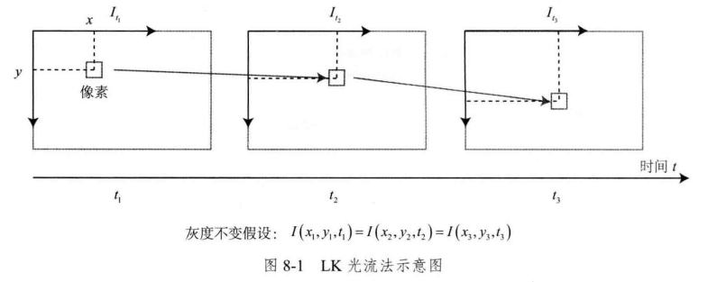
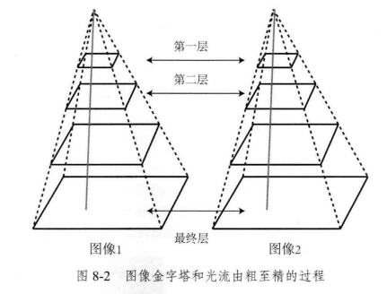
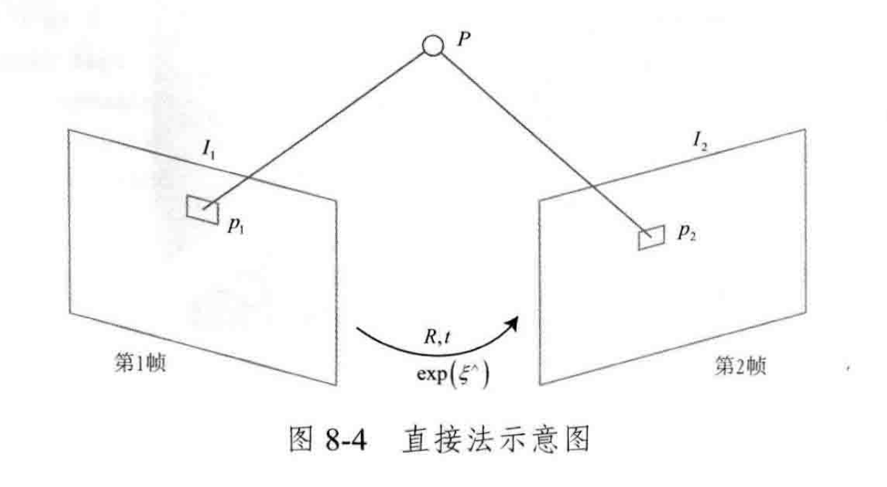

# 视觉SLAM十四讲笔记

## 第八讲 - 视觉里程计 2

### 8.1 直接法的引出

#### 特征点法的缺点

-   关键点, 描述子计算耗时
-   只用特征点抛弃了大量可能有用的图像信息
-   特征缺失时无法找到足够匹配点计算相机运动

#### 克服特征点缺陷的思路

-   保留关键点, 不计算描述子, 使用**光流法**跟踪特征点
    -   仍然通过**最小化重投影误差**(Reporjection error)优化相机运动
    -   仍然需要计算关键点与光流特征
-   保留关键点, 不计算描述子, 使用**直接法**预测下一帧特征点位置
    -   不需要点对点的对应关系, 通过**最小化光度误差**(Photometric error)求得相机运动
    -   根据图像的像素亮度信息同时估计相机运动和点的投影
    -   避免了特征计算时间和特征缺失的情况
    -   直接法可以进行稀疏, 稠密, 半稠密的地图构建

### 8.2 2D光流

##### 光流介绍

-   描述像素随时间在图像间运动的方法
    -   稀疏光流: 计算部分像素
        -   Lucas-Kanade (LK) 光流
    -   稠密光流: 计算所有像素
        -   Horn-Schunck (HS) 光流

##### Lucas-Kanade 光流

-   图像中的像素可以看作关于时间的函数 $I(x,y,t)$

-   灰度不变假设: 同一空间点像素灰度在各个图像中固定不变
    $$
    \boldsymbol{I}(x+\mathrm{d} x, y+\mathrm{d} y, t+\mathrm{d} t)=\boldsymbol{I}(x, y, t)
    $$

-   泰勒展开保留一阶项
    $$
    \boldsymbol{I}(x+\mathrm{d} x, y+\mathrm{d} y, t+\mathrm{d} t) \approx \boldsymbol{I}(x, y, t)+\frac{\partial \boldsymbol{I}}{\partial x} \mathrm{d} x+\frac{\partial \boldsymbol{I}}{\partial y} \mathrm{d} y+\frac{\partial \boldsymbol{I}}{\partial t} \mathrm{d} t 
    
    \\
    \\
    
    \frac{\partial \boldsymbol{I}}{\partial x} \mathrm{d} x+\frac{\partial \boldsymbol{I}}{\partial y} \mathrm{d} y+\frac{\partial \boldsymbol{I}}{\partial t} \mathrm{d} t=0 
    
    \\
    \\
    
    
    \frac{\partial \boldsymbol{I}}{\partial x} \frac{\mathrm{d} x}{\mathrm{d} t}+\frac{\partial \boldsymbol{I}}{\partial y} \frac{\mathrm{d} y}{\mathrm{d} t}=-\frac{\partial \boldsymbol{I}}{\partial t}
    
    \\
    \\
    
    \begin{align}
    \mathrm{像素在x轴上的速度}&: u = \frac{\mathrm{d}x}{\mathrm{d}t} \\ 
    \mathrm{像素在y轴上的速度}&: v = \frac{\mathrm{d}y}{\mathrm{d}t} \\
    \mathrm{像素在该点处x方向的梯度}&: \boldsymbol{I}_x = \frac{\part \boldsymbol{I}}{\part x} \\
    \mathrm{像素在该点处y方向的梯度}&: \boldsymbol{I}_y = \frac{\part \boldsymbol{I}}{\part y}
    \end{align}
    
    \\
    \\
    
    \left[\begin{array}{ll}
    \boldsymbol{I}_x & \boldsymbol{I}_y
    \end{array}\right]\left[\begin{array}{l}
    u \\
    v
    \end{array}\right]=-\boldsymbol{I}_t
    $$

-   LK光流中假设某个窗口内的像素具有相同的运动, 大小为 w x w, 像素数量为 $w^2$
    $$
    \left[\begin{array}{ll}
    \boldsymbol{I}_x & \boldsymbol{I}_y
    \end{array}\right]_k\left[\begin{array}{c}
    u \\
    v
    \end{array}\right]=-\boldsymbol{I}_{t k}, \quad k=1, \ldots, w^2
    
    \\
    \\
    
    \boldsymbol{A}=\left[\begin{array}{c}
    {\left[\boldsymbol{I}_x, \boldsymbol{I}_y\right]_1} \\
    \vdots \\
    {\left[\boldsymbol{I}_x, \boldsymbol{I}_y\right]_k}
    \end{array}\right], \boldsymbol{b}=\left[\begin{array}{c}
    \boldsymbol{I}_{t 1} \\
    \vdots \\
    \boldsymbol{I}_{t k}
    \end{array}\right]
    
    \\
    \\
    
    \boldsymbol{A}\left[\begin{array}{l}
    u \\
    v
    \end{array}\right]=-\boldsymbol{b}
    $$

-   利用最小二乘求解超定线性方程得到**像素在图像间的移动速度** $u, v$ :
    $$
    \left[\begin{array}{l}
    u \\
    v
    \end{array}\right]^* = 
    
    -\left(\boldsymbol{A}^{\mathrm{T}} \boldsymbol{A}\right)^{-1} \boldsymbol{A}^{\mathrm{T}} \boldsymbol{b}
    $$

### 8.3 实践：LK光流

-   OpenCV 调用 cv::calcOpticalFlowPyrLK

-   高斯牛顿法

    $$
    \min _{\Delta x, \Delta y}\left\|\boldsymbol{I}_1(x, y)-\boldsymbol{I}_2(x+\Delta x, y+\Delta y)\right\|_2^2
    
    \\
    \\
    
    
    残差: 
    
    E = \boldsymbol{I}_1(x, y)-\boldsymbol{I}_2(x+\Delta x, y+\Delta y)
    
    \\
    \\
    
    雅可比:
    
    J = -\frac{1}{2} 
    \left[\begin{array}{l}
    \left( \boldsymbol{I}_2(x+\Delta x + 1, y + \Delta y) -  \boldsymbol{I}_2(x+\Delta x - 1, y + \Delta y) \right) \\
     \boldsymbol{I}_2(x+\Delta x, y + \Delta y + 1) -  \boldsymbol{I}_2(x+\Delta x, y + \Delta y - 1)
    \end{array}\right]
    
    \\
    \\
    
    B = -EJ
    
    \\
    
    H = JJ^{\mathrm{T}}
    
    \\
    \\
    
    求解: H\Delta X = B
    $$

    ​    

-   单层

    -   如果相机运动较快, 两帧图像差异明显, 单层图像光流法容易局部最小, 可以引入图像多层金字塔解决

-   多层

    -   由粗至精 (Coarse-to-fine)

    -   当原始图像像素运动较大时, 从顶层看运动仍然在一个较小的范围内

        

### 8.4 直接法

#### 直接法的推导

-   直接法与光流法比较

    -   光流法 两步走方案
        -   先追踪特征点位置
        -   再根据特征点位置确定相机位置
        -   难以保证全局最优性
    -   直接法
        -   通过后一步确定的相机位置, 调整前一步中光流的追踪结果

-   考虑某个空间点 $P$ 和两个时刻的相机。 $P$ 的世界坐标为 $[X, Y, Z]$, 它在两个相机上成像, 记像素坐标为 $\boldsymbol{p}_1, \boldsymbol{p}_2$ 。目标求第一个相机到第二个相机的相对位姿变换, 设第二个相机相对于第一个相机的旋转和平移为 $\boldsymbol{R}, \boldsymbol{t}$, 对应李群 $\boldsymbol{T}$, 相机内参 $\boldsymbol{K}$

    

    -   投影
        $$
        \begin{aligned}
        &\boldsymbol{p}_1=\left[\begin{array}{l}
        u \\
        v \\
        1
        \end{array}\right]_1=\frac{1}{Z_1} \boldsymbol{K} \boldsymbol{P} \\
        \\
        &\boldsymbol{p}_2=\left[\begin{array}{l}
        u \\
        v \\
        1
        \end{array}\right]_2=\frac{1}{Z_2} \boldsymbol{K}(\boldsymbol{R} \boldsymbol{P}+\boldsymbol{t})=\frac{1}{Z_2} \boldsymbol{K}(\boldsymbol{T} \boldsymbol{P})_{1: 3} .
        \end{aligned}
        $$

-   直接法通过当前相机位姿估计值寻找  $\boldsymbol{p}_2$ 的位置, 如果位置不够好, $\boldsymbol{p}_2$ 与 $\boldsymbol{p}_1$ 会有比较明显的图像差别, 通过减小图像差别来优化相机位姿, 寻找与 $\boldsymbol{p}_1$ 更相似的 $\boldsymbol{p}_2$, 这里最小化的是**光度误差**, 通过优化相机位姿 $\boldsymbol{T}$:
    $$
    单个特征点: \min _T J(\boldsymbol{T})=\|e\|^2, e=\boldsymbol{I}_1\left(\boldsymbol{p}_1\right)-\boldsymbol{I}_2\left(\boldsymbol{p}_2\right)
    
    \\
    \\
    
    多个特征点: \min _{\boldsymbol{T}} J(\boldsymbol{T})=\sum_{i=1}^N e_i^T e_i, \quad e_i=\boldsymbol{I}_1\left(\boldsymbol{p}_{1, i}\right)-\boldsymbol{I}_2\left(\boldsymbol{p}_{2, i}\right)
    $$

-   计算误差 $e$ 与相机 $\boldsymbol{T}$ 之间的导数关系

    -   第二个相机下 $P$ 点的相机坐标系坐标 $\boldsymbol{q}$, 以及图像像素坐标 $\boldsymbol{u}$
        $$
        \boldsymbol{q}=\boldsymbol{T P}
        
        \\
        
        \boldsymbol{u}=\frac{1}{Z_2} \boldsymbol{K} \boldsymbol{q}
        $$

    -   考虑李代数左扰动模型, 并利用一阶泰勒展开
        $$
        e(\boldsymbol{T})=\boldsymbol{I}_1\left(\boldsymbol{p}_1\right)-\boldsymbol{I}_2(\boldsymbol{u})
        
        \\
        \\
        
        \frac{\partial e}{\partial \boldsymbol{T}}=\frac{\partial \boldsymbol{I}_2}{\partial \boldsymbol{u}} \frac{\partial \boldsymbol{u}}{\partial \boldsymbol{q}} \frac{\partial \boldsymbol{q}}{\partial \delta \boldsymbol{\xi}} \delta \boldsymbol{\xi}
        $$

        -   $\delta \boldsymbol{\xi}$ 为  $\boldsymbol{T}$ 的左扰动

        -   第一项 $\partial \boldsymbol{I}_2 / \partial \boldsymbol{u}$ 为 $\boldsymbol{u}$ 处的像素梯度

        -   第二项 $\partial \boldsymbol{u} / \partial \boldsymbol{q}$ 为投影方程关于相机坐标系下的三维点的导数。记 $\boldsymbol{q}=[X, Y, Z]^{\mathrm{T}}$, 则导数为:
            $$
            \frac{\partial \boldsymbol{u}}{\partial \boldsymbol{q}}=\left[\begin{array}{lll}
            \frac{\partial u}{\partial X} & \frac{\partial u}{\partial Y} & \frac{\partial u}{\partial Z} \\
            \frac{\partial v}{\partial X} & \frac{\partial v}{\partial Y} & \frac{\partial v}{\partial Z}
            \end{array}\right]=\left[\begin{array}{ccc}
            \frac{f_x}{Z} & 0 & -\frac{f_x X}{Z^2} \\
            0 & \frac{f_y}{Z} & -\frac{f_y Y}{Z^2}
            \end{array}\right]
            $$

        -   第三项 $\partial \boldsymbol{q} / \partial \delta \boldsymbol{\xi}$ 为变换后的三维点对变换的导数
            $$
            \frac{\partial \boldsymbol{q}}{\partial \delta \boldsymbol{\xi}}=\left[\boldsymbol{I},-\boldsymbol{q}^{\wedge}\right]
            $$

        -   第二项与第三项合并后
            $$
            \frac{\partial \boldsymbol{u}}{\partial \delta \boldsymbol{\xi}}=\left[\begin{array}{cccccc}\frac{f_x}{Z} & 0 & -\frac{f_x X}{Z^2} & -\frac{f_x X Y}{Z^2} & f_x+\frac{f_x X^2}{Z^2} & -\frac{f_x Y}{Z} \\ 0 & \frac{f_y}{Z} & -\frac{f_y Y}{Z^2} & -f_y-\frac{f_y Y^2}{Z^2} & \frac{f_y X Y}{Z^2} & \frac{f_y X}{Z}\end{array}\right]
            $$

        -   误差相对于李代数的雅可比矩阵
            $$
            \boldsymbol{J}=-\frac{\partial \boldsymbol{I}_2}{\partial \boldsymbol{u}} \frac{\partial \boldsymbol{u}}{\partial \delta \boldsymbol{\xi}}
            $$

#### 直接法的讨论

$P$ 的来源

-   $P$ 来自于稀疏关键点, 稀疏直接法, 
    -   数百至上千关键点, 假设周围像素不变, 无描述子, 速度快
    -   稀疏重构
-   $P$ 来自部分像素, 半稠密法
    -   考虑只用图像中有梯度的像素点, 舍弃像素梯度不明显的地方
    -   半稠密重构
-   $P$ 来自所有像素, 稠密法
    -   计算所有像素, 像素梯度不明显的点, 运动中不会有太大贡献 

### 8.5 实践：直接法

为了保持程序简单, 考虑双目下带有深度信息的稀疏直接法

-   单层直接法
-   多层直接法
