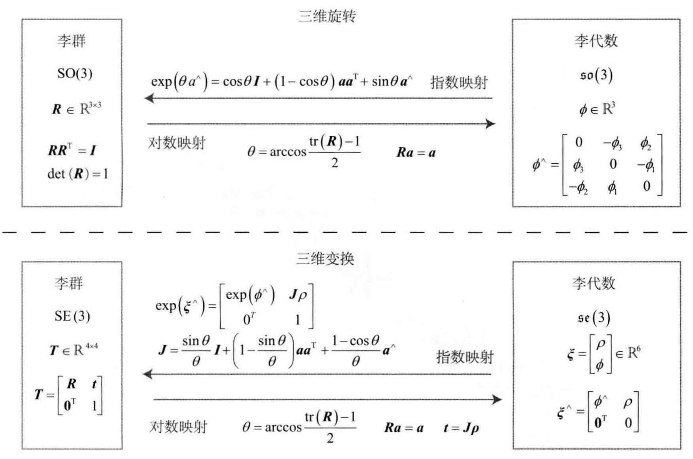
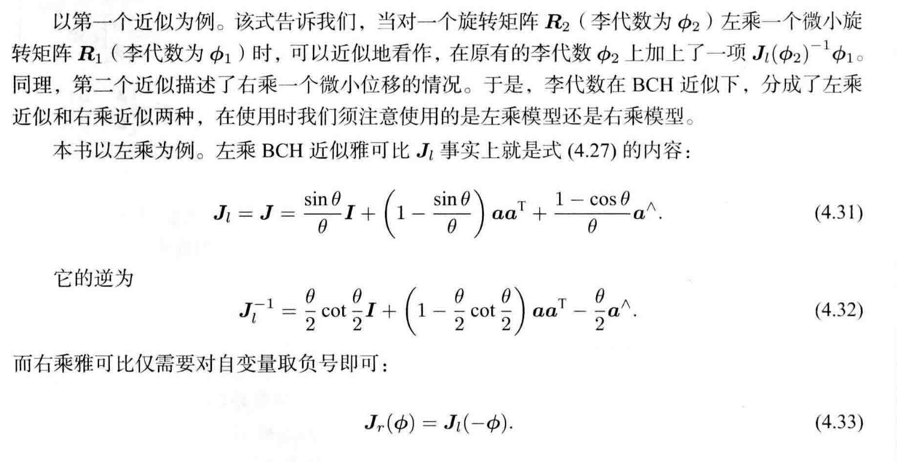

# 视觉SLAM十四讲笔记

## 第四讲 - 李群与李代数

### 4.1 李群与李代数基础

#### 李群

##### 群定义

只有一个良好的运算的集合，称之为群
$$
\begin{align}
\mathrm{SO}(3) &= \{\boldsymbol{R}\in\R^{3\times 3}|\boldsymbol{R}\boldsymbol{R}^\mathrm{T}=\boldsymbol{I}, \mathrm{det}(\boldsymbol{R}) = 1\} \\
\mathrm{SE}(3) &=
\{
\boldsymbol{T} = 
	\begin{bmatrix}
		\boldsymbol{R} & \boldsymbol{t} \\
		\boldsymbol{0} & 1
	\end{bmatrix} 
	\in \R^{4\times 4} | \boldsymbol{R}\in\mathrm{SO}(3), t\in \R^3
\}

\end{align}
$$

$$
\begin{align}
\boldsymbol{R}_{1}+\boldsymbol{R}_{2} \notin \mathrm{SO}(3)&, \quad \boldsymbol{T}_{1}+\boldsymbol{T}_{2} \notin \mathrm{SE}(3) \\
\boldsymbol{R}_{1} \boldsymbol{R}_{2} \in \mathrm{SO}(3)&, \quad \boldsymbol{T}_{1} \boldsymbol{T}_{2} \in \mathrm{SE}(3)

\end{align}
$$

##### 群性质

1. 封闭性
    $$
    \forall a_{1}, a_{2} \in A, \quad a_{1} \cdot a_{2} \in A
    $$

2. 结合律
    $$
    \forall a_{1}, a_{2}, a_{3} \in A, \quad\left(a_{1} \cdot a_{2}\right) \cdot a_{3}=a_{1} \cdot\left(a_{2} \cdot a_{3}\right)
    $$

3. 幺元
    $$
    \exists a_{0} \in A, \quad \text { s.t. } \quad \forall a \in A, \quad a_{0} \cdot a=a \cdot a_{0}=a
    $$

4. 逆

$$
\forall a \in A, \quad \exists a^{-1} \in A, \quad \text { s.t. } \quad a \cdot a^{-1}=a_{0}
$$

一般常见的群：

- 一般线性群 $\text{GL}(n)$
- 特殊正交群 $\text{SO}(n)$
- 特殊欧式群 $\text{SE}(n)$

##### 李群定义

李群指具有连续（光滑）性质的群。$\text{SO}(3)$ 与 $\text{SE}(3)$ 在实数空间上是连续的，想象一个刚体能够连续地在空间中运动。

#### 李代数

##### 李代数的引出

$$
\boldsymbol{R}(t) = \text{exp}(\boldsymbol{\phi}_0^{\wedge}t),\quad
\boldsymbol{\phi}(t) \in \R^{3}
$$

1. 给定某时刻的 $\boldsymbol{R}$，可以求得一个 $\boldsymbol{\phi}$，它描述了 $\boldsymbol{R}$ 在局部的导数关系，$\boldsymbol{\phi}$ 为对应到 $\text{SO}(3)$ 上的李代数 $\mathfrak{s o}(3)$
2. 李代数的指数映射，对数映射
    1. 指数映射： $\boldsymbol{R} = \text{exp}(\boldsymbol{\phi}^{\wedge}),\quad \mathfrak{s o}(3) \rightarrow \text{SO}(3)$
    2. 对数映射： $\boldsymbol{\phi} = \ln (\boldsymbol{R})^{\vee},\quad \text{SO}(3) \rightarrow \mathfrak{s o}(3)$

##### 李代数的定义

每个李群都有与之对应的李代数。李代数描述了李群的局部性质，准确的说，是单位元附近的正切空间。一般的李代数定义如下：

- 李代数由一个集合 $\mathbb{V}$、一个数域 $\mathbb{F}$ 和一个二元运算 $[,]$ 组成。如果它们满足以下性质，则称 $(\mathbb{V}, \mathbb{F}, [,])$ 为一个李代数，记为 $\mathfrak{g}$:

    1. 封闭性
        $$
        \forall \boldsymbol{X}, \boldsymbol{Y} \in \mathbb{V},[\boldsymbol{X}, \boldsymbol{Y}] \in \mathbb{V}
        $$

    2. 双线性
        $$
        \forall \boldsymbol{X}, \boldsymbol{Y}, \boldsymbol{Z} \in \mathbb{V}, a, b \in \mathbb{F} \\
        \text{s. t.} \quad [a \boldsymbol{X}+b \boldsymbol{Y}, \boldsymbol{Z}]=a[\boldsymbol{X}, \boldsymbol{Z}]+b[\boldsymbol{Y}, \boldsymbol{Z}], \quad[\boldsymbol{Z}, a \boldsymbol{X}+b \boldsymbol{Y}]=a[\boldsymbol{Z}, \boldsymbol{X}]+b[\boldsymbol{Z}, \boldsymbol{Y}]
        $$

    3. 自反性
        $$
        \forall \boldsymbol{X} \in \mathbb{V},[\boldsymbol{X}, \boldsymbol{X}]=\mathbf{0}
        $$

    4. 雅可比等价
        $$
        \forall \boldsymbol{X}, \boldsymbol{Y}, \boldsymbol{Z} \in \mathbb{V},[\boldsymbol{X},[\boldsymbol{Y}, \boldsymbol{Z}]]+[\boldsymbol{Z},[\boldsymbol{X}, \boldsymbol{Y}]]+[\boldsymbol{Y},[\boldsymbol{Z}, \boldsymbol{X}]]=\mathbf{0}
        $$

##### 李代数 $\mathfrak{s o}(3)$

1. 李代数 $\mathfrak{s o}(3)$ 的反对称矩阵 $\boldsymbol{\Phi}$
    $$
    \boldsymbol{\Phi}= \boldsymbol{\phi}^{\wedge}=\left[\begin{array}{ccc}
    0 & -\phi_{3} & \phi_{2} \\
    \phi_{3} & 0 & -\phi_{1} \\
    -\phi_{2} & \phi_{1} & 0
    \end{array}\right] \in \mathbb{R}^{3 \times 3}
    $$

2. $\mathfrak{s o}(3)$ 的定义
    $$
    \mathfrak{s o}(3)=\left\{\boldsymbol{\phi} \in \mathbb{R}^{3}, \boldsymbol{\Phi}=\boldsymbol{\phi}^{\wedge} \in \mathbb{R}^{3 \times 3}\right\}
    $$

3.  $\mathfrak{s o}(3)$ 到  $\text{SO}(3)$ 的指数映射
    $$
    \boldsymbol{R}=\exp \left(\boldsymbol{\phi}^{\wedge}\right)
    $$

4. $\mathfrak{s o}(3)$ 的李括号
    $$
    \left[\boldsymbol{\phi}_{1}, \boldsymbol{\phi}_{2}\right]=\left(\boldsymbol{\Phi}_{1} \boldsymbol{\Phi}_{2}-\boldsymbol{\Phi}_{2} \boldsymbol{\Phi}_{1}\right)^{\vee}
    $$

##### 李代数 $\mathfrak{s e}(3)$

1. $\mathfrak{s e}(3)$ 的定义
    $$
    \mathfrak{s e}(3)=\left\{\boldsymbol{\xi}=\left[\begin{array}{c}
    \boldsymbol{\rho} \\
    \boldsymbol{\phi}
    \end{array}\right] \in \mathbb{R}^{6}, \boldsymbol{\rho} \in \mathbb{R}^{3}, \boldsymbol{\phi} \in \mathfrak{s o}(3), \boldsymbol{\xi}^{\wedge}=\left[\begin{array}{cc}
    \boldsymbol{\phi}^{\wedge} & \boldsymbol{\rho} \\
    \mathbf{0}^{\mathrm{T}} & 0
    \end{array}\right] \in \mathbb{R}^{4 \times 4}\right\}
    $$

2. $\mathfrak{s e}(3)$ 到 $\text{SO}(3)$ 的指数映射
    $$
    \boldsymbol{T}=\exp \left(\boldsymbol{\xi}^{\wedge}\right)
    $$

3. $\mathfrak{s e}(3)$ 的李括号
    $$
    \left[\boldsymbol{\xi}_{1}, \boldsymbol{\xi}_{2}\right]=\left(\boldsymbol{\xi}_{1}^{\wedge} \boldsymbol{\xi}_{2}^{\wedge}-\boldsymbol{\xi}_{2}^{\wedge} \boldsymbol{\xi}_{1}^{\wedge}\right)^{\vee}
    $$

### 4.2 指数与对数映射

#### $\mathfrak{s o}(3)$ 指数映射与对数映射

定义 $\boldsymbol{\phi}$ 的模长为 $\theta$，方向为 $\boldsymbol{a}$：
$$
\boldsymbol{\phi} = \theta \boldsymbol{a},\quad \|\boldsymbol{a}\|=1 \\
$$
 $\mathfrak{s o}(3)$ 到  $\text{SO}(3)$ 的指数映射：
$$
\begin{align}
\boldsymbol{R} 
&= \exp(\boldsymbol{\boldsymbol{\phi}^{\wedge}}) \\
&= \exp \left(\theta \boldsymbol{a}^{\wedge}\right)\\
&= \sum_{n=0}^{\infty} \frac{1}{n !}\left(\theta \boldsymbol{a}^{\wedge}\right)^{n} \\
&= \cos \theta \boldsymbol{I}+(1-\cos \theta) \boldsymbol{a} \boldsymbol{a}^{\mathrm{T}}+\sin \theta \boldsymbol{a}^{\wedge}
\end{align}
$$
$\text{SO}(3)$ 到 $\mathfrak{s o}(3)$ 的对数映射：
$$
\begin{align}
\boldsymbol{\phi}
&= \ln (\boldsymbol{R})^{\vee}=\left(\sum_{n=0}^{\infty} \frac{(-1)^{n}}{n+1}(\boldsymbol{R}-\boldsymbol{I})^{n+1}\right)^{\vee} \\
&= \theta \boldsymbol{a} \\
\theta &= \arccos(\frac{\mathrm{tr}(\boldsymbol{R}) - 1}{2}) \\
\boldsymbol{R}\boldsymbol{a} &= \boldsymbol{a},\quad (\boldsymbol{R} - \boldsymbol{I})\boldsymbol{a} = \boldsymbol{0}
\end{align}
$$

#### $\mathfrak{s e}(3)$ 指数映射与对数映射

 $\mathfrak{s e}(3)$ 到  $\text{SE}(3)$ 的指数映射：
$$
\begin{align}
\boldsymbol{T} 
&= \exp \left(\boldsymbol{\xi}^{\wedge}\right)
\\
&=\left[\begin{array}{cc}
\sum_{n=0}^{\infty} \frac{1}{n !}\left(\boldsymbol{\phi}^{\wedge}\right)^{n} & \sum_{n=0}^{\infty} \frac{1}{(n+1) !}\left(\boldsymbol{\phi}^{\wedge}\right)^{n} \boldsymbol{\rho} \\
\mathbf{0}^{\mathrm{T}} & 1
\end{array}\right] \\

&\triangleq\left[\begin{array}{cc}
\boldsymbol{R} & \boldsymbol{J} \boldsymbol{\rho} \\
\mathbf{0}^{\mathrm{T}} & 1
\end{array}\right]

\\
\\
\boldsymbol{\phi} &= \theta \boldsymbol{a},\quad \|\boldsymbol{a}\|=1,\quad 

\boldsymbol{\xi} =  
\left[\begin{array}{c}
\boldsymbol{\phi} \\
\boldsymbol{\rho}
\end{array}\right]

\\

\boldsymbol{R} 
&= \cos \theta \boldsymbol{I}+(1-\cos \theta) \boldsymbol{a} \boldsymbol{a}^{\mathrm{T}}+\sin \theta \boldsymbol{a}^{\wedge} \\

\boldsymbol{J}
&= \frac{\sin \theta}{\theta} \boldsymbol{I}+\left(1-\frac{\sin \theta}{\theta}\right) \boldsymbol{a} \boldsymbol{a}^{\mathrm{T}}+\frac{1-\cos \theta}{\theta} \boldsymbol{a}^{\wedge}\\

\boldsymbol{t} &=\boldsymbol{J}\boldsymbol{\rho}

\end{align}
$$
$\text{SE}(3)$ 到 $\mathfrak{s e}(3)$ 的对数映射：
$$
\begin{align}
\boldsymbol{\phi}
&= \theta \boldsymbol{a} \\

\theta &= \arccos(\frac{\mathrm{tr}(\boldsymbol{R}) - 1}{2}) \\
\boldsymbol{R}\boldsymbol{a} &= \boldsymbol{a},\quad (\boldsymbol{R} - \boldsymbol{I})\boldsymbol{a} = \boldsymbol{0} \\

\boldsymbol{J}\boldsymbol{\rho} &= \boldsymbol{t} \\

\boldsymbol{\xi} &=  
\left[\begin{array}{c}
\boldsymbol{\phi} \\
\boldsymbol{\rho}
\end{array}\right] 
= 
\left[\begin{array}{c}
\boldsymbol{\phi} \\
\boldsymbol{\theta \boldsymbol{a}}
\end{array}\right] 

\end{align}
$$

#### 三维旋转与三维变换指数映射与对数映射关系表 

### 4.3 李代数求导与扰动模型

#### BCH近似

在 $\text{SO}(3)$ 中的两个矩阵相乘，无法对应 $\mathfrak{so}(3)$ 中的两个李代数相加，因为对于矩阵来说，下式不成立:
$$
\ln (\exp (\boldsymbol{A}) \exp (\boldsymbol{B}))=\boldsymbol{A}+\boldsymbol{B}
$$
两个李代数指数映射**乘积**的完整形式如下(BCH公式), 其中$[\ ]$为李括号:
$$
\ln (\exp (\boldsymbol{A}) \exp (\boldsymbol{B}))=\boldsymbol{A}+\boldsymbol{B}+\frac{1}{2}[\boldsymbol{A}, \boldsymbol{B}]+\frac{1}{12}[\boldsymbol{A},[\boldsymbol{A}, \boldsymbol{B}]]-\frac{1}{12}[\boldsymbol{B},[\boldsymbol{A}, \boldsymbol{B}]]+\cdots
$$
考虑 $\text{SO}(3)$ 上的李代数 $\ln \left(\exp \left(\boldsymbol{\phi}_{1}^{\wedge}\right) \exp \left(\boldsymbol{\phi}_{2}^{\wedge}\right)\right)^{\vee}$, 当 $\boldsymbol{\phi}_1$ 或 $\boldsymbol{\phi}_2$  为小量时, 小量二次以上的项都可以被忽略, 此时BCH拥有线性近似表达:
$$
\ln \left(\exp \left(\boldsymbol{\phi}_{1}^{\wedge}\right) \exp \left(\boldsymbol{\phi}_{2}^{\wedge}\right)\right)^{\vee} \approx \begin{cases}\boldsymbol{J}_{l}\left(\boldsymbol{\boldsymbol{\phi}}_{2}\right)^{-1} \boldsymbol{\boldsymbol{\phi}}_{1}+\boldsymbol{\boldsymbol{\phi}}_{2} & \text { 当 } \boldsymbol{\phi}_{1} \text { 为小量, } \\ \boldsymbol{J}_{r}\left(\boldsymbol{\phi}_{1}\right)^{-1} \boldsymbol{\phi}_{2}+\boldsymbol{\phi}_{1} & \text { 当 } \boldsymbol{\phi}_{2} \text { 为小量. }\end{cases}
$$

BCH近似的意义：

- 对于 $\mathfrak{so}(3)$

    - 李群上的乘法对应李代数上的加法, 对于某个旋转 $\boldsymbol{R}$ , 对应的李代数为 $\boldsymbol{\phi}$。对它左乘一个微小旋转 $\Delta\boldsymbol{R}$, 对应李代数 $\Delta\boldsymbol{\phi}$, 在李群上得到结果 $\Delta\boldsymbol{R}\cdot\boldsymbol{R}$, 李代数上根据BCH近似，为$\boldsymbol{J}_l^{-1}(\boldsymbol{\phi})\Delta\boldsymbol{\phi}+\boldsymbol{\phi}$ , 如下：
        $$
        \exp \left(\Delta \boldsymbol{\phi}^{\wedge}\right) \exp \left(\boldsymbol{\phi}^{\wedge}\right)=\exp \left(\left(\boldsymbol{\phi}+J_{l}^{-1}(\boldsymbol{\phi}) \Delta \boldsymbol{\phi}\right)^{\wedge}\right)
        $$

    - 李代数上的加法对应李群上的乘法：
        $$
        \exp \left((\boldsymbol{\phi}+\Delta \boldsymbol{\phi})^{\wedge}\right)=\exp \left(\left(\boldsymbol{J}_{l} \Delta \boldsymbol{\phi}\right)^{\wedge}\right) \exp \left(\boldsymbol{\phi}^{\wedge}\right)=\exp \left(\boldsymbol{\phi}^{\wedge}\right) \exp \left(\left(\boldsymbol{J}_{r} \Delta \boldsymbol{\phi}\right)^{\wedge}\right)
        $$

- 对于$\mathfrak{se}(3)$
    $$
    \begin{aligned}
    &\exp \left(\Delta \boldsymbol{\xi}^{\wedge}\right) \exp \left(\boldsymbol{\xi}^{\wedge}\right) \approx \exp \left(\left(\boldsymbol{\mathcal{J}}_{l}^{-1} \Delta \boldsymbol{\xi}+\boldsymbol{\xi}\right)^{\wedge}\right) \\
    &\exp \left(\boldsymbol{\xi}^{\wedge}\right) \exp \left(\Delta \boldsymbol{\xi}^{\wedge}\right) \approx \exp \left(\left(\boldsymbol{\mathcal{J}}_{r}^{-1} \Delta \boldsymbol{\xi}+\boldsymbol{\xi}\right)^{\wedge}\right)
    \end{aligned}
    $$

#### $\text{SO}(3)$ 上的求导

为了优化位姿的估计值, 经常会讨论关于位姿函数的导数, 有以下两种方法对位姿函数的求导

-   李代数求导法: 用李代数表示姿态, 根据李代数加法进行李代数求导
-   扰动求导法: 对李群左乘或右乘一个微小扰动, 对该扰动求导

##### 李代数求导法

对空间点 $\boldsymbol{p}$ 旋转 $\boldsymbol{R}$, 得到 $\boldsymbol{R}\boldsymbol{p}$, 设 $\boldsymbol{R}$ 对应的李代数为 $\boldsymbol{\phi}$, 计算旋转之后点的坐标相对于旋转的导数:
$$
\begin{align}
\frac{\part(\boldsymbol{R}\boldsymbol{p})}{\part\boldsymbol{R}} = 
\frac{\partial\left(\exp \left(\boldsymbol{\phi}^{\wedge}\right) \boldsymbol{p}\right)}{\partial \boldsymbol{\phi}} = 
-(\boldsymbol{R} \boldsymbol{p})^{\wedge} \boldsymbol{J}_{l}
\end{align} 
$$

##### 扰动模型求导法(左乘)

对空间点 $\boldsymbol{p}$ 旋转 $\boldsymbol{R}$, 得到 $\boldsymbol{R}\boldsymbol{p}$, 对$\boldsymbol{R}$ 进行一次扰动 $\Delta\boldsymbol{R}$, 看结果相对于扰动的变化率. 以左扰动为例, 设左扰动 $\Delta\boldsymbol{R}$ 对应的李代数为 $\boldsymbol{\varphi}$, 对 $\boldsymbol{\varphi}$ 求导, 结果比李代数求导法省去一个 $\boldsymbol{J}_l$ 的计算: 
$$
\frac{\partial(\boldsymbol{R} \boldsymbol{p})}{\partial \boldsymbol{\varphi}}=\lim _{\boldsymbol{\varphi} \rightarrow 0} \frac{\exp \left(\boldsymbol{\varphi}^{\wedge}\right) \exp \left(\boldsymbol{\phi}^{\wedge}\right) \boldsymbol{p}-\exp \left(\boldsymbol{\phi}^{\wedge}\right) \boldsymbol{p}}{\boldsymbol{\varphi}} = -(\boldsymbol{R}\boldsymbol{p})^{\wedge}
$$

#### $\text{SE}(3)$ 上的求导

##### 扰动模型求导法(左乘)

假设某空间点 $\boldsymbol{p}$ 经过一次变换 $\boldsymbol{T}$ (对应李代数为$\boldsymbol{\xi}$), 得到 $\boldsymbol{T}\boldsymbol{p}$, 给 $\boldsymbol{T}$ 左乘一个扰动 $\Delta\boldsymbol{T} = \exp(\delta\boldsymbol{\xi}^{\wedge})$, 设扰动项的李代数为 $\delta\boldsymbol{\xi} = [\delta\boldsymbol{\rho}, \delta\boldsymbol{\phi}]^{\mathrm{T}}$, 那么:
$$
\begin{align}
\frac{\partial(\boldsymbol{T} \boldsymbol{p})}{\partial \delta \boldsymbol{\xi}} &= \lim _{\delta \boldsymbol{\xi} \rightarrow 0} \frac{\exp \left(\delta \boldsymbol{\xi}^{\wedge}\right) \exp \left(\boldsymbol{\xi}^{\wedge}\right) \boldsymbol{p}-\exp \left(\boldsymbol{\xi}^{\wedge}\right) \boldsymbol{p}}{\delta \boldsymbol{\xi}} \\

&= \left[\begin{array}{cc}
\boldsymbol{I} & -(\boldsymbol{R} \boldsymbol{p}+\boldsymbol{t})^{\wedge} \\
\mathbf{0}^{\mathrm{T}} & \mathbf{0}^{\mathrm{T}}
\end{array}\right] \stackrel{\text { def }}{=}(\boldsymbol{T} \boldsymbol{p})^{\odot}
\end{align}
$$

### 4.4 评估轨迹误差

-   绝对误差  (ATE, Absolute Trajectory Error)

    -   绝对轨迹误差 (ATE, Absolute Trajectory Error), 实际也是均方根误差 (RMSE, Root-Mean-Squared Error)
        $$
        \mathrm{ATE}_{\mathrm{all}}=\sqrt{\frac{1}{N} \sum_{i=1}^{N}\left\|\log \left(\boldsymbol{T}_{\mathrm{gt}, i}^{-1} \boldsymbol{T}_{\mathrm{esti}, i}\right)^{\vee}\right\|_{2}^{2}}
        $$

    -   平均平移误差 (ATE, Average Translational Error), $\text{trans}()$ 表示取括号内部变量的平移部分
        $$
        \mathrm{ATE}_{\text {trans }}=\sqrt{\frac{1}{N} \sum_{i=1}^{N}\left\|\operatorname{trans}\left(\boldsymbol{T}_{\mathrm{gt}, i}^{-1} \boldsymbol{T}_{\text {esti, } i}\right)\right\|_{2}^{2}}
        $$

-   相对误差 (RPE, Relative Pose Error)

    -   相对轨迹误差
        $$
        \mathrm{RPE}_{\mathrm{all}}=\sqrt{\frac{1}{N-\Delta t} \sum_{i=1}^{N-\Delta t} \| \log \left(\left(T_{\mathrm{gt}, i}^{-1} \boldsymbol{T}_{\mathrm{gt}, i+\Delta t}\right)^{-1}\left(\boldsymbol{T}_{\mathrm{est}, i}^{-1} \boldsymbol{T}_{\text {esti }, i+\Delta t}\right)\right)^{\vee} \|_{2}^{2}}
        $$

    -   相对平移误差
        $$
        \mathrm{RPE}_{\text {trans }}=\sqrt{\frac{1}{N-\Delta t} \sum_{i=1}^{N-\Delta t} \| \operatorname{trans}\left(\left(\boldsymbol{T}_{\mathrm{gt}, i}^{-1} \boldsymbol{T}_{\mathrm{gt}, i+\Delta t}\right)^{-1}\left(\boldsymbol{T}_{\mathrm{est}, i}^{-1} \boldsymbol{T}_{\mathrm{est}, i+\Delta t}\right)\right) \|_{2}^{2}}
        $$

### 4.5 相似变换群 $\text{Sim}(3)$ 与李代数

-   相似变换
    $$
    \boldsymbol{p}^{\prime}=\left[\begin{array}{cc}
    s \boldsymbol{R} & \boldsymbol{t} \\
    \mathbf{0}^{\mathrm{T}} & 1
    \end{array}\right] \boldsymbol{p}=s \boldsymbol{R} \boldsymbol{p}+\boldsymbol{t}
    $$

-   相似变换群 $\text{Sim}(3)$
    $$
    \operatorname{Sim}(3)=\left\{\boldsymbol{S}=\left[\begin{array}{cc}
    s \boldsymbol{R} & \boldsymbol{t} \\
    \mathbf{0}^{\mathrm{T}} & 1
    \end{array}\right] \in \mathbb{R}^{4 \times 4}\right\}
    $$

-   相似变换群的李代数 $\mathfrak{sim}(3)$
    $$
    \operatorname{sim}(3)=\left\{\boldsymbol{\zeta} \mid \boldsymbol{\zeta}=\left[\begin{array}{l}
    \boldsymbol{\rho} \\
    \boldsymbol{\phi} \\
    \sigma
    \end{array}\right] \in \mathbb{R}^{7}, \boldsymbol{\zeta}^{\wedge}=\left[\begin{array}{cc}
    \sigma \boldsymbol{I}+\boldsymbol{\phi}^{\wedge} & \boldsymbol{\rho} \\
    \mathbf{0}^{\mathrm{T}} & 0
    \end{array}\right] \in \mathbb{R}^{4 \times 4}\right\}
    $$

-   相似变换群的指数映射
    $$
    \begin{align}
    \exp \left(\boldsymbol{\zeta}^{\wedge}\right) =& \left[\begin{array}{cc}
    \mathrm{e}^{\sigma} \exp \left(\phi^{\wedge}\right) & \boldsymbol{J}_{s} \rho \\
    \mathbf{0}^{\mathrm{T}} & 1
    \end{array}\right],\\
    
    s =& \mathrm{e}^{\sigma}, 
    \boldsymbol{R}=\exp \left(\boldsymbol{\phi}^{\wedge}\right), \boldsymbol{t}=\boldsymbol{J}_{s} \boldsymbol{\rho}, \\
    
    
    \boldsymbol{J}_{s} =& \frac{\mathrm{e}^{\sigma}-1}{\sigma} \boldsymbol{I}+\frac{\sigma \mathrm{e}^{\sigma} \sin \theta+\left(1-\mathrm{e}^{\sigma} \cos \theta\right) \theta}{\sigma^{2}+\theta^{2}} \boldsymbol{a}^{\wedge} \\
    
    &+\left(\frac{\mathrm{e}^{\sigma}-1}{\sigma}-\frac{\left(\mathrm{e}^{\sigma} \cos \theta-1\right) \sigma+\left(\mathrm{e}^{\sigma} \sin \theta\right) \theta}{\sigma^{2}+\theta^{2}}\right) \boldsymbol{a}^{\wedge} \boldsymbol{a}^{\wedge} .
    
    
    
    \end{align}
    $$

-   相思变换群的扰动模型

    -   $\operatorname{Sim}(3)$ 的 BCH 近似与 $\text{SE}(3)$ 是类似的。我们可以讨论一个点 $\boldsymbol{p}$ 经过相似变换 $\boldsymbol{S} \boldsymbol{p}$ 后, 相对 于 $\boldsymbol{S}$ 的导数。同样地, 存在微分模型和扰动模型两种方式, 而扰动模型较为简单。我们省略推导 过程, 直接给出扰动模型的结果。设给予 $\boldsymbol{S} \boldsymbol{p}$ 左侧一个小扰动 $\exp \left(\boldsymbol{\zeta}^{\wedge}\right)$, 并求 $\boldsymbol{S} \boldsymbol{p}$ 对于扰动的导数。因为 $\boldsymbol{S p}$ 是 4 维的齐次坐标, $\boldsymbol{\zeta}$ 是 7 维向量, 所以该导数应该是 $4 \times 7$ 的雅可比。方便起见, 记 $\boldsymbol{S p}$ 的前 3 维组成向量为 $\boldsymbol{q}$, 那么:

$$
\frac{\partial \boldsymbol{S} \boldsymbol{p}}{\partial \boldsymbol{\zeta}}=\left[\begin{array}{ccc}
\boldsymbol{I} & -\boldsymbol{q}^{\wedge} & \boldsymbol{q} \\
\mathbf{0}^{\mathrm{T}} & \boldsymbol{0}^{\mathrm{T}} & 0
\end{array}\right]
$$

