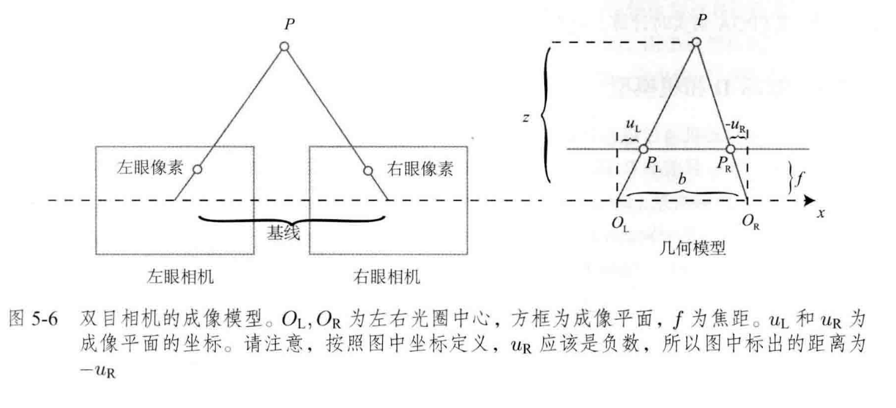

# 视觉SLAM十四讲笔记

## 第五讲 - 相机与图像

### 相机模型

#### 针孔相机模型

- 相机内参矩阵 $\boldsymbol{K}$:

$$
\begin{align}
\left(\begin{array}{l}
u \\
v \\
1
\end{array}\right)=\frac{1}{Z}\left(\begin{array}{ccc}
f_{x} & 0 & c_{x} \\
0 & f_{y} & c_{y} \\
0 & 0 & 1
\end{array}\right)\left(\begin{array}{l}
X \\
Y \\
Z
\end{array}\right) \stackrel{\text { def }}{=} \frac{1}{Z} \boldsymbol{K} \boldsymbol{P}  
\end{align}
$$

- 相机外参矩阵 $\boldsymbol{T}$:
    $$
    Z \boldsymbol{P}_{u v}=Z\left[\begin{array}{c}
    u \\
    v \\
    1
    \end{array}\right]=\boldsymbol{K}\left(\boldsymbol{R} \boldsymbol{P}_{\mathrm{w}}+\boldsymbol{t}\right)=\boldsymbol{K} \boldsymbol{T} \boldsymbol{P}_{\mathrm{w}}
    $$

- 归一化坐标:
    $$
    \left(\boldsymbol{R} \boldsymbol{P}_{\mathrm{w}}+\boldsymbol{t}\right)=\underbrace{[X, Y, Z]^{\mathrm{T}}}_{\text {相机坐标 }} \rightarrow \underbrace{[X / Z, Y / Z, 1]^{\mathrm{T}}}_{\text {归一化坐标 }} .
    $$

#### 畸变模型

- 径向畸变

    - 桶形畸变

    - 枕形畸变

    - $$
        \begin{aligned}
        &x_{\text {distorted }}=x\left(1+k_{1} r^{2}+k_{2} r^{4}+k_{3} r^{6}\right) \\
        &y_{\text {distorted }}=y\left(1+k_{1} r^{2}+k_{2} r^{4}+k_{3} r^{6}\right)
        \end{aligned}
        $$

        

- 切向畸变

    - $$
        \begin{aligned}
        x_{\text {distorted }} &=x+2 p_{1} x y+p_{2}\left(r^{2}+2 x^{2}\right) \\
        y_{\text {distorted }} &=y+p_{1}\left(r^{2}+2 y^{2}\right)+2 p_{2} x y
        \end{aligned}
        $$

- 通过5个畸变系数, 将归一化坐标 $[x,y]$ 转换为像素坐标: 

    - $$
        \left\{\begin{array}{l}
        x_{\text {distorted }}=x\left(1+k_{1} r^{2}+k_{2} r^{4}+k_{3} r^{6}\right)+2 p_{1} x y+p_{2}\left(r^{2}+2 x^{2}\right) \\
        y_{\text {distorted }}=y\left(1+k_{1} r^{2}+k_{2} r^{4}+k_{3} r^{6}\right)+p_{1}\left(r^{2}+2 y^{2}\right)+2 p_{2} x y
        \end{array}\right.
        $$

    - $$
        \left\{\begin{array}{l}
        u=f_{x} x_{\text {distorted }}+c_{x} \\
        v=f_{y} y_{\text {distorted }}+c_{y}
        \end{array}\right.
        $$

        

#### 双目相机模型

$$
\frac{z-f}{z}=\frac{b-u_{\mathrm{L}}+u_{\mathrm{R}}}{b}
$$

$$
z=\frac{f b}{d}, \quad d \stackrel{\text { def }}{=} u_{\mathrm{L}}-u_{\mathrm{R}}
$$

#### RGB-D 相机模型

- 红外结构光 Structured light
    - Kinect Gen1
    - Intel Realsense
- 飞行时间 ToF Time-of-Flight
    - Kinect Gen2
    - ToF cam

