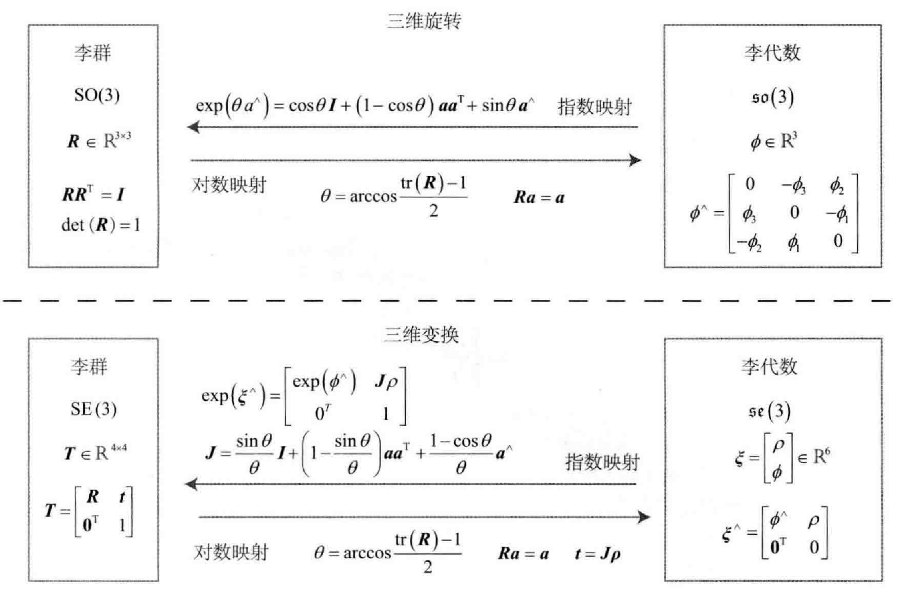
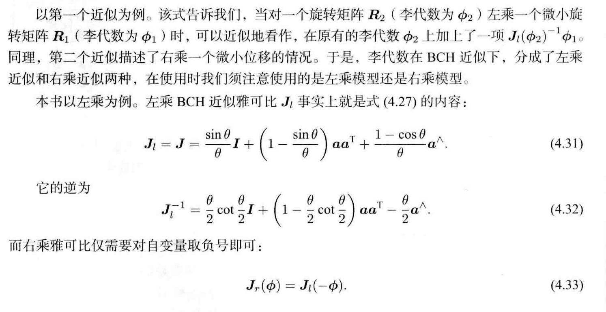
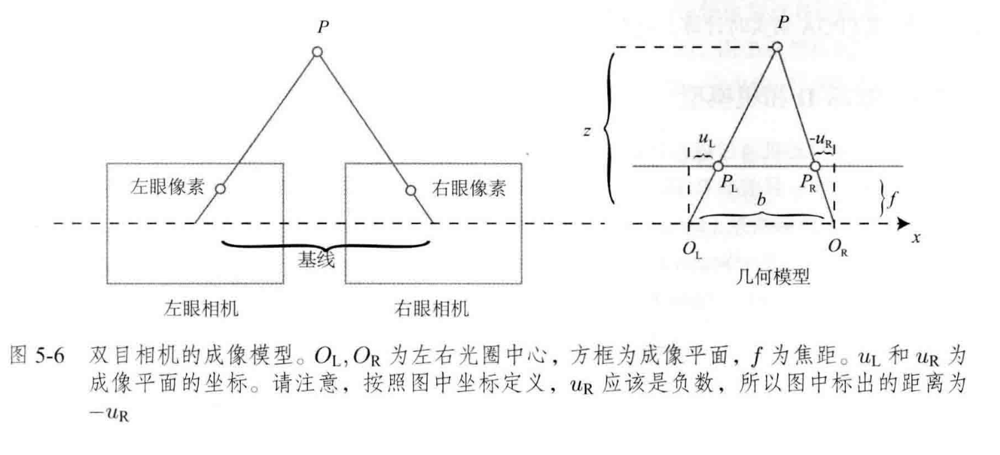
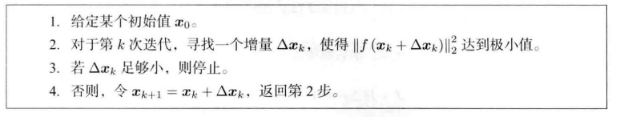

# 视觉SLAM十四讲Note

## 第一讲 - 预备知识

### 章节划分

1. 预备知识
2. SLAM系统概述
   1. 模块组成
   2. 编程环境，IDE
3. 三维空间刚体运动
   1. 旋转矩阵，欧拉角，四元数，Eigen
4. 李群李代数，Sophus
5. 相机模型，OpenCV
6. 非线性优化
7. 特征点法的视觉里程计
8. 直接法的视觉里程计
9. 后端优化
10. 后端优化位姿图
11. 回环检测
12. 地图构建，
    1. 单目稠密深度图构建
    2. RGB-D 稠密地图构建
13. 双目视觉里程计框架

### 习题答案

https://blog.csdn.net/jiahao62/article/details/80655542

## 第二讲 - 初识SLAM

### 传感器分类

- 外部传感器：导轨，二维码，GPS，依赖于环境，直接物理量
- 内部传感器：激光传感器，相机，轮式编码器，IMU，间接物理量

### 相机分类

- 单目相机 Monocular
  - 结构简单，成本低，
  - 无法确定物体真实大小 - 尺度不确定性
- 双目相机 Stereo
  - 通过基线估计每个像素空间位置，基线距离越大，测量物体可以越远
  - 消耗计算资源
- 深度相机 RGB-D
  - 红外结构光或者ToF(Time-of-Flight)，向物体发射光并接受返回的光
  - 测量范围窄，噪声大，视野小，易受阳光干扰，无法测量透射材质等

### 经典SLAM框架

- 传感器信息读取 Sensor Data
- 前端视觉里程计 VO (Visual Odometry)
- 后端（非线性）优化 (Optimization)
- 回环检测 (Loop Closure Detection)
- 建图 (Mapping)

### 视觉里程计 VO

- 主要关于计算机视觉领域，图像特征提取与匹配
- 通过相邻帧间图像估计相机运动，并恢复场景的空间结构
- 累积漂移 Accumulating Drift
- 需要**后端优化**和**回环检测**
  - 回环检测：负责把“机器人回到原始位置”检测出来
  - 后端优化：根据回环检测，校正整个轨迹

### 后端优化 Optimization

- 主要关于滤波与非线性优化算法
- 主要处理SLAM过程中的噪声，估计整个系统的状态（包括机器人轨迹，地图）
- 最大后验概率估计 MAP(Maximum-a-Posteriori)

### 回环检测 Loop Closure Detection

- 主要解决 位置估计随时间漂移的问题
- 识别到过的场景的能力，比如通过判断图像间的相似性

### 建图 Mapping

- 地图类型：
  - 2D栅格地图，2D拓扑地图，3D点云地图，3D网格地图
  - 度量地图与拓扑地图
- 度量地图(Metric Map)：精确表示地图中物体的位置关系
  - 稀疏(Sparse)：用于定位，
    - 抽象，不需要表达所有物体，只需要路标 Landmark
  - 半稠密
  - 稠密(Dense)：用于导航，
    - 用Grid或者Voxel表示一个小块，
    - 小块含有空闲，占据，未知三种状态，以表示是否有物体
- 拓扑地图(Topological Map)：强调元素之间的关系，图(Graph)
  - 图由节点和边构成，只考虑节点间的连通性
  - 不擅长复杂结构的地图

### SLAM数学表达

- 数学表达

$$
\begin{align}
离散时刻&：t = 1, \cdots, K \\
位置点&：\boldsymbol{x}_1,\cdots, \boldsymbol{x}_2 \\
路标点&：\boldsymbol{y}_1,\cdots, \boldsymbol{y}_2 \\
运动方程&：\boldsymbol{x}_k = f(\boldsymbol{x}_{k-1},\boldsymbol{u}_k, \boldsymbol{w}_k), 前一刻位置状态\boldsymbol{x}_{k-1}根据此刻运动传感器数据\boldsymbol{u}_k以及噪声\boldsymbol{w}_k来推导此刻的位置状态\boldsymbol{x}_k \\
观测方程&：\boldsymbol{z}_{k,j} = f(\boldsymbol{y}_{j},\boldsymbol{x}_k, \boldsymbol{v}_{k,j}),在此刻位置\boldsymbol{x}_k看到某个路标点\boldsymbol{y}_{j}时产生观测噪声\boldsymbol{v}_{k,j}和观测数据\boldsymbol{z}_{k,j} \\
基本\mathrm{SLAM}问题&：当知道运动数据\boldsymbol{u}以及传感器数据\boldsymbol{z}时，如何求解定位问题(估计\boldsymbol{x})和建图问题(估计\boldsymbol{y})
\end{align}
$$

- SLAM问题分类
  - 按照**运动和观测方程是否线性**，**噪声是否服从高斯分布**
    - 线性高斯系统, Linear Gaussian LG系统
      - 最简单，无偏最优估计由卡尔曼滤波器 (Kalman Filter, KF) 求解
    - 线性非高斯系统
    - 非线性高斯系统
    - 非线性非高斯系统，Non-Linear Non-Gaussian NLNG系统
      - 扩展卡尔曼滤波器 (Extended Kalman, Filter EKF)
      - 非线性优化 (None Linear Optimization)
        - 图优化 (Graph Optimization)
        
        

## 第三讲 - 三维空间刚体运动

### 向量计算

- 向量内积，可以描述向量间的投影关系

$$
\boldsymbol{a\cdot b} = \boldsymbol{a}^\mathrm{T}\boldsymbol{b} = \sum_{i=1}^{3}a_ib_i = |\boldsymbol{a}||\boldsymbol{b}|\cos<\boldsymbol{a}, \boldsymbol{b}>
$$

-  向量外积，外积的结果是一个垂直于叉乘的两个向量的向量，大小为$|a||b|sin<a,b>$,是两个向量张成的四边形的有向面积
  $$
  \boldsymbol{a}\times\boldsymbol{b} = 
      \begin{Vmatrix} 
      \boldsymbol{e}_1 & \boldsymbol{e}_2 & \boldsymbol{e}_3 \\
      a_1 & a_2 & a_3 \\
      b_1 & b_2 & b_3 \\
      \end{Vmatrix} = 
      
      \begin{bmatrix}
      a_2 b_3 - a_3 b_2 \\
      a_3 b_1 - a_1 b_3 \\
      a_1 b_2 - a_2 b_1
      \end{bmatrix} = 
      
      \begin{bmatrix}
      0 & -a_3 & a_2 \\
      a_3 & 0 & -a_1 \\
      -a_2 & a_1 & 0
      \end{bmatrix}\boldsymbol{b} 	
      
      \xlongequal{\mathrm{def}} 
      
  \boldsymbol{a}^{\land}\boldsymbol{b} \\
  $$
  
- 反对称矩阵：
  $$
  \boldsymbol{a}^{\wedge} = 
  	\begin{bmatrix}
      0 & -a_3 & a_2 \\
      a_3 & 0 & -a_1 \\
      -a_2 & a_1 & 0
  	\end{bmatrix}
  $$

### 旋转矩阵$\boldsymbol{R}$

- 旋转矩阵是正交矩阵，其逆为自身的转置

- 旋转矩阵的行列式为1

- 旋转矩阵属于特殊正交群 SO(3) (Special Orthogonal Group)
  $$
  \mathrm{SO}(3) = \{\boldsymbol{R}\in\R^{3\times 3}|\boldsymbol{R}\boldsymbol{R}^\mathrm{T}=\boldsymbol{I}, \mathrm{det}(\boldsymbol{R}) = 1\} \\
  \boldsymbol{a}' = \boldsymbol{R}^{-1}\boldsymbol{a} = \boldsymbol{R}^{\mathrm{T}}\boldsymbol{a}
  $$
  

### 变换矩阵$\boldsymbol{T}$

- 变换矩阵属于特殊欧式群SE(3)
  $$
  \mathrm{SE}(3) =
  \{
  \boldsymbol{T} = 
  	\begin{bmatrix}
  		\boldsymbol{R} & \boldsymbol{t} \\
  		\boldsymbol{0} & 1
  	\end{bmatrix} 
  	\in \R^{4\times 4} | \boldsymbol{R}\in\mathrm{SO}(3), t\in \R^3
  \} \\
  
  \boldsymbol{b} = \boldsymbol{T}_1\boldsymbol{a}, \boldsymbol{c} = \boldsymbol{T}_2\boldsymbol{a} \Rightarrow \boldsymbol{c} = \boldsymbol{T}_2 \boldsymbol{T}_1 \boldsymbol{a}\\
  
  \boldsymbol{T}^{-1} = 
  	\begin{bmatrix}
  		\boldsymbol{R}^{\mathrm{T}} & -\boldsymbol{R}^{\mathrm{T}}\boldsymbol{t} \\
  		\boldsymbol{0} & 1
  	\end{bmatrix}
  $$

### 旋转向量$\theta \boldsymbol{n}$

- 任意旋转都可以用一个旋转轴和一个旋转角来刻画

- 旋转向量的方向与单位长度的旋转轴$\boldsymbol{n}$一致，长度等于旋转角$\theta$，则可以表示为$\theta \boldsymbol{n}$

- 罗德里格斯公式

  - 从旋转向量 $\theta \boldsymbol{n}$ 到旋转矩阵 $\boldsymbol{R}$

  $$
  \boldsymbol{R} = \cos(\theta )\boldsymbol{I} + (1-\cos(\theta))\boldsymbol{n}\boldsymbol{n}^{\mathrm{T}} + \sin(\theta)\boldsymbol{n}^{\land}
  $$

  - 从旋转矩阵 $\boldsymbol{R}$ 到旋转向量 $\theta \boldsymbol{n}$

  $$
  \theta = \arccos(\frac{(1+2\cos(\theta)) - 1}{2}) \\
  \boldsymbol{R}\boldsymbol{n} = \boldsymbol{n}, (\boldsymbol{R}-\bold{I})\boldsymbol{n} = \boldsymbol{0}
  $$

- 旋转向量的奇异性发生在转角$\theta$超过$2\pi$时产生周期性

### 欧拉角

- 使用三个分离的旋转角
- 常用的RPY(Roll-Pitch-Yaw)，即ZYX旋转，假设刚体正前方为X轴朝向
  - 绕Z旋转，偏航角Yaw
  - 绕新Y旋转，俯仰角Pitch
  - 绕新X旋转，翻滚角Roll
- 欧拉角有万向锁从而产生奇异性问题，俯仰角为$\pm90^{\circ}$ 时，第一次旋转与第三次旋转在宏观层面效果相同，使系统丢失一个自由度。

### 四元数$\boldsymbol{q}$

- 四元数没有奇异性，可以解决三维向量描述旋转时的奇异性问题

- 四元数基本定义
  $$
  \begin{align}
  \boldsymbol{q} &= q_0 + q_1\mathrm{i} + q_2\mathrm{j} + q_3\mathrm{k} \\
  \boldsymbol{q} &= [s, \boldsymbol{v}^{\mathrm{T}}], s=q_0\in\R,\boldsymbol{v}=[q_1, q_2, q_3]^{\mathrm{T}}\in\R^3 \\
  \end{align}
  $$

- 四元数运算

  - 加减
    $$
    \boldsymbol{q}_a\pm\boldsymbol{q}_b = [s_a\pm s_b,\boldsymbol{v}_a\pm\boldsymbol{v}_b]^{\mathrm{T}}
    $$

  - 乘法
    $$
    \boldsymbol{q}_a \boldsymbol{q}_b = [s_a s_b - \boldsymbol{v}_a^{\mathrm{T}}\boldsymbol{v}_b, s_a\boldsymbol{v}_b + s_b\boldsymbol{v}_a + \boldsymbol{v}_a\times \boldsymbol{v}_b]^{\mathrm{T}}
    $$

  - 模长
    $$
    \begin{align}
    \begin{Vmatrix}\boldsymbol{q}_a\end{Vmatrix} &= \sqrt{s_a^2 + x_a^2 + y_a^2 + z_a^2} \\
    
    \begin{Vmatrix}\boldsymbol{q}_a\boldsymbol{q}_b\end{Vmatrix} &= \begin{Vmatrix}\boldsymbol{q}_a\end{Vmatrix}\begin{Vmatrix}\boldsymbol{q}_b\end{Vmatrix}
    \end{align}
    $$

  - 共轭
    $$
    \boldsymbol{q}^{*} = [s_a, -\boldsymbol{v}_a]^{\mathrm{T}} \\
    \boldsymbol{q}^{*}\boldsymbol{q} = \boldsymbol{q}\boldsymbol{q}^{*} = [s_a^2 + \boldsymbol{v}^{
    \mathrm{T}}\boldsymbol{v}, \boldsymbol{0}]^{\mathrm{T}}
    $$
    
  - 逆
    $$
    \boldsymbol{q}^{-1} = \boldsymbol{q}^{*}/\begin{Vmatrix}\boldsymbol{q}\end{Vmatrix}^2 \\
    \boldsymbol{q}\boldsymbol{q}^{-1} = \boldsymbol{q}^{-1}\boldsymbol{q} = 1 \\
    (\boldsymbol{q}_a\boldsymbol{q}_b)^{-1} = \boldsymbol{q}_b^{-1}\boldsymbol{q}_a^{-1}
    $$
    
  - 数乘
    $$
    \mathrm{k}\boldsymbol{q} = [\mathrm{k}s,\mathrm{k}\boldsymbol{v}]^{\mathrm{T}}
    $$
  
- 四元数旋转

  - 空间三维点 $\boldsymbol{p} = [x,y,z]\in\R^{3}$ 经过旋转 $\boldsymbol{q}$ 变为 $\boldsymbol{p}'$
    $$
    \boldsymbol{p} = [0,x,y,z]^{\mathrm{T}} = [0, \boldsymbol{v}]^\mathrm{T} \\
    \boldsymbol{p}' = \boldsymbol{q}\boldsymbol{p}\boldsymbol{q}^{-1}
    $$

- 四元数转换

  - 四元数到旋转矩阵
    $$
    \boldsymbol{R} = \boldsymbol{v}\boldsymbol{v}^{\mathrm{T}} + s^2\boldsymbol{I} + 2s\boldsymbol{v}^{\wedge} + (\boldsymbol{v}^{\wedge})^{2} \\
    $$

  - 四元数到旋转向量

  $$
  \begin{align}
  \theta &= 2\arccos(s) \\
  [n_x, n_y, n_z]^{\mathrm{T}} &= [q_1, q_2, q_3]^{\mathrm{T}}/\sin(\frac{\theta}{2})
  \end{align}
  $$

### 相似、仿射、射影变换

- 欧式变换

  - 自由度：6

  - 不变性质：长度、夹角、体积

  - $$
    \boldsymbol{T} = 
    \begin{bmatrix}
    \boldsymbol{R} & \boldsymbol{t} \\
    \boldsymbol{0} & 1
    \end{bmatrix}
    $$

    

- 相似变换

  - 自由度：7

  - 不变性质：体积比

  - 特点：

    - 比欧式变换多一个自由度，允许物体均匀缩放
    - 相似变换的集合也叫做相似变换群Sim(3)

  - $$
    \boldsymbol{T} = 
    \begin{bmatrix}
    s\boldsymbol{R} & \boldsymbol{t} \\
    \boldsymbol{0} & 1
    \end{bmatrix}
    $$

    

- 仿射变换

  - 自由度：12

  - 不变性质：平行性、体积比

  - 特点：

    - 只要求 $\boldsymbol{A}$ 是可逆矩阵，不必是正交矩阵，
    - 仿射变换也叫做正交投影，经过仿射变换后，立方体不再是方的，但各个平面仍然是平行四边形

  - $$
    \boldsymbol{T} = 
    \begin{bmatrix}
    \boldsymbol{A} & \boldsymbol{t} \\
    \boldsymbol{0} & 1
    \end{bmatrix}
    $$

    

- 射影变换

  - 自由度：15

  - 不变性质：接触平面的相交与相切

  - 特点： 

    - 左上角是可逆矩阵 $\boldsymbol{A}$，右上角是平移向量 $\boldsymbol{t}$，左下角是缩放向量 $\boldsymbol{a}^{\mathrm{T}}$。
    - 当 $v\neq 0$ 时，可以对整个矩阵除以 $v$ 得到右下角为1的矩阵，否则得到右下角为0的矩阵
    - 从真实世界到相机照片的变换可以看成是一个射影变换

  - $$
    \boldsymbol{T} = 
    \begin{bmatrix}
    \boldsymbol{A} & \boldsymbol{t} \\
    \boldsymbol{a}^{\mathrm{T}} & v
    \end{bmatrix}
    $$

    

## 第四讲 - 李群与李代数

### 李群与李代数基础

#### 李群

##### 群定义

只有一个良好的运算的集合，称之为群
$$
\begin{align}
\mathrm{SO}(3) &= \{\boldsymbol{R}\in\R^{3\times 3}|\boldsymbol{R}\boldsymbol{R}^\mathrm{T}=\boldsymbol{I}, \mathrm{det}(\boldsymbol{R}) = 1\} \\
\mathrm{SE}(3) &=
\{
\boldsymbol{T} = 
	\begin{bmatrix}
		\boldsymbol{R} & \boldsymbol{t} \\
		\boldsymbol{0} & 1
	\end{bmatrix} 
	\in \R^{4\times 4} | \boldsymbol{R}\in\mathrm{SO}(3), t\in \R^3
\}

\end{align}
$$

$$
\begin{align}
\boldsymbol{R}_{1}+\boldsymbol{R}_{2} \notin \mathrm{SO}(3)&, \quad \boldsymbol{T}_{1}+\boldsymbol{T}_{2} \notin \mathrm{SE}(3) \\
\boldsymbol{R}_{1} \boldsymbol{R}_{2} \in \mathrm{SO}(3)&, \quad \boldsymbol{T}_{1} \boldsymbol{T}_{2} \in \mathrm{SE}(3)

\end{align}
$$

##### 群性质

1. 封闭性
   $$
   \forall a_{1}, a_{2} \in A, \quad a_{1} \cdot a_{2} \in A
   $$

2. 结合律
   $$
   \forall a_{1}, a_{2}, a_{3} \in A, \quad\left(a_{1} \cdot a_{2}\right) \cdot a_{3}=a_{1} \cdot\left(a_{2} \cdot a_{3}\right)
   $$

3. 幺元
   $$
   \exists a_{0} \in A, \quad \text { s.t. } \quad \forall a \in A, \quad a_{0} \cdot a=a \cdot a_{0}=a
   $$

4. 逆

$$
\forall a \in A, \quad \exists a^{-1} \in A, \quad \text { s.t. } \quad a \cdot a^{-1}=a_{0}
$$

一般常见的群：

- 一般线性群 $\text{GL}(n)$
- 特殊正交群 $\text{SO}(n)$
- 特殊欧式群 $\text{SE}(n)$

##### 李群定义

李群指具有连续（光滑）性质的群。$\text{SO}(3)$ 与 $\text{SE}(3)$ 在实数空间上是连续的，想象一个刚体能够连续地在空间中运动。

#### 李代数

##### 李代数的引出

$$
\boldsymbol{R}(t) = \text{exp}(\boldsymbol{\phi}_0^{\wedge}t),\quad
\boldsymbol{\phi}(t) \in \R^{3}
$$

1. 给定某时刻的 $\boldsymbol{R}$，可以求得一个 $\boldsymbol{\phi}$，它描述了 $\boldsymbol{R}$ 在局部的导数关系，$\boldsymbol{\phi}$ 为对应到 $\text{SO}(3)$ 上的李代数 $\mathfrak{s o}(3)$
2. 李代数的指数映射，对数映射
   1. 指数映射： $\boldsymbol{R} = \text{exp}(\boldsymbol{\phi}^{\wedge}),\quad \mathfrak{s o}(3) \rightarrow \text{SO}(3)$
   2. 对数映射： $\boldsymbol{\phi} = \ln (\boldsymbol{R})^{\vee},\quad \text{SO}(3) \rightarrow \mathfrak{s o}(3)$

##### 李代数的定义

每个李群都有与之对应的李代数。李代数描述了李群的局部性质，准确的说，是单位元附近的正切空间。一般的李代数定义如下：

- 李代数由一个集合 $\mathbb{V}$、一个数域 $\mathbb{F}$ 和一个二元运算 $[,]$ 组成。如果它们满足以下性质，则称 $(\mathbb{V}, \mathbb{F}, [,])$ 为一个李代数，记为 $\mathfrak{g}$:

  1. 封闭性
     $$
     \forall \boldsymbol{X}, \boldsymbol{Y} \in \mathbb{V},[\boldsymbol{X}, \boldsymbol{Y}] \in \mathbb{V}
     $$

  2. 双线性
     $$
     \forall \boldsymbol{X}, \boldsymbol{Y}, \boldsymbol{Z} \in \mathbb{V}, a, b \in \mathbb{F} \\
     \text{s. t.} \quad [a \boldsymbol{X}+b \boldsymbol{Y}, \boldsymbol{Z}]=a[\boldsymbol{X}, \boldsymbol{Z}]+b[\boldsymbol{Y}, \boldsymbol{Z}], \quad[\boldsymbol{Z}, a \boldsymbol{X}+b \boldsymbol{Y}]=a[\boldsymbol{Z}, \boldsymbol{X}]+b[\boldsymbol{Z}, \boldsymbol{Y}]
     $$

  3. 自反性
     $$
     \forall \boldsymbol{X} \in \mathbb{V},[\boldsymbol{X}, \boldsymbol{X}]=\mathbf{0}
     $$

  4. 雅可比等价
     $$
     \forall \boldsymbol{X}, \boldsymbol{Y}, \boldsymbol{Z} \in \mathbb{V},[\boldsymbol{X},[\boldsymbol{Y}, \boldsymbol{Z}]]+[\boldsymbol{Z},[\boldsymbol{X}, \boldsymbol{Y}]]+[\boldsymbol{Y},[\boldsymbol{Z}, \boldsymbol{X}]]=\mathbf{0}
     $$
     

##### 李代数 $\mathfrak{s o}(3)$

1. 李代数 $\mathfrak{s o}(3)$ 的反对称矩阵 $\boldsymbol{\Phi}$
   $$
   \boldsymbol{\Phi}= \boldsymbol{\phi}^{\wedge}=\left[\begin{array}{ccc}
   0 & -\phi_{3} & \phi_{2} \\
   \phi_{3} & 0 & -\phi_{1} \\
   -\phi_{2} & \phi_{1} & 0
   \end{array}\right] \in \mathbb{R}^{3 \times 3}
   $$

2. $\mathfrak{s o}(3)$ 的定义
   $$
   \mathfrak{s o}(3)=\left\{\boldsymbol{\phi} \in \mathbb{R}^{3}, \boldsymbol{\Phi}=\boldsymbol{\phi}^{\wedge} \in \mathbb{R}^{3 \times 3}\right\}
   $$

3.  $\mathfrak{s o}(3)$ 到  $\text{SO}(3)$ 的指数映射
   $$
   \boldsymbol{R}=\exp \left(\boldsymbol{\phi}^{\wedge}\right)
   $$

4. $\mathfrak{s o}(3)$ 的李括号
   $$
   \left[\boldsymbol{\phi}_{1}, \boldsymbol{\phi}_{2}\right]=\left(\boldsymbol{\Phi}_{1} \boldsymbol{\Phi}_{2}-\boldsymbol{\Phi}_{2} \boldsymbol{\Phi}_{1}\right)^{\vee}
   $$

##### 李代数 $\mathfrak{s e}(3)$

1. $\mathfrak{s e}(3)$ 的定义
   $$
   \mathfrak{s e}(3)=\left\{\boldsymbol{\xi}=\left[\begin{array}{c}
   \boldsymbol{\rho} \\
   \boldsymbol{\phi}
   \end{array}\right] \in \mathbb{R}^{6}, \boldsymbol{\rho} \in \mathbb{R}^{3}, \boldsymbol{\phi} \in \mathfrak{s o}(3), \boldsymbol{\xi}^{\wedge}=\left[\begin{array}{cc}
   \boldsymbol{\phi}^{\wedge} & \boldsymbol{\rho} \\
   \mathbf{0}^{\mathrm{T}} & 0
   \end{array}\right] \in \mathbb{R}^{4 \times 4}\right\}
   $$

2. $\mathfrak{s e}(3)$ 到 $\text{SO}(3)$ 的指数映射
   $$
   \boldsymbol{T}=\exp \left(\boldsymbol{\xi}^{\wedge}\right)
   $$

3. $\mathfrak{s e}(3)$ 的李括号
   $$
   \left[\boldsymbol{\xi}_{1}, \boldsymbol{\xi}_{2}\right]=\left(\boldsymbol{\xi}_{1}^{\wedge} \boldsymbol{\xi}_{2}^{\wedge}-\boldsymbol{\xi}_{2}^{\wedge} \boldsymbol{\xi}_{1}^{\wedge}\right)^{\vee}
   $$

### 指数与对数映射

#### $\mathfrak{s o}(3)$ 指数映射与对数映射

定义 $\boldsymbol{\phi}$ 的模长为 $\theta$，方向为 $\boldsymbol{a}$：
$$
\boldsymbol{\phi} = \theta \boldsymbol{a},\quad \|\boldsymbol{a}\|=1 \\
$$
 $\mathfrak{s o}(3)$ 到  $\text{SO}(3)$ 的指数映射：
$$
\begin{align}
\boldsymbol{R} 
&= \exp(\boldsymbol{\boldsymbol{\phi}^{\wedge}}) \\
&= \exp \left(\theta \boldsymbol{a}^{\wedge}\right)\\
&= \sum_{n=0}^{\infty} \frac{1}{n !}\left(\theta \boldsymbol{a}^{\wedge}\right)^{n} \\
&= \cos \theta \boldsymbol{I}+(1-\cos \theta) \boldsymbol{a} \boldsymbol{a}^{\mathrm{T}}+\sin \theta \boldsymbol{a}^{\wedge}
\end{align}
$$
$\text{SO}(3)$ 到 $\mathfrak{s o}(3)$ 的对数映射：
$$
\begin{align}
\boldsymbol{\phi}
&= \ln (\boldsymbol{R})^{\vee}=\left(\sum_{n=0}^{\infty} \frac{(-1)^{n}}{n+1}(\boldsymbol{R}-\boldsymbol{I})^{n+1}\right)^{\vee} \\
&= \theta \boldsymbol{a} \\
\theta &= \arccos(\frac{\mathrm{tr}(\boldsymbol{R}) - 1}{2}) \\
\boldsymbol{R}\boldsymbol{a} &= \boldsymbol{a},\quad (\boldsymbol{R} - \boldsymbol{I})\boldsymbol{a} = \boldsymbol{0}
\end{align}
$$

#### $\mathfrak{s e}(3)$ 指数映射与对数映射

 $\mathfrak{s e}(3)$ 到  $\text{SE}(3)$ 的指数映射：
$$
\begin{align}
\boldsymbol{T} 
&= \exp \left(\boldsymbol{\xi}^{\wedge}\right)
\\
&=\left[\begin{array}{cc}
\sum_{n=0}^{\infty} \frac{1}{n !}\left(\boldsymbol{\phi}^{\wedge}\right)^{n} & \sum_{n=0}^{\infty} \frac{1}{(n+1) !}\left(\boldsymbol{\phi}^{\wedge}\right)^{n} \boldsymbol{\rho} \\
\mathbf{0}^{\mathrm{T}} & 1
\end{array}\right] \\

&\triangleq\left[\begin{array}{cc}
\boldsymbol{R} & \boldsymbol{J} \boldsymbol{\rho} \\
\mathbf{0}^{\mathrm{T}} & 1
\end{array}\right]

\\
\\
\boldsymbol{\phi} &= \theta \boldsymbol{a},\quad \|\boldsymbol{a}\|=1,\quad 

\boldsymbol{\xi} =  
\left[\begin{array}{c}
\boldsymbol{\phi} \\
\boldsymbol{\rho}
\end{array}\right]

\\

\boldsymbol{R} 
&= \cos \theta \boldsymbol{I}+(1-\cos \theta) \boldsymbol{a} \boldsymbol{a}^{\mathrm{T}}+\sin \theta \boldsymbol{a}^{\wedge} \\

\boldsymbol{J}
&= \frac{\sin \theta}{\theta} \boldsymbol{I}+\left(1-\frac{\sin \theta}{\theta}\right) \boldsymbol{a} \boldsymbol{a}^{\mathrm{T}}+\frac{1-\cos \theta}{\theta} \boldsymbol{a}^{\wedge}\\

\boldsymbol{t} &=\boldsymbol{J}\boldsymbol{\rho}

\end{align}
$$
$\text{SE}(3)$ 到 $\mathfrak{s e}(3)$ 的对数映射：
$$
\begin{align}
\boldsymbol{\phi}
&= \theta \boldsymbol{a} \\

\theta &= \arccos(\frac{\mathrm{tr}(\boldsymbol{R}) - 1}{2}) \\
\boldsymbol{R}\boldsymbol{a} &= \boldsymbol{a},\quad (\boldsymbol{R} - \boldsymbol{I})\boldsymbol{a} = \boldsymbol{0} \\

\boldsymbol{J}\boldsymbol{\rho} &= \boldsymbol{t} \\

\boldsymbol{\xi} &=  
\left[\begin{array}{c}
\boldsymbol{\phi} \\
\boldsymbol{\rho}
\end{array}\right] 
= 
\left[\begin{array}{c}
\boldsymbol{\phi} \\
\boldsymbol{\theta \boldsymbol{a}}
\end{array}\right] 

\end{align}
$$

#### 三维旋转与三维变换指数映射与对数映射关系表 

### 李代数求导与扰动模型

#### BCH近似

在 $\text{SO}(3)$ 中的两个矩阵相乘，无法对应 $\mathfrak{so}(3)$ 中的两个李代数相加，因为对于矩阵来说，下式不成立:
$$
\ln (\exp (\boldsymbol{A}) \exp (\boldsymbol{B}))=\boldsymbol{A}+\boldsymbol{B}
$$
两个李代数指数映射**乘积**的完整形式如下(BCH公式), 其中$[\ ]$为李括号:
$$
\ln (\exp (\boldsymbol{A}) \exp (\boldsymbol{B}))=\boldsymbol{A}+\boldsymbol{B}+\frac{1}{2}[\boldsymbol{A}, \boldsymbol{B}]+\frac{1}{12}[\boldsymbol{A},[\boldsymbol{A}, \boldsymbol{B}]]-\frac{1}{12}[\boldsymbol{B},[\boldsymbol{A}, \boldsymbol{B}]]+\cdots
$$
考虑 $\text{SO}(3)$ 上的李代数 $\ln \left(\exp \left(\boldsymbol{\phi}_{1}^{\wedge}\right) \exp \left(\boldsymbol{\phi}_{2}^{\wedge}\right)\right)^{\vee}$, 当 $\boldsymbol{\phi}_1$ 或 $\boldsymbol{\phi}_2$  为小量时, 小量二次以上的项都可以被忽略, 此时BCH拥有线性近似表达:
$$
\ln \left(\exp \left(\boldsymbol{\phi}_{1}^{\wedge}\right) \exp \left(\boldsymbol{\phi}_{2}^{\wedge}\right)\right)^{\vee} \approx \begin{cases}\boldsymbol{J}_{l}\left(\boldsymbol{\boldsymbol{\phi}}_{2}\right)^{-1} \boldsymbol{\boldsymbol{\phi}}_{1}+\boldsymbol{\boldsymbol{\phi}}_{2} & \text { 当 } \boldsymbol{\phi}_{1} \text { 为小量, } \\ \boldsymbol{J}_{r}\left(\boldsymbol{\phi}_{1}\right)^{-1} \boldsymbol{\phi}_{2}+\boldsymbol{\phi}_{1} & \text { 当 } \boldsymbol{\phi}_{2} \text { 为小量. }\end{cases}
$$

BCH近似的意义：

- 对于 $\mathfrak{so}(3)$

  - 李群上的乘法对应李代数上的加法, 对于某个旋转 $\boldsymbol{R}$ , 对应的李代数为 $\boldsymbol{\phi}$。对它左乘一个微小旋转 $\Delta\boldsymbol{R}$, 对应李代数 $\Delta\boldsymbol{\phi}$, 在李群上得到结果 $\Delta\boldsymbol{R}\cdot\boldsymbol{R}$, 李代数上根据BCH近似，为$\boldsymbol{J}_l^{-1}(\boldsymbol{\phi})\Delta\boldsymbol{\phi}+\boldsymbol{\phi}$ , 如下：
    $$
    \exp \left(\Delta \boldsymbol{\phi}^{\wedge}\right) \exp \left(\boldsymbol{\phi}^{\wedge}\right)=\exp \left(\left(\boldsymbol{\phi}+J_{l}^{-1}(\boldsymbol{\phi}) \Delta \boldsymbol{\phi}\right)^{\wedge}\right)
    $$
    
  - 李代数上的加法对应李群上的乘法：
    $$
    \exp \left((\boldsymbol{\phi}+\Delta \boldsymbol{\phi})^{\wedge}\right)=\exp \left(\left(\boldsymbol{J}_{l} \Delta \boldsymbol{\phi}\right)^{\wedge}\right) \exp \left(\boldsymbol{\phi}^{\wedge}\right)=\exp \left(\boldsymbol{\phi}^{\wedge}\right) \exp \left(\left(\boldsymbol{J}_{r} \Delta \boldsymbol{\phi}\right)^{\wedge}\right)
    $$
  
- 对于$\mathfrak{se}(3)$
  $$
  \begin{aligned}
  &\exp \left(\Delta \boldsymbol{\xi}^{\wedge}\right) \exp \left(\boldsymbol{\xi}^{\wedge}\right) \approx \exp \left(\left(\boldsymbol{\mathcal{J}}_{l}^{-1} \Delta \boldsymbol{\xi}+\boldsymbol{\xi}\right)^{\wedge}\right) \\
  &\exp \left(\boldsymbol{\xi}^{\wedge}\right) \exp \left(\Delta \boldsymbol{\xi}^{\wedge}\right) \approx \exp \left(\left(\boldsymbol{\mathcal{J}}_{r}^{-1} \Delta \boldsymbol{\xi}+\boldsymbol{\xi}\right)^{\wedge}\right)
  \end{aligned}
  $$

#### $\text{SO}(3)$ 上的求导

为了优化位姿的估计值, 经常会讨论关于位姿函数的导数, 有以下两种方法对位姿函数的求导

-   李代数求导法: 用李代数表示姿态, 根据李代数加法进行李代数求导
-   扰动求导法: 对李群左乘或右乘一个微小扰动, 对该扰动求导

##### 李代数求导法

对空间点 $\boldsymbol{p}$ 旋转 $\boldsymbol{R}$, 得到 $\boldsymbol{R}\boldsymbol{p}$, 设 $\boldsymbol{R}$ 对应的李代数为 $\boldsymbol{\phi}$, 计算旋转之后点的坐标相对于旋转的导数:
$$
\begin{align}
\frac{\part(\boldsymbol{R}\boldsymbol{p})}{\part\boldsymbol{R}} = 
\frac{\partial\left(\exp \left(\boldsymbol{\phi}^{\wedge}\right) \boldsymbol{p}\right)}{\partial \boldsymbol{\phi}} = 
-(\boldsymbol{R} \boldsymbol{p})^{\wedge} \boldsymbol{J}_{l}
\end{align} 
$$

##### 扰动模型求导法(左乘)

对空间点 $\boldsymbol{p}$ 旋转 $\boldsymbol{R}$, 得到 $\boldsymbol{R}\boldsymbol{p}$, 对$\boldsymbol{R}$ 进行一次扰动 $\Delta\boldsymbol{R}$, 看结果相对于扰动的变化率. 以左扰动为例, 设左扰动 $\Delta\boldsymbol{R}$ 对应的李代数为 $\boldsymbol{\varphi}$, 对 $\boldsymbol{\varphi}$ 求导, 结果比李代数求导法省去一个 $\boldsymbol{J}_l$ 的计算: 
$$
\frac{\partial(\boldsymbol{R} \boldsymbol{p})}{\partial \boldsymbol{\varphi}}=\lim _{\boldsymbol{\varphi} \rightarrow 0} \frac{\exp \left(\boldsymbol{\varphi}^{\wedge}\right) \exp \left(\boldsymbol{\phi}^{\wedge}\right) \boldsymbol{p}-\exp \left(\boldsymbol{\phi}^{\wedge}\right) \boldsymbol{p}}{\boldsymbol{\varphi}} = -(\boldsymbol{R}\boldsymbol{p})^{\wedge}
$$

#### $\text{SE}(3)$ 上的求导

##### 扰动模型求导法(左乘)

假设某空间点 $\boldsymbol{p}$ 经过一次变换 $\boldsymbol{T}$ (对应李代数为$\boldsymbol{\xi}$), 得到 $\boldsymbol{T}\boldsymbol{p}$, 给 $\boldsymbol{T}$ 左乘一个扰动 $\Delta\boldsymbol{T} = \exp(\delta\boldsymbol{\xi}^{\wedge})$, 设扰动项的李代数为 $\delta\boldsymbol{\xi} = [\delta\boldsymbol{\rho}, \delta\boldsymbol{\phi}]^{\mathrm{T}}$, 那么:
$$
\begin{align}
\frac{\partial(\boldsymbol{T} \boldsymbol{p})}{\partial \delta \boldsymbol{\xi}} &= \lim _{\delta \boldsymbol{\xi} \rightarrow 0} \frac{\exp \left(\delta \boldsymbol{\xi}^{\wedge}\right) \exp \left(\boldsymbol{\xi}^{\wedge}\right) \boldsymbol{p}-\exp \left(\boldsymbol{\xi}^{\wedge}\right) \boldsymbol{p}}{\delta \boldsymbol{\xi}} \\

&= \left[\begin{array}{cc}
\boldsymbol{I} & -(\boldsymbol{R} \boldsymbol{p}+\boldsymbol{t})^{\wedge} \\
\mathbf{0}^{\mathrm{T}} & \mathbf{0}^{\mathrm{T}}
\end{array}\right] \stackrel{\text { def }}{=}(\boldsymbol{T} \boldsymbol{p})^{\odot}
\end{align}
$$

### 评估轨迹误差

-   绝对误差  (ATE, Absolute Trajectory Error)

    -   绝对轨迹误差 (ATE, Absolute Trajectory Error), 实际也是均方根误差 (RMSE, Root-Mean-Squared Error)
        $$
        \mathrm{ATE}_{\mathrm{all}}=\sqrt{\frac{1}{N} \sum_{i=1}^{N}\left\|\log \left(\boldsymbol{T}_{\mathrm{gt}, i}^{-1} \boldsymbol{T}_{\mathrm{esti}, i}\right)^{\vee}\right\|_{2}^{2}}
        $$
        
    -   平均平移误差 (ATE, Average Translational Error), $\text{trans}()$ 表示取括号内部变量的平移部分
        $$
        \mathrm{ATE}_{\text {trans }}=\sqrt{\frac{1}{N} \sum_{i=1}^{N}\left\|\operatorname{trans}\left(\boldsymbol{T}_{\mathrm{gt}, i}^{-1} \boldsymbol{T}_{\text {esti, } i}\right)\right\|_{2}^{2}}
        $$
        
    
-   相对误差 (RPE, Relative Pose Error)

    -   相对轨迹误差
        $$
        \mathrm{RPE}_{\mathrm{all}}=\sqrt{\frac{1}{N-\Delta t} \sum_{i=1}^{N-\Delta t} \| \log \left(\left(T_{\mathrm{gt}, i}^{-1} \boldsymbol{T}_{\mathrm{gt}, i+\Delta t}\right)^{-1}\left(\boldsymbol{T}_{\mathrm{est}, i}^{-1} \boldsymbol{T}_{\text {esti }, i+\Delta t}\right)\right)^{\vee} \|_{2}^{2}}
        $$
        
    -   相对平移误差
        $$
        \mathrm{RPE}_{\text {trans }}=\sqrt{\frac{1}{N-\Delta t} \sum_{i=1}^{N-\Delta t} \| \operatorname{trans}\left(\left(\boldsymbol{T}_{\mathrm{gt}, i}^{-1} \boldsymbol{T}_{\mathrm{gt}, i+\Delta t}\right)^{-1}\left(\boldsymbol{T}_{\mathrm{est}, i}^{-1} \boldsymbol{T}_{\mathrm{est}, i+\Delta t}\right)\right) \|_{2}^{2}}
        $$
        

### 相似变换群 $\text{Sim}(3)$ 与李代数

-   相似变换
    $$
    \boldsymbol{p}^{\prime}=\left[\begin{array}{cc}
    s \boldsymbol{R} & \boldsymbol{t} \\
    \mathbf{0}^{\mathrm{T}} & 1
    \end{array}\right] \boldsymbol{p}=s \boldsymbol{R} \boldsymbol{p}+\boldsymbol{t}
    $$
    
-   相似变换群 $\text{Sim}(3)$
    $$
    \operatorname{Sim}(3)=\left\{\boldsymbol{S}=\left[\begin{array}{cc}
    s \boldsymbol{R} & \boldsymbol{t} \\
    \mathbf{0}^{\mathrm{T}} & 1
    \end{array}\right] \in \mathbb{R}^{4 \times 4}\right\}
    $$
    
-   相似变换群的李代数 $\mathfrak{sim}(3)$
    $$
    \operatorname{sim}(3)=\left\{\boldsymbol{\zeta} \mid \boldsymbol{\zeta}=\left[\begin{array}{l}
    \boldsymbol{\rho} \\
    \boldsymbol{\phi} \\
    \sigma
    \end{array}\right] \in \mathbb{R}^{7}, \boldsymbol{\zeta}^{\wedge}=\left[\begin{array}{cc}
    \sigma \boldsymbol{I}+\boldsymbol{\phi}^{\wedge} & \boldsymbol{\rho} \\
    \mathbf{0}^{\mathrm{T}} & 0
    \end{array}\right] \in \mathbb{R}^{4 \times 4}\right\}
    $$
    
-   相似变换群的指数映射
    $$
    \begin{align}
    \exp \left(\boldsymbol{\zeta}^{\wedge}\right) =& \left[\begin{array}{cc}
    \mathrm{e}^{\sigma} \exp \left(\phi^{\wedge}\right) & \boldsymbol{J}_{s} \rho \\
    \mathbf{0}^{\mathrm{T}} & 1
    \end{array}\right],\\
    
    s =& \mathrm{e}^{\sigma}, 
    \boldsymbol{R}=\exp \left(\boldsymbol{\phi}^{\wedge}\right), \boldsymbol{t}=\boldsymbol{J}_{s} \boldsymbol{\rho}, \\
    
    
    \boldsymbol{J}_{s} =& \frac{\mathrm{e}^{\sigma}-1}{\sigma} \boldsymbol{I}+\frac{\sigma \mathrm{e}^{\sigma} \sin \theta+\left(1-\mathrm{e}^{\sigma} \cos \theta\right) \theta}{\sigma^{2}+\theta^{2}} \boldsymbol{a}^{\wedge} \\
    
    &+\left(\frac{\mathrm{e}^{\sigma}-1}{\sigma}-\frac{\left(\mathrm{e}^{\sigma} \cos \theta-1\right) \sigma+\left(\mathrm{e}^{\sigma} \sin \theta\right) \theta}{\sigma^{2}+\theta^{2}}\right) \boldsymbol{a}^{\wedge} \boldsymbol{a}^{\wedge} .
    
    
    
    \end{align}
    $$
    
-   相思变换群的扰动模型

    -   $\operatorname{Sim}(3)$ 的 BCH 近似与 $\text{SE}(3)$ 是类似的。我们可以讨论一个点 $\boldsymbol{p}$ 经过相似变换 $\boldsymbol{S} \boldsymbol{p}$ 后, 相对 于 $\boldsymbol{S}$ 的导数。同样地, 存在微分模型和扰动模型两种方式, 而扰动模型较为简单。我们省略推导 过程, 直接给出扰动模型的结果。设给予 $\boldsymbol{S} \boldsymbol{p}$ 左侧一个小扰动 $\exp \left(\boldsymbol{\zeta}^{\wedge}\right)$, 并求 $\boldsymbol{S} \boldsymbol{p}$ 对于扰动的导数。因为 $\boldsymbol{S p}$ 是 4 维的齐次坐标, $\boldsymbol{\zeta}$ 是 7 维向量, 所以该导数应该是 $4 \times 7$ 的雅可比。方便起见, 记 $\boldsymbol{S p}$ 的前 3 维组成向量为 $\boldsymbol{q}$, 那么:

$$
\frac{\partial \boldsymbol{S} \boldsymbol{p}}{\partial \boldsymbol{\zeta}}=\left[\begin{array}{ccc}
\boldsymbol{I} & -\boldsymbol{q}^{\wedge} & \boldsymbol{q} \\
\mathbf{0}^{\mathrm{T}} & \boldsymbol{0}^{\mathrm{T}} & 0
\end{array}\right]
$$

## 第五讲 - 相机与图像

### 相机模型

#### 针孔相机模型

- 相机内参矩阵 $\boldsymbol{K}$:

$$
\begin{align}
\left(\begin{array}{l}
u \\
v \\
1
\end{array}\right)=\frac{1}{Z}\left(\begin{array}{ccc}
f_{x} & 0 & c_{x} \\
0 & f_{y} & c_{y} \\
0 & 0 & 1
\end{array}\right)\left(\begin{array}{l}
X \\
Y \\
Z
\end{array}\right) \stackrel{\text { def }}{=} \frac{1}{Z} \boldsymbol{K} \boldsymbol{P}  
\end{align}
$$

- 相机外参矩阵 $\boldsymbol{T}$:
  $$
  Z \boldsymbol{P}_{u v}=Z\left[\begin{array}{c}
  u \\
  v \\
  1
  \end{array}\right]=\boldsymbol{K}\left(\boldsymbol{R} \boldsymbol{P}_{\mathrm{w}}+\boldsymbol{t}\right)=\boldsymbol{K} \boldsymbol{T} \boldsymbol{P}_{\mathrm{w}}
  $$

- 归一化坐标:
  $$
  \left(\boldsymbol{R} \boldsymbol{P}_{\mathrm{w}}+\boldsymbol{t}\right)=\underbrace{[X, Y, Z]^{\mathrm{T}}}_{\text {相机坐标 }} \rightarrow \underbrace{[X / Z, Y / Z, 1]^{\mathrm{T}}}_{\text {归一化坐标 }} .
  $$
  

#### 畸变模型

- 径向畸变

  - 桶形畸变

  - 枕形畸变

  - $$
    \begin{aligned}
    &x_{\text {distorted }}=x\left(1+k_{1} r^{2}+k_{2} r^{4}+k_{3} r^{6}\right) \\
    &y_{\text {distorted }}=y\left(1+k_{1} r^{2}+k_{2} r^{4}+k_{3} r^{6}\right)
    \end{aligned}
    $$

    

- 切向畸变

  - $$
    \begin{aligned}
    x_{\text {distorted }} &=x+2 p_{1} x y+p_{2}\left(r^{2}+2 x^{2}\right) \\
    y_{\text {distorted }} &=y+p_{1}\left(r^{2}+2 y^{2}\right)+2 p_{2} x y
    \end{aligned}
    $$

- 通过5个畸变系数, 将归一化坐标 $[x,y]$ 转换为像素坐标: 

  - $$
    \left\{\begin{array}{l}
    x_{\text {distorted }}=x\left(1+k_{1} r^{2}+k_{2} r^{4}+k_{3} r^{6}\right)+2 p_{1} x y+p_{2}\left(r^{2}+2 x^{2}\right) \\
    y_{\text {distorted }}=y\left(1+k_{1} r^{2}+k_{2} r^{4}+k_{3} r^{6}\right)+p_{1}\left(r^{2}+2 y^{2}\right)+2 p_{2} x y
    \end{array}\right.
    $$

  - $$
    \left\{\begin{array}{l}
    u=f_{x} x_{\text {distorted }}+c_{x} \\
    v=f_{y} y_{\text {distorted }}+c_{y}
    \end{array}\right.
    $$

    

#### 双目相机模型

$$
\frac{z-f}{z}=\frac{b-u_{\mathrm{L}}+u_{\mathrm{R}}}{b}
$$

$$
z=\frac{f b}{d}, \quad d \stackrel{\text { def }}{=} u_{\mathrm{L}}-u_{\mathrm{R}}
$$

#### RGB-D 相机模型

- 红外结构光 Structured light
  - Kinect Gen1
  - Intel Realsense
- 飞行时间 ToF Time-of-Flight
  - Kinect Gen2
  - ToF cam

## 第六讲 - 非线性优化

### 状态估计问题

#### 批量状态估计与最大后验估计

-   经典SLAM模型: 
    -   $\boldsymbol{x}_{k-1}$, 前一刻相机位姿
    -   $\boldsymbol{u}_k$, 此刻运动控制
    -   $\boldsymbol{w}_k$, 此刻运动噪声
    -   $\boldsymbol{x}_k$, 此刻相机位姿
    -   $\boldsymbol{y}_j$, 此刻观测的路标
    -   $\boldsymbol{v}_{k,j}$, 此刻观测噪声
    -   $\boldsymbol{z}_{k,j}$, 此刻观测结果, 即路标对应到图像上的像素位置 

$$
\left\{\begin{array}{l}
\boldsymbol{x}_{k}=f\left(\boldsymbol{x}_{k-1}, \boldsymbol{u}_{k}\right)+\boldsymbol{w}_{k} \\
\boldsymbol{z}_{k, j}=h\left(\boldsymbol{y}_{j}, \boldsymbol{x}_{k}\right)+\boldsymbol{v}_{k, j}
\end{array}\right.
$$

-   观测方程:

    -   $\boldsymbol{K}$, 相机内参
    -   $s$, 观测路标到图像的距离

    $$
    s \boldsymbol{z}_{k, j}=\boldsymbol{K}\left(\boldsymbol{R}_{k} \boldsymbol{y}_{j}+\boldsymbol{t}_{k}\right)
    $$

-   噪声, 假设满足零均值高斯分布

    -   $\boldsymbol{w}_k$, 运动噪声

    -   $\boldsymbol{v}_{k,j}$, 观测噪声

    -   $\mathcal{N}$, 高斯分布

    -   $0$, 表示零均值

    -   $\boldsymbol{R}_{k}, \boldsymbol{Q}_{k, j}$, 为协方差矩阵
        $$
        \boldsymbol{w}_{k} \sim \mathcal{N}\left(\mathbf{0}, \boldsymbol{R}_{k}\right), \boldsymbol{v}_{k} \sim \mathcal{N}\left(\mathbf{0}, \boldsymbol{Q}_{k, j}\right)
        $$

-   估计方法

    -   增量式
        -   扩展卡尔曼滤波
    -   批量式
        -   局部批量: 滑动窗口法
        -   全局批量: SfM, Structure from Motion

#### 全局批量法SfM

-   考虑从1到N的所有时刻, 假设有M个路标, 定义所有时刻的机器人位姿 $\boldsymbol{x}$ 和路标点坐标 $\boldsymbol{y}$ 为:
    $$
    \boldsymbol{x}=\left\{\boldsymbol{x}_{1}, \ldots, \boldsymbol{x}_{N}\right\}, \quad \boldsymbol{y}=\left\{\boldsymbol{y}_{1}, \ldots, \boldsymbol{y}_{M}\right\}
    $$

-   $\boldsymbol{u}$ 表示所有时刻运动输入, $\boldsymbol{z}$ 表示所有时刻观测数据. 对机器人状态的估计, 从概率学来说, 就是已知输入数据 $\boldsymbol{u}$ 和观测数据 $\boldsymbol{z}$ 的条件下, 求状态 $\boldsymbol{x}$, $\boldsymbol{y}$ 的条件概率分布:
    $$
    P(\boldsymbol{x}, \boldsymbol{y} \mid \boldsymbol{z}, \boldsymbol{u}) .
    $$

    -   当不知道控制输入时
        $$
        P(\boldsymbol{x}, \boldsymbol{y} \mid \boldsymbol{z})
        $$

    -   贝叶斯法则
        $$
        P(\boldsymbol{x}, \boldsymbol{y} \mid \boldsymbol{z}, \boldsymbol{u})=\frac{P(\boldsymbol{z}, \boldsymbol{u} \mid \boldsymbol{x}, \boldsymbol{y}) P(\boldsymbol{x}, \boldsymbol{y})}{P(\boldsymbol{z}, \boldsymbol{u})} \propto \underbrace{P(\boldsymbol{z}, \boldsymbol{u} \mid \boldsymbol{x}, \boldsymbol{y})}_{\text {似然 }} \underbrace{P(\boldsymbol{x}, \boldsymbol{y})}_{\text {先验 }} .
        $$
    
    -   求解最大后验概率, 等价于最大化似然和先验的乘积
        $$
        (\boldsymbol{x}, \boldsymbol{y})^{*}{ }_{\text {MAP }}=\arg \max P(\boldsymbol{x}, \boldsymbol{y} \mid \boldsymbol{z}, \boldsymbol{u})=\arg \max P(\boldsymbol{z}, \boldsymbol{u} \mid \boldsymbol{x}, \boldsymbol{y}) P(\boldsymbol{x}, \boldsymbol{y})
        $$
    
    -   如果没有机器人位姿或路标, 则没有了先验, 此时可以求解最大似然估计 (MLE, Maximize Likelihood Estimation), 即 "在什么样的状态下, 最可能产生现在观测到的数据"
        $$
        (\boldsymbol{x}, \boldsymbol{y})^{*}{ }_{\mathrm{MLE}}=\arg \max P(\boldsymbol{z}, \boldsymbol{u} \mid \boldsymbol{x}, \boldsymbol{y})
        $$

-   最小二乘法求解最大似然估计

    -   观测模型
        $$
        \boldsymbol{z}_{k, j}=h\left(\boldsymbol{y}_{j}, \boldsymbol{x}_{k}\right)+\boldsymbol{v}_{k, j},
        $$

    -   假设噪声项符合高斯分布 $\boldsymbol{v}_{k} \sim \mathcal{N}\left(\mathbf{0}, \boldsymbol{Q}_{k, j}\right)$

    -   观测数据的条件概率依然是高斯分布
        $$
        P\left(\boldsymbol{z}_{j, k} \mid \boldsymbol{x}_{k}, \boldsymbol{y}_{j}\right)=N\left(h\left(\boldsymbol{y}_{j}, \boldsymbol{x}_{k}\right), \boldsymbol{Q}_{k, j}\right)
        $$

    -   高斯分布的概率密度函数
        $$
        P(\boldsymbol{x})=\frac{1}{\sqrt{(2 \pi)^{N} \operatorname{det}(\boldsymbol{\Sigma})}} \exp \left(-\frac{1}{2}(\boldsymbol{x}-\boldsymbol{\mu})^{\mathrm{T}} \boldsymbol{\Sigma}^{-1}(\boldsymbol{x}-\boldsymbol{\mu})\right)
        $$
        
    -   对其取负对数
        $$
        -\ln (P(\boldsymbol{x}))=\frac{1}{2} \ln \left((2 \pi)^{N} \operatorname{det}(\boldsymbol{\Sigma})\right)+\frac{1}{2}(\boldsymbol{x}-\boldsymbol{\mu})^{\mathrm{T}} \boldsymbol{\Sigma}^{-1}(\boldsymbol{x}-\boldsymbol{\mu})
        $$
        
    -   对数函数单调递增, 所以对原函数求最大化, 即对负对数求最小化. 上式中第一项与 $\boldsymbol{x}$ 无关, 只要最小化右侧的二次型项, 就得到状态的最大似然估计. 这里等价于最小化噪声项误差的一个二次型, 为马式距离, 也可以理解为由 $\boldsymbol{Q}_{k, j}^{-1}$ 加权后的欧氏距离.
        $$
        \begin{aligned}
        \left(\boldsymbol{x}_{k}, \boldsymbol{y}_{j}\right)^{*} &=\arg \max \mathcal{N}\left(h\left(\boldsymbol{y}_{j}, \boldsymbol{x}_{k}\right), \boldsymbol{Q}_{k, j}\right) \\
        &=\arg \min \left(\left(\boldsymbol{z}_{k, j}-h\left(\boldsymbol{x}_{k}, \boldsymbol{y}_{j}\right)\right)^{\mathrm{T}} \boldsymbol{Q}_{k, j}^{-1}\left(\boldsymbol{z}_{k, j}-h\left(\boldsymbol{x}_{k}, \boldsymbol{y}_{j}\right)\right)\right)
        \end{aligned}
        $$

    -   假设各个时刻的运动输入和观测互相独立
        $$
        P(\boldsymbol{z}, \boldsymbol{u} \mid \boldsymbol{x}, \boldsymbol{y})=\prod_{k} P\left(\boldsymbol{u}_{k} \mid \boldsymbol{x}_{k-1}, \boldsymbol{x}_{k}\right) \prod_{k, j} P\left(\boldsymbol{z}_{k, j} \mid \boldsymbol{x}_{k}, \boldsymbol{y}_{j}\right)
        $$

    -   定义每次输入和观测数据与模型之间的误差
        $$
        \begin{aligned}
        \boldsymbol{e}_{\boldsymbol{u}, k} &=\boldsymbol{x}_{k}-f\left(\boldsymbol{x}_{k-1}, \boldsymbol{u}_{k}\right) \\
        \boldsymbol{e}_{\boldsymbol{z}, j, k} &=\boldsymbol{z}_{k, j}-h\left(\boldsymbol{x}_{k}, \boldsymbol{y}_{j}\right)
        \end{aligned}
        $$

    -   最小化所有时刻估计值与真实读书之间的马式距离, 等价于求最大似然估计. 这里负对数允许我们把乘积变成求和, 由此变成一个最小二乘问题 (Least Square Problem)
        $$
        \min J(\boldsymbol{x}, \boldsymbol{y})=\sum_{k} \boldsymbol{e}_{\boldsymbol{u}, k}^{\mathrm{T}} \boldsymbol{R}_{k}^{-1} \boldsymbol{e}_{\boldsymbol{u}, k}+\sum_{k} \sum_{j} \boldsymbol{e}_{\boldsymbol{z}, k, j}^{\mathrm{T}} \boldsymbol{Q}_{k, j}^{-1} \boldsymbol{e}_{\boldsymbol{z}, k, j}
        $$

    -   SLAM中最小二乘问题的特点

        -   目标函数由许多简单的加权误差项二次型组成
        -   如果用李代数表示增量, 该问题为无约束的最小二乘问题. 如果用旋转矩阵, 则要考虑旋转矩阵自身的约束比如 $\boldsymbol{R}^{\mathrm{T}} \boldsymbol{R}=\boldsymbol{I}$ 且 $\operatorname{det}(\boldsymbol{R})=1$
        -   误差分布将影响每个误差项在整个问题中的权重, 比如某次观测非常准确, 那么该误差项会在问题中占有较高的权重

-   批量状态估计的简单例子: 沿x轴前进或后退的汽车

    -   运动方程和观测方程

        -   $\boldsymbol{x}_k$ 为汽车在k时刻在x轴上的位置
        -   $\boldsymbol{u}_k$ 为运动输入
        -   $\boldsymbol{w}_k$ 为运动噪声
        -   $\boldsymbol{z}_k$ 为对汽车位置在k时刻的测量
        -   $\boldsymbol{n}_k$ 为测量噪声

        $$
        \begin{array}{ll}
        \boldsymbol{x}_{k}=\boldsymbol{x}_{k-1}+\boldsymbol{u}_{k}+\boldsymbol{w}_{k}, & \boldsymbol{w}_{k} \sim \mathcal{N}\left(0, \boldsymbol{Q}_{k}\right) \\
        \boldsymbol{z}_{k}=\boldsymbol{x}_{k}+\boldsymbol{n}_{k}, & \boldsymbol{n}_{k} \sim \mathcal{N}\left(0, \boldsymbol{R}_{k}\right)
        \end{array}
        $$

        -   批量状态变量: $\boldsymbol{x}=\left[\boldsymbol{x}_{0}, \boldsymbol{x}_{1}, \boldsymbol{x}_{2}, \boldsymbol{x}_{3}\right]^{\mathrm{T}}$
        -   批量观测: $\boldsymbol{z}=\left[\boldsymbol{z}_{1}, \boldsymbol{z}_{2}, \boldsymbol{z}_{3}\right]^{\mathrm{T}}$
        -   批量运动输入: $\boldsymbol{u}=\left[\boldsymbol{u}_{1}, \boldsymbol{u}_{2}, \boldsymbol{u}_{3}\right]^{\mathrm{T}}$

    -   最大似然估计为
        $$
        \begin{aligned}
        \boldsymbol{x}_{\text {map }}^{*} &=\arg \max P(\boldsymbol{x} \mid \boldsymbol{u}, \boldsymbol{z})=\arg \max P(\boldsymbol{u}, \boldsymbol{z} \mid \boldsymbol{x}) \\
        &=\prod_{k=1}^{3} P\left(\boldsymbol{u}_{k} \mid \boldsymbol{x}_{k-1}, \boldsymbol{x}_{k}\right) \prod_{k=1}^{3} P\left(\boldsymbol{z}_{k} \mid \boldsymbol{x}_{k}\right)
        \end{aligned}
        $$

        -   运动方程的似然概率
            $$
            P\left(\boldsymbol{u}_{k} \mid \boldsymbol{x}_{k-1}, \boldsymbol{x}_{k}\right)=\mathcal{N}\left(\boldsymbol{x}_{k}-\boldsymbol{x}_{k-1}, \boldsymbol{Q}_{k}\right)
            $$

        -   观测方程的似然概率
            $$
            P\left(\boldsymbol{z}_{k} \mid \boldsymbol{x}_{k}\right)=\mathcal{N}\left(\boldsymbol{x}_{k}, \boldsymbol{R}_{k}\right) .
            $$

        -   误差变量
            $$
            \begin{align}
            \boldsymbol{e}_{\boldsymbol{u}, k} &= \boldsymbol{x}_{k}-\boldsymbol{x}_{k-1}-\boldsymbol{u}_{k}, \\
            
            \boldsymbol{e}_{z, k} &= \boldsymbol{z}_{k}-\boldsymbol{x}_{k}
            \end{align}
            $$

        -   最小二乘的目标函数
            $$
            \min \sum_{k=1}^{3} \boldsymbol{e}_{\boldsymbol{u}, k}^{\mathrm{T}} \boldsymbol{Q}_{k}^{-1} \boldsymbol{e}_{\boldsymbol{u}, k}+\sum_{k=1}^{3} \boldsymbol{e}_{\boldsymbol{z}, k}^{\mathrm{T}} \boldsymbol{R}_{k}^{-1} \boldsymbol{e}_{z, k}
            $$

        -   由于该系统是线性的, 很容易写成向量形式, 定义 $\boldsymbol{y}=[\boldsymbol{u}, \boldsymbol{z}]^{\mathrm{T}}$, 写出矩阵 $\boldsymbol{H}$, 使得:
            $$
            \begin{align}
            \boldsymbol{y}-\boldsymbol{H} \boldsymbol{x} &= 
            \boldsymbol{e} \sim \mathcal{N}(\mathbf{0}, \boldsymbol{\Sigma})
            
            \\
            \\
            
            \boldsymbol{H} &= \left[\begin{array}{cccc}
            1 & -1 & 0 & 0 \\
            0 & 1 & -1 & 0 \\
            0 & 0 & 1 & -1 \\
            0 & 1 & 0 & 0 \\
            0 & 0 & 1 & 0 \\
            0 & 0 & 0 & 1
            \end{array}\right],
            
            \\
            \\
            
            \boldsymbol{\Sigma} &= \operatorname{diag}\left(\boldsymbol{Q}_{1}, \boldsymbol{Q}_{2}, \boldsymbol{Q}_{3}, \boldsymbol{R}_{1}, \boldsymbol{R}_{2}, \boldsymbol{R}_{3}\right)
            
            
            \end{align}
            $$

        -   整个问题可以写成
            $$
            \boldsymbol{x}_{\text {map }}^{*}=\arg \min \boldsymbol{e}^{\mathrm{T}} \boldsymbol{\Sigma}^{-1} \boldsymbol{e}
            
            \\
            $$

        -   唯一解
            $$
            \boldsymbol{x}_{\text {map }}^{*}=\left(\boldsymbol{H}^{\mathrm{T}} \boldsymbol{\Sigma}^{-1} \boldsymbol{H}\right)^{-1} \boldsymbol{H}^{\mathrm{T}} \boldsymbol{\Sigma}^{-1} \boldsymbol{y} .
            $$

### 非线性最小二乘

#### 简单的最小二乘问题

$$
\min _{\boldsymbol{x}} F(\boldsymbol{x})=\frac{1}{2}\|f(\boldsymbol{x})\|_{2}^{2}
$$
其中, 自变量 $\boldsymbol{x} \in \mathbb{R}^{n}, f$ 是任意标量非线性函数 $f(\boldsymbol{x}): \mathbb{R}^{n} \mapsto \mathbb{R}$ 。

这样一个优化问题。显然, 如果 $f$ 是个数学形式上很简单的函数, 那么该问题可以用解析形式来 求。令目标函数的导数为零, 然后求解 $\boldsymbol{x}$ 的最优值, 就和求二元函数的极值一样:
$$
\frac{\mathrm{d} F}{\mathrm{~d} \boldsymbol{x}}=\mathbf{0} .
$$
如果 $f$ 为简单的线形函数, 那么这个问题就是简单的线形最小二乘问题, 但有些导函数形式复杂, 可以采用迭代法:

#### 一阶和二阶梯度法

现在考虑第 $k$ 次迭代, 假设我们在 $\boldsymbol{x}_{k}$ 处, 想要寻到增量 $\Delta \boldsymbol{x}_{k}$, 那么最直观的方式是将目标函数在 $x_{k}$ 附近进行泰勒展开:
$$
F\left(\boldsymbol{x}_{k}+\Delta \boldsymbol{x}_{k}\right) \approx F\left(\boldsymbol{x}_{k}\right)+\boldsymbol{J}\left(\boldsymbol{x}_{k}\right)^{\mathrm{T}} \Delta \boldsymbol{x}_{k}+\frac{1}{2} \Delta \boldsymbol{x}_{k}^{\mathrm{T}} \boldsymbol{H}\left(\boldsymbol{x}_{k}\right) \Delta \boldsymbol{x}_{k} .
$$
其中 $\boldsymbol{J}\left(\boldsymbol{x}_{k}\right)$ 是 $F(\boldsymbol{x})$ 关于 $\boldsymbol{x}$ 的一阶导数 (也叫梯度、雅可比（Jacobian ) 矩阵), $ \boldsymbol{H}$ 则是二阶导数 (海塞 (Hessian) 矩阵), 它们都在 $\boldsymbol{x}_{k}$ 处取值.

-   一阶梯度下降
    $$
    \Delta \boldsymbol{x}^{*}=-\boldsymbol{J}\left(\boldsymbol{x}_{k}\right)
    $$

-   二阶梯度下降
    $$
    \Delta \boldsymbol{x}^{*}=\arg \min \left(F(\boldsymbol{x})+\boldsymbol{J}(\boldsymbol{x})^{\mathrm{T}} \Delta \boldsymbol{x}+\frac{1}{2} \Delta \boldsymbol{x}^{\mathrm{T}} \boldsymbol{H} \Delta \boldsymbol{x}\right)
    $$
    求右侧等式关于 $\Delta \boldsymbol{x}$ 的导数并令它为零, 求解这个线性方程, 就得到了增量。该方法又称为牛顿法。
    $$
    \boldsymbol{J}+\boldsymbol{H} \Delta \boldsymbol{x}=\mathbf{0} \Rightarrow \boldsymbol{H} \Delta \boldsymbol{x}=-\boldsymbol{J}
    $$

-   一阶和二阶梯度法的特点
    -   把函数在迭代点附近进行泰勒展开, 针对更新量做最小化
    -   一阶梯度最速下降过于贪心, 容易走出锯齿, 增加迭代次数
    -   二阶梯度牛顿法需要计算海森矩阵, 计算消耗大

#### 高斯牛顿法

-   将 $f(\boldsymbol{x})$ 进行一阶泰勒展开

$$
f(\boldsymbol{x}+\Delta \boldsymbol{x}) \approx f(\boldsymbol{x})+\boldsymbol{J}(\boldsymbol{x})^{\mathrm{T}} \Delta \boldsymbol{x}
$$

-   这里 $\boldsymbol{J}(\boldsymbol{x})^{\mathrm{T}}$ 为 $f(\boldsymbol{x})$ 关于 $\boldsymbol{x}$ 的导数, 为 $n \times 1$ 的列向量。根据前面的框架, 当前的目标是寻找增量 $\Delta \boldsymbol{x}$, 使得 $\|f(\boldsymbol{x}+\Delta \boldsymbol{x})\|^{2}$ 达到最小。为了求 $\Delta \boldsymbol{x}$, 我们需要解一个线性的最小二乘问题:
    $$
    \Delta \boldsymbol{x}^{*}=\arg \min _{\Delta \boldsymbol{x}} \frac{1}{2}\left\|f(\boldsymbol{x})+\boldsymbol{J}(\boldsymbol{x})^{\mathrm{T}} \Delta \boldsymbol{x}\right\|^{2}
    $$

-   根据极值条件, 将上述目标函数对 $ \Delta \boldsymbol{x}$ 求导, 并令导数为零, 为此先展开目标函数平方项:
    $$
    \begin{aligned}
    \frac{1}{2}\left\|f(\boldsymbol{x})+\boldsymbol{J}(\boldsymbol{x})^{\mathrm{T}} \Delta \boldsymbol{x}\right\|^{2} &=\frac{1}{2}\left(f(\boldsymbol{x})+\boldsymbol{J}(\boldsymbol{x})^{\mathrm{T}} \Delta \boldsymbol{x}\right)^{\mathrm{T}}\left(f(\boldsymbol{x})+\boldsymbol{J}(\boldsymbol{x})^{\mathrm{T}} \Delta \boldsymbol{x}\right) \\
    &=\frac{1}{2}\left(\|f(\boldsymbol{x})\|_{2}^{2}+2 f(\boldsymbol{x}) \boldsymbol{J}(\boldsymbol{x})^{\mathrm{T}} \Delta \boldsymbol{x}+\Delta \boldsymbol{x}^{\mathrm{T}} \boldsymbol{J}(\boldsymbol{x}) \boldsymbol{J}(\boldsymbol{x})^{\mathrm{T}} \Delta \boldsymbol{x}\right) .
    \end{aligned}
    $$

-   求上式关于 $\Delta \boldsymbol{x}$ 的导数, 并令其为零:

$$
\boldsymbol{J}(\boldsymbol{x}) f(\boldsymbol{x})+\boldsymbol{J}(\boldsymbol{x}) \boldsymbol{J}^{\mathrm{T}}(\boldsymbol{x}) \Delta \boldsymbol{x}=\mathbf{0}
$$

$$
\underbrace{\boldsymbol{J}(\boldsymbol{x}) \boldsymbol{J}^{\mathrm{T}}}_{\boldsymbol{H}(\boldsymbol{x})}(\boldsymbol{x}) \Delta \boldsymbol{x}=\underbrace{-\boldsymbol{J}(\boldsymbol{x}) f(\boldsymbol{x})}_{\boldsymbol{g}(\boldsymbol{x})} .
$$

-   这个方程是关于变量 $\Delta \boldsymbol{x}$ 的线性方程组, 我们称它为增量方程, 也可以称为高斯牛顿方程 ( Gauss-Newton equation) 或者正规方程 (Normal equation)。我们把左边的系数定义为 $\boldsymbol{H}$, 右边定义为 $\boldsymbol{g}$, 那么上式变为:
    $$
    \boldsymbol{H} \Delta \boldsymbol{x}=\boldsymbol{g}
    $$

-   这里把左侧记作 $\boldsymbol{H}$ 是有意义的。对比牛顿法可见, 高斯牛顿法用 $\boldsymbol{J} \boldsymbol{J}^{\mathrm{T}}$ 作为牛顿法中二阶 Hessian 矩阵的近似, 从而省略了计算 $\boldsymbol{H}$ 的过程。求解增量方程是整个优化问题的核心所在.

-   高斯牛顿步骤

    1. 给定初始值 $\boldsymbol{x}_{0}$ 。
    2. 对于第 $k$ 次迭代, 求出当前的雅可比矩阵 $\boldsymbol{J}\left(\boldsymbol{x}_{k}\right)$ 和误差 $f\left(\boldsymbol{x}_{k}\right)$ 。
    3. 求解增量方程: $\boldsymbol{H} \Delta \boldsymbol{x}_{k}=\boldsymbol{g}$ 。
    4. 若 $\Delta \boldsymbol{x}_{k}$ 足够小, 则停止。否则, 令 $\boldsymbol{x}_{k+1}=\boldsymbol{x}_{k}+\Delta \boldsymbol{x}_{k}$, 返回第 2 步。

-   高斯牛顿缺点

    -   $\boldsymbol{J} \boldsymbol{J}^{\mathrm{T}}$ 只有半正定性, 可能为奇异矩阵或病态矩阵, 稳定性较差, 导致算法不收敛
    -   原函数在这个点的局部近似不像二次函数
    -   如果 $\Delta \boldsymbol{x}$ 步长太大, 也会导致局部近似不够准确.
    -   一些线搜索法加入了步长 $\alpha$ 
    -   列文伯格一马夸尔特方法在一定程度上修正了这些问题, 一般认为它比高斯牛顿法更加健壮, 但它的收玫速度可能比高斯牛顿法更慢, 被称为阻尼牛顿法

#### 列文伯格一马夸尔特方法

-   相比高斯牛顿, 给 $\Delta\boldsymbol{x}$ 添加一个范围, 信赖区域 (Trust Region)

-   那么, 如何确定这个信赖区域的范围呢? 一个比较好的方法是根据我们的近似模型跟实际函 数之间的差异来确定: 如果差异小, 说明近似效果好, 我们扩大近似的范围; 反之, 如果差异大, 就缩小近似的范围。我们定义一个指标 $\rho$ 来刻画近似的好坏程度
    $$
    \rho=\frac{f(\boldsymbol{x}+\Delta \boldsymbol{x})-f(\boldsymbol{x})}{\boldsymbol{J}(\boldsymbol{x})^{\mathrm{T}} \Delta \boldsymbol{x}}
    $$

-   $\rho$ 的分子是实际函数下降的值, 分母是近似模型下降的值。如果 $\rho$ 接近于 1, 则近似是好的。如 果 $\rho$ 太小, 说明实际减小的值远少于近似减小的值, 则认为近似比较差, 需要缩小近似范围。反 之, 如果 $\rho$ 比较大, 则说明实际下降的比预计的更大，我们可以放大近似范围。

### 实践 - 曲线拟合问题
